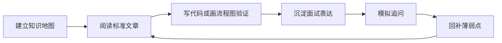

# 项目简介

这份资料面向有开发经验、希望补齐系统性前端知识并准备中高级前端面试的学习者。

它不是零基础教程，也不是单纯的八股题清单。每个主题都要回答这些问题：

- 这个技术是什么。
- 为什么需要它。
- 它解决什么真实问题。
- 在项目里怎么写、怎么选型、怎么兜底。
- 常见错误会导致什么后果。
- 面试时如何表达，并能承接追问。

## 学习方式

## 内容形态

- 系统文章：解释概念、机制、场景、代码、反例和排查方式。
- 面试答案：把系统文章压缩成 30 秒、1 分钟和深入追问版本。
- 项目复盘：记录真实项目中的背景、难点、方案、权衡、指标和结果。
- 资料索引：沉淀官方文档和高质量参考资料。

## 当前阶段

当前阶段只完成项目初始化、基础导航、首页、简介页、学习大纲和文章模板。下一阶段会先确认整体文章计划，再按模块逐篇补充内容。
