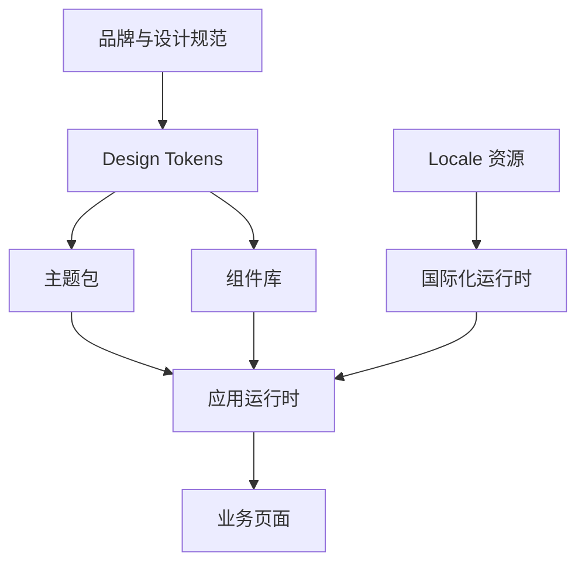
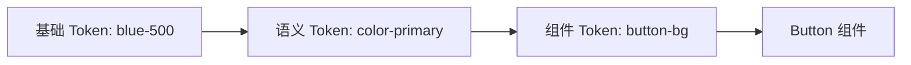

# 国际化、主题系统和设计系统

## 场景

一个 SaaS 产品从国内市场扩展到海外市场，同时要支持企业客户的品牌色、暗色模式和多租户定制。最初团队只是把中文文案替换成英文，又给按钮加了几个 CSS 变量。上线后问题开始出现：英文变长导致布局溢出，日期和金额格式不对，阿拉伯语方向错乱，暗色模式下图表不可读，组件库和业务页面主题不一致。

国际化、主题和设计系统看起来是 UI 问题，本质上是跨团队、一致性和可扩展性问题。

## 是什么

国际化是让应用支持不同语言、地区、数字、日期、货币、时区和文本方向的能力。

主题系统是通过设计变量控制颜色、字号、间距、圆角、阴影等视觉属性，并支持运行时切换。

设计系统是一套组件、设计 token、交互规范、可访问性规则、文档和治理机制，保证产品体验一致并提升交付效率。



## 为什么需要

没有系统化设计，主题切换会变成到处改颜色；没有国际化边界，文案会散落在代码里；没有组件规范，不同业务线会写出多个交互不一致的按钮、表单和弹窗。

中大型前端应用需要把视觉和语言变化点抽成稳定协议。这样新增语言、接入客户品牌、升级组件规范时，不需要逐页手改。

## 推荐做法

### 1. 文案和格式化逻辑集中管理

文案不要直接写在组件里。组件里引用 message id，具体语言由 locale 文件提供。

```json
{
  "order.status.paid": "Paid",
  "order.status.pending": "Pending",
  "order.createdAt": "Created at {time}"
}
```

日期、金额、数字、复数和相对时间不要手写字符串拼接，优先用 `Intl` 或成熟 i18n 库。

### 2. Token 分层：基础 token 和语义 token 分开

基础 token 描述原始值，例如 `blue-500`、`spacing-8`。语义 token 描述用途，例如 `color-primary`、`color-danger-bg`、`text-secondary`。

主题切换应该改语义 token 的值，而不是让业务组件直接依赖具体色阶。



### 3. 用 CSS Variables 支持运行时主题

CSS 变量可以天然继承，也能在根节点或局部容器上切换主题。

```css
:root {
  --color-primary: #1677ff;
  --color-bg-page: #ffffff;
  --color-text: #1f2329;
}

[data-theme='dark'] {
  --color-primary: #69b1ff;
  --color-bg-page: #101418;
  --color-text: #f2f4f7;
}
```

### 4. 组件库要暴露受控扩展点

设计系统不是把所有样式锁死。组件应该提供稳定的 API、slot、className、token 覆盖和组合能力，让业务能扩展但不破坏一致性。

### 5. 兼顾可访问性和 RTL

主题切换要验证对比度。国际化要考虑 RTL 语言，例如阿拉伯语和希伯来语。布局方向应尽量使用逻辑属性：`margin-inline-start`、`padding-inline-end`，而不是只写 `left/right`。

## 代码示例

### React 国际化格式化

```tsx
const messages = {
  en: {
    orderTotal: 'Total: {amount}',
    createdAt: 'Created at {time}'
  },
  zh: {
    orderTotal: '合计：{amount}',
    createdAt: '创建时间：{time}'
  }
};

function formatCurrency(value: number, locale: string, currency: string) {
  return new Intl.NumberFormat(locale, {
    style: 'currency',
    currency
  }).format(value);
}

function OrderSummary({ total, locale }: { total: number; locale: 'en' | 'zh' }) {
  const amount = formatCurrency(total, locale === 'zh' ? 'zh-CN' : 'en-US', locale === 'zh' ? 'CNY' : 'USD');
  return <span>{messages[locale].orderTotal.replace('{amount}', amount)}</span>;
}
```

生产项目建议使用 FormatJS、i18next 或 Lingui 等库处理插值、复数、懒加载和提取流程。

### 主题 Provider

```tsx
type ThemeName = 'light' | 'dark';

export function ThemeProvider({ theme, children }: { theme: ThemeName; children: React.ReactNode }) {
  React.useEffect(() => {
    document.documentElement.dataset.theme = theme;
  }, [theme]);

  return <>{children}</>;
}
```

### 组件使用语义 token

```css
.button {
  background: var(--color-primary);
  color: var(--color-on-primary);
  border-radius: var(--radius-md);
  min-height: 36px;
  padding: 0 var(--space-3);
}

.button[data-variant='danger'] {
  background: var(--color-danger);
}
```

### RTL 友好的布局

```css
.menuItem {
  padding-inline-start: var(--space-3);
  padding-inline-end: var(--space-2);
  border-inline-start: 2px solid transparent;
}

.menuItem[data-active='true'] {
  border-inline-start-color: var(--color-primary);
}
```

## 反例与后果

### 反例 1：业务代码里直接写中文文案

后果：后续接入多语言时需要全仓搜索替换，动态文案和复数规则很难处理。

### 反例 2：组件直接写死品牌色

后果：客户定制主题要改大量组件，还容易漏掉 hover、disabled、focus 状态。

### 反例 3：只替换文案，不处理格式和布局

后果：日期、货币、数字和文本方向不符合当地习惯，长文案导致布局溢出。

### 反例 4：组件库没有治理

后果：组件 API 不稳定，业务方不断 fork，设计系统失去统一价值。

## 常见坑

- 英文、德文等文案可能比中文长很多，按钮和表格列不能按中文长度写死。
- `Intl` 的 locale 和 currency 要由业务场景决定，不能只根据浏览器语言猜。
- 暗色主题不是简单颜色取反，阴影、边框、图表色板都要重新设计。
- Token 命名要表达语义，不要让业务大量依赖 `blue-6` 这类基础色。
- RTL 不只是文字右对齐，还包括布局方向、图标方向和动画方向。
- 组件库升级要有 changelog、迁移指南和废弃周期。

## 排查与验证

### 文案溢出

切换到长文本语言，检查按钮、表格列、弹窗标题和空状态。必要时使用伪本地化，把文本自动拉长来压测布局。

### 主题不一致

用 DevTools 检查组件最终颜色来自哪个 CSS 变量。查找写死颜色、第三方组件默认样式和图表自定义色板。

### 对比度不足

用 Lighthouse、axe 或设计工具检查文本和交互状态对比度，尤其是 disabled、placeholder、focus ring。

### RTL 错乱

设置 `<html dir="rtl">` 后检查导航、表单、图标、弹层位置和拖拽方向。

## 面试怎么讲

30 秒版本：

> 国际化解决语言、格式和文本方向问题；主题系统用 token 和 CSS 变量管理视觉变化；设计系统把 token、组件、规范和治理沉淀成团队能力。关键是把变化点协议化，而不是逐页改样式和文案。

1 分钟版本：

> 我会把这类平台能力拆成三层：locale 资源和格式化运行时负责国际化，design token 和主题包负责视觉变量，组件库负责稳定交互和可访问性。Token 要分基础 token 和语义 token，组件使用语义 token。主题切换用 CSS Variables 支持运行时变更。国际化不能只翻译文案，还要处理日期、货币、复数、长文本和 RTL。

追问版本：

> 如果问设计系统如何落地，我会说除了组件实现，还要有文档、示例、版本策略、变更治理和业务反馈机制。否则组件库很容易被业务 fork。设计系统的价值是减少重复决策，同时保留明确扩展点。

## 延伸阅读

- [MDN: Intl](https://developer.mozilla.org/en-US/docs/Web/JavaScript/Reference/Global_Objects/Intl)
- [FormatJS](https://formatjs.io/)
- [W3C: Internationalization](https://www.w3.org/International/)
- [W3C: Design Tokens Community Group](https://www.w3.org/community/design-tokens/)
- [Material Design: Design tokens](https://m3.material.io/foundations/design-tokens/overview)
