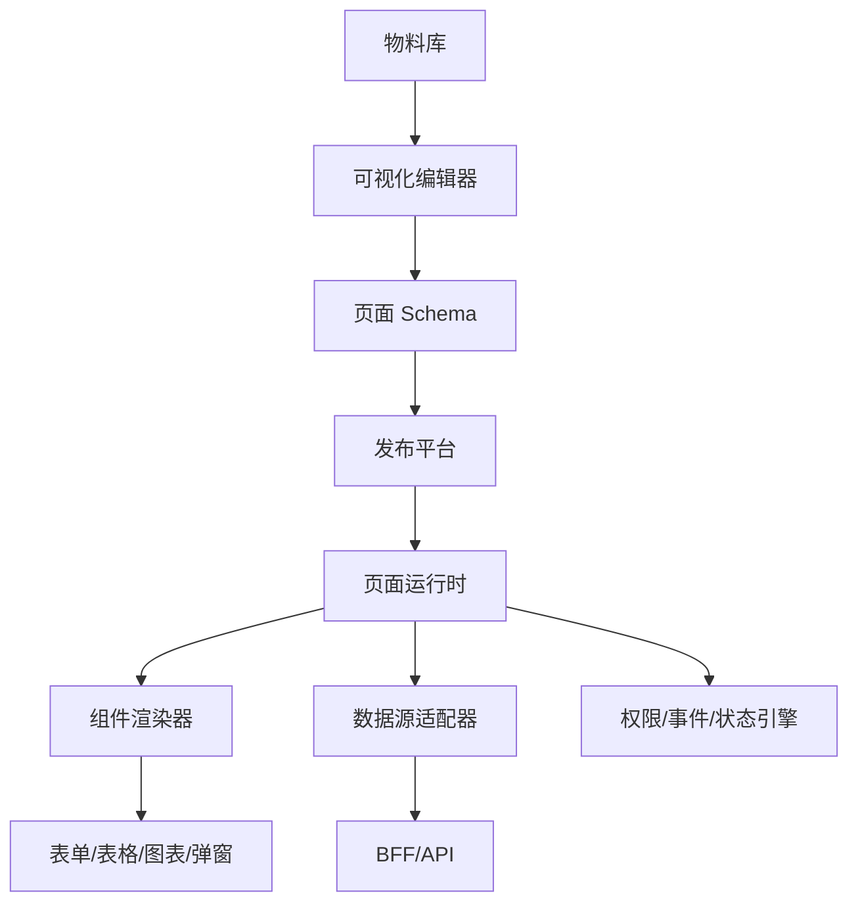
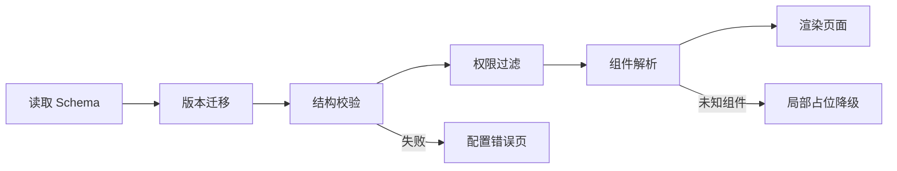

# 大型表格、低代码页面和可视化编辑器系统设计

## 场景

一个企业后台有大量相似页面：搜索表单、工具栏、数据表格、批量操作、弹窗表单、权限控制和导入导出。每个业务线都重复开发列表页，字段变化频繁，需求交付慢。团队希望做一套低代码页面搭建系统，让运营或业务开发通过配置生成页面；同时表格要支持上万行数据、固定列、虚拟滚动、列权限、筛选排序和单元格编辑。

这类题常出现在中高级前端面试中，因为它同时考察组件抽象、状态管理、性能、权限、数据协议、扩展性和可维护性。

## 是什么

低代码页面系统是用配置描述页面结构、数据源、组件属性、交互事件和权限规则，再由运行时引擎渲染真实页面。

可视化编辑器是配置的生产工具，通常包含物料面板、画布、属性面板、事件编排、预览和发布。

大型表格是复杂数据展示和操作组件，关注大量数据下的渲染性能、交互一致性和业务扩展能力。



核心术语：

- Schema：描述页面结构和行为的 JSON 配置。
- 物料：可被拖拽或配置的组件，例如表格、表单、按钮、图表。
- 渲染器：把 Schema 转成真实 React 组件树的运行时。
- 数据源：页面组件读取和提交数据的接口抽象。
- 事件编排：把点击、请求成功、弹窗打开等事件连接成动作链。
- 虚拟滚动：只渲染视口附近的行或列，降低 DOM 数量。

## 为什么需要

低代码和大型表格要解决的不是“少写代码”这么简单，而是把重复页面的变化点抽出来，让高频业务需求通过配置交付，同时把性能、权限、错误处理和组件规范沉淀到平台。

如果每个列表页都手写，字段和权限变化会造成大量重复修改；如果表格没有性能设计，大数据量下会卡顿；如果低代码没有边界，复杂逻辑会被塞进 JSON，最终变成难以调试的另一种代码。

## 推荐做法

### 1. 先定义 Schema 边界

Schema 应该描述稳定且可组合的页面结构，不应该承载任意业务代码。

```json
{
  "pageId": "order-list",
  "components": [
    {
      "type": "SearchForm",
      "props": {
        "fields": [
          { "name": "keyword", "label": "关键词", "widget": "Input" },
          { "name": "status", "label": "状态", "widget": "Select", "source": "orderStatus" }
        ]
      }
    },
    {
      "type": "DataTable",
      "props": {
        "dataSource": "orders",
        "rowKey": "id",
        "columns": [
          { "key": "id", "title": "订单号", "width": 160 },
          { "key": "amount", "title": "金额", "width": 120, "format": "currency" }
        ]
      }
    }
  ]
}
```

复杂业务逻辑可以通过受控扩展点实现，例如自定义组件、自定义动作、BFF 字段适配，而不是把函数字符串塞进配置。

### 2. 渲染器要做校验、隔离和降级

渲染器不能直接相信 Schema。运行前要做版本兼容、字段校验、权限过滤和组件白名单检查。未知组件或配置错误要局部降级，不能让整页白屏。



### 3. 大型表格按“数据、渲染、交互”拆

表格性能问题通常不是单点优化能解决的，要分层处理：

- 数据层：服务端分页、游标分页、筛选排序下推、字段裁剪。
- 渲染层：行虚拟、列虚拟、固定行高或可测量行高、稳定 key。
- 交互层：列宽调整、固定列、批量选择、编辑状态、快捷键。

数据量很大时，优先服务端分页和筛选排序，不要把几十万行数据一次性拉到浏览器再处理。

### 4. 编辑器和运行时分离

编辑器负责生产配置，运行时负责消费配置。两者可以共享物料元数据，但不要把编辑器的拖拽状态、选中框、辅助线逻辑带进线上运行时。

### 5. 权限放在多层兜底

前端可以控制按钮、列、菜单是否展示，但不能替代服务端鉴权。低代码平台尤其要注意：配置层可以隐藏组件，BFF/API 层必须再次校验数据权限和操作权限。

## 代码示例

### Schema 渲染器

```tsx
type ComponentSchema = {
  id: string;
  type: string;
  props?: Record<string, unknown>;
  children?: ComponentSchema[];
};

type Registry = Record<string, React.ComponentType<any>>;

export function SchemaRenderer({ schema, registry }: { schema: ComponentSchema; registry: Registry }) {
  const Component = registry[schema.type];

  if (!Component) {
    return <div role="alert">Unsupported component: {schema.type}</div>;
  }

  return (
    <Component {...schema.props}>
      {schema.children?.map((child) => (
        <SchemaRenderer key={child.id} schema={child} registry={registry} />
      ))}
    </Component>
  );
}
```

### 表格虚拟滚动核心思路

```tsx
function VirtualRows<T>({ rows, rowHeight, height, renderRow }: {
  rows: T[];
  rowHeight: number;
  height: number;
  renderRow: (row: T, index: number) => React.ReactNode;
}) {
  const [scrollTop, setScrollTop] = React.useState(0);
  const start = Math.floor(scrollTop / rowHeight);
  const visibleCount = Math.ceil(height / rowHeight) + 2;
  const visibleRows = rows.slice(start, start + visibleCount);

  return (
    <div style={{ height, overflow: 'auto' }} onScroll={(event) => setScrollTop(event.currentTarget.scrollTop)}>
      <div style={{ height: rows.length * rowHeight, position: 'relative' }}>
        <div style={{ transform: `translateY(${start * rowHeight}px)` }}>
          {visibleRows.map((row, offset) => renderRow(row, start + offset))}
        </div>
      </div>
    </div>
  );
}
```

真实项目建议优先使用成熟库，例如 TanStack Table、AG Grid、React Aria Table 或虚拟列表库，再基于业务封装。

### 事件动作链

```ts
type Action =
  | { type: 'request'; dataSource: string }
  | { type: 'openModal'; modalId: string }
  | { type: 'toast'; message: string }
  | { type: 'refresh'; target: string };

async function runActions(actions: Action[], context: RuntimeContext) {
  for (const action of actions) {
    if (action.type === 'request') {
      await context.dataSources[action.dataSource].execute();
    }

    if (action.type === 'openModal') {
      context.modals.open(action.modalId);
    }

    if (action.type === 'toast') {
      context.toast(action.message);
    }

    if (action.type === 'refresh') {
      context.components[action.target].refresh();
    }
  }
}
```

动作类型要少而稳定，复杂流程应交给业务服务或自定义扩展，而不是在配置里堆出完整编程语言。

## 反例与后果

### 反例 1：Schema 允许执行任意 JS 字符串

后果：安全风险高，难以静态校验，也难以调试和版本迁移。

### 反例 2：低代码平台追求覆盖所有业务

后果：平台复杂度迅速膨胀，简单页面不简单，复杂页面仍然很痛苦。

### 反例 3：表格一次性渲染所有行列

后果：DOM 数量爆炸，滚动和输入卡顿，浏览器内存持续升高。

### 反例 4：前端隐藏按钮就认为完成权限控制

后果：用户仍可能直接调用接口完成未授权操作。

## 常见坑

- Schema 没有版本号，配置结构升级后历史页面无法渲染。
- 物料组件没有稳定协议，组件升级破坏旧页面。
- 编辑器状态和运行时状态混在一起，线上包体和复杂度都增加。
- 表格固定列、虚拟滚动、可变行高同时存在时，滚动同步很容易错位。
- 单元格编辑没有草稿状态和校验状态，保存失败后用户修改丢失。
- 导出大数据不应该在浏览器拼 CSV，应该走异步任务或服务端导出。

## 排查与验证

### 页面配置渲染失败

检查 Schema 版本、组件 registry、权限过滤结果和数据源返回结构。渲染器应能指出具体组件路径，例如 `components[1].columns[3]`。

### 表格滚动卡顿

用 Performance 面板查看长任务、Layout 和 Paint。检查是否渲染过多 DOM、单元格 render 是否创建大量新对象、滚动事件是否触发全表重渲染。

### 权限不一致

对比菜单权限、组件权限、列权限和接口权限。前端展示和后端鉴权必须使用同一套权限语义，不能各写一套枚举。

### 发布后旧页面异常

检查物料版本兼容策略。必要时为页面配置锁定物料大版本，或提供 Schema migration。

## 面试怎么讲

30 秒版本：

> 低代码的核心是用 Schema 描述页面，用渲染器和物料库消费配置；大型表格的核心是把数据、渲染和交互分层，服务端分页筛选配合前端虚拟滚动。重点不是拖拽本身，而是配置协议、扩展点、权限、性能和版本兼容。

1 分钟版本：

> 我会把低代码系统拆成编辑器、Schema、物料库、运行时、数据源和发布平台。编辑器负责生产配置，运行时负责校验和渲染，物料通过稳定元数据暴露可配置属性。大型表格会优先做服务端分页和字段裁剪，前端用行列虚拟、稳定 key 和受控编辑状态保证性能。权限要多层兜底，前端只负责体验，服务端必须鉴权。

追问版本：

> 如果问低代码边界，我会说它适合高重复、结构化、规则稳定的页面，例如后台列表、表单、看板。不适合强定制、高交互、规则频繁变化且难抽象的业务。平台要提供扩展点，但不能把任意 JS 塞进配置，否则会失去可维护性、安全性和可迁移性。

## 延伸阅读

- [TanStack Table](https://tanstack.com/table/latest)
- [AG Grid Documentation](https://www.ag-grid.com/react-data-grid/)
- [React: Rendering Lists](https://react.dev/learn/rendering-lists)
- [web.dev: Virtualize large lists with react-window](https://web.dev/articles/virtualize-long-lists-react-window)
- [JSON Schema](https://json-schema.org/)
