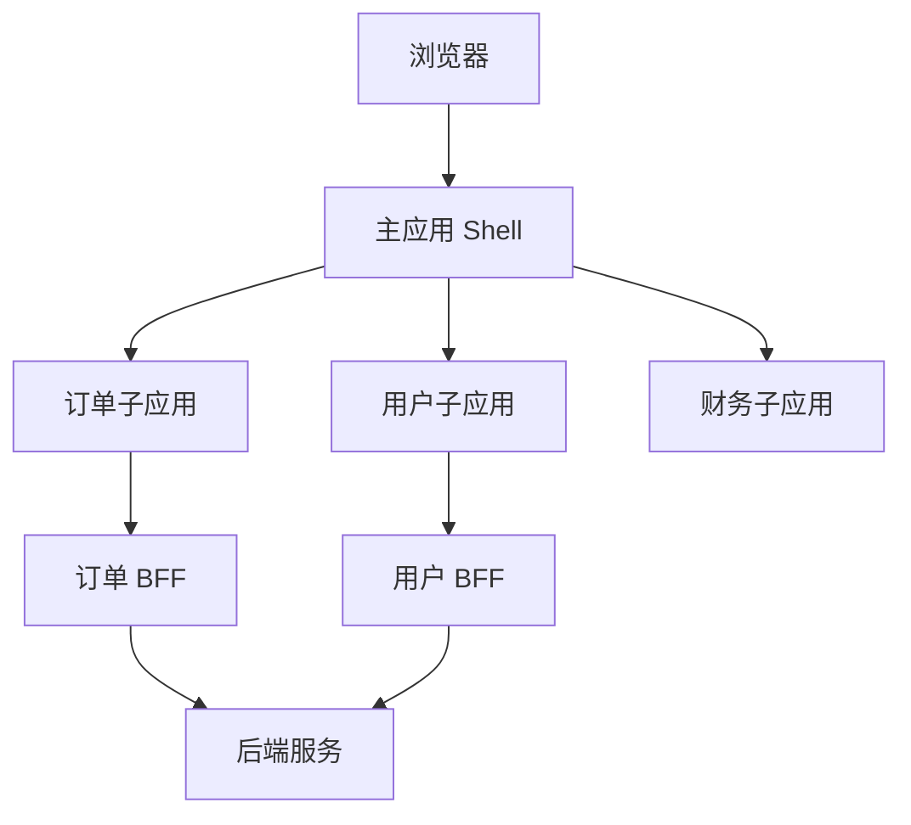

# 微前端与 BFF：前端系统拆分和协作边界

## 场景

一个企业级平台里有订单、用户、财务、营销、数据看板多个业务域。不同团队独立开发，发布节奏不同，技术栈也不完全一致。随着系统增长，单体前端出现问题：构建慢、发布互相阻塞、代码边界混乱、跨团队协作成本高。

同时，前端页面需要聚合多个后端服务的数据，接口字段不适合页面直接使用，权限和数据裁剪逻辑也散落在前端。

微前端和 BFF 都是解决协作边界的问题，但它们解决的层面不同。

## 是什么

微前端是把一个大型前端应用拆成多个可以独立开发、构建、部署的子应用，再由主应用集成。

BFF 是 Backend For Frontend，为特定前端体验定制服务端接口，负责聚合、裁剪、编排和适配后端数据。



## 为什么需要

微前端适合解决前端团队规模和发布边界问题。BFF 适合解决前后端接口适配和页面数据编排问题。

不要把它们当成默认架构。小团队、小系统使用微前端可能只会增加复杂度。BFF 如果缺少所有权，也可能变成新的大泥球。

## 推荐做法

### 1. 先判断是否真的需要微前端

适合场景：

- 多团队独立交付。
- 业务域边界清晰。
- 发布节奏不同。
- 历史技术栈需要渐进整合。

不适合场景：

- 只是为了“架构先进”。
- 团队很小但引入大量运行时集成复杂度。
- 业务边界不清，拆完仍然强耦合。

### 2. 明确主应用和子应用职责

主应用通常负责：登录态、全局布局、菜单、路由基座、全局错误边界、公共监控。

子应用负责：业务页面、局部状态、业务请求、业务组件。

共享依赖要谨慎。共享过多会造成隐式耦合，共享过少会造成体积膨胀。

### 3. BFF 负责页面友好的接口

```ts
app.get('/bff/dashboard', async (request, response) => {
  const [profile, metrics, permissions] = await Promise.all([
    userService.getProfile(request.user.id),
    metricsService.getDashboardMetrics(request.user.orgId),
    permissionService.getPermissions(request.user.id)
  ]);

  response.json({
    userName: profile.name,
    cards: metrics.cards,
    canExport: permissions.includes('dashboard:export')
  });
});
```

BFF 可以减少前端多接口串联和字段适配，但不能绕过后端领域边界。

### 4. 设计跨应用通信边界

跨子应用通信越多，说明拆分边界可能有问题。优先使用 URL、事件、公共服务或后端状态同步，不要让子应用互相直接调用内部模块。

## 代码示例

一个简化的微前端路由注册表：

```ts
type MicroApp = {
  name: string;
  basePath: string;
  entry: string;
  permissions?: string[];
};

const apps: MicroApp[] = [
  {
    name: 'orders',
    basePath: '/orders',
    entry: 'https://cdn.example.com/orders/entry.js',
    permissions: ['order:view']
  },
  {
    name: 'finance',
    basePath: '/finance',
    entry: 'https://cdn.example.com/finance/entry.js',
    permissions: ['finance:view']
  }
];

function getAvailableApps(userPermissions: Set<string>) {
  return apps.filter((app) =>
    app.permissions?.every((permission) => userPermissions.has(permission)) ?? true
  );
}
```

真实项目还要处理资源加载失败、版本回滚、样式隔离、错误边界和监控归因。

## 反例与后果

### 反例 1：没有业务边界就拆微前端

后果：子应用之间频繁通信和共享状态，复杂度比单体更高。

### 反例 2：BFF 变成万能聚合层

后果：所有业务逻辑都堆到 BFF，领域服务边界被破坏，排查问题更难。

### 反例 3：子应用各自带一份大型依赖

后果：首屏资源膨胀，运行时重复加载，性能变差。

## 常见坑

- 微前端首先是组织和发布边界，不只是技术方案。
- 样式隔离、运行时隔离、依赖共享和路由同步都要设计。
- 主应用不能承载所有业务逻辑，否则会退化成新的单体。
- BFF 要有明确 owner 和数据契约。
- 前端聚合数据不能替代服务端鉴权和数据权限。

## 排查与验证

### 子应用加载失败

检查 entry URL、CDN 缓存、跨域、版本号和回滚策略。主应用要提供降级 UI。

### 样式互相污染

检查全局 CSS、reset、组件库样式和 CSS Modules/Shadow DOM/命名空间策略。

### 性能变差

检查重复依赖、子应用资源瀑布图、预加载策略和主应用首屏职责是否过重。

### BFF 数据不一致

检查聚合接口依赖的后端服务版本、缓存策略、错误降级和字段契约。

## 面试怎么讲

30 秒版本：

> 微前端解决大型前端的团队协作和独立发布问题，BFF 解决前端页面和后端服务之间的数据适配和聚合问题。它们都不是默认方案，只有在团队规模、业务边界和发布复杂度达到一定程度时才值得引入。

1 分钟版本：

> 我会先看问题是什么。如果是多团队独立交付、历史系统整合和发布解耦，微前端有价值；如果是页面要聚合多个后端服务、字段适配复杂，BFF 更合适。微前端要设计主子应用职责、路由、样式隔离、依赖共享、错误边界和监控。BFF 要保持数据契约清晰，不能变成万能业务层。

追问版本：

> 如果问微前端缺点，我会说它会增加运行时集成、版本管理、样式隔离、依赖共享和故障定位成本。拆分前要确认业务域边界和团队边界是否稳定。对于小团队，monorepo 加模块边界可能比微前端更实际。

## 延伸阅读

- [micro-frontends.org](https://micro-frontends.org/)
- [Martin Fowler: Micro Frontends](https://martinfowler.com/articles/micro-frontends.html)
- [Pattern: Backends For Frontends](https://samnewman.io/patterns/architectural/bff/)
- [Module Federation](https://webpack.js.org/concepts/module-federation/)
