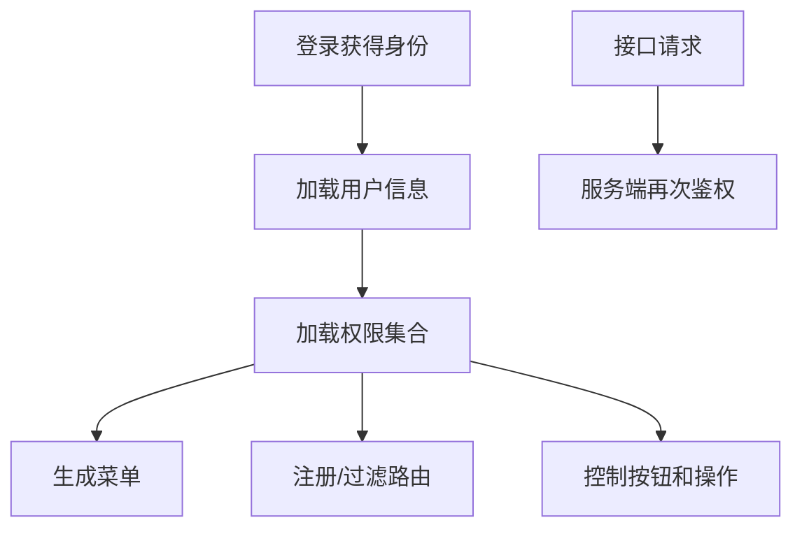

# 权限系统、菜单系统和动态路由

## 场景

你在做一个企业后台：不同角色看到不同菜单，不同组织有不同数据范围，某些按钮只有管理员能点，路由刷新后要恢复权限状态，用户权限变更后要及时生效。

常见问题包括：

- 前端隐藏了菜单，但用户直接输入 URL 仍能访问页面。
- 按钮权限散落在组件里，难以维护。
- 菜单、路由和后端权限模型不一致。
- 权限数据加载前页面闪烁或误跳转。
- 只做前端权限，后端接口没有校验。

权限系统的重点不是“动态生成路由”本身，而是前后端如何共同表达和执行访问控制。

## 是什么

后台权限通常包含几层：

- 身份认证：用户是谁。
- 功能权限：能访问哪些页面、按钮、操作。
- 数据权限：能查看哪些组织、项目、记录。
- 菜单系统：把可访问功能组织成导航。
- 路由守卫：控制页面级访问和跳转。



前端权限主要负责体验和减少误操作，服务端权限负责真正安全边界。

## 为什么需要

后台系统经常随组织结构、岗位、套餐、租户和业务流程变化。权限如果没有统一模型，就会变成页面里的大量 `if` 判断。

好的权限设计能带来：

- 菜单和路由来源一致。
- 页面、按钮和接口权限可追踪。
- 权限变更影响范围清楚。
- 前端体验友好，后端安全可控。

## 推荐做法

### 1. 权限码作为稳定契约

```ts
type PermissionCode =
  | 'order:view'
  | 'order:create'
  | 'order:delete'
  | 'user:manage';

type CurrentUser = {
  id: string;
  name: string;
  permissions: PermissionCode[];
};
```

权限码应该由产品和后端共同维护，前端消费它，而不是各页面自行发明字符串。

### 2. 菜单和路由用同一份元数据

```ts
type RouteConfig = {
  path: string;
  title: string;
  element: React.ReactNode;
  permission?: PermissionCode;
  children?: RouteConfig[];
};

const routes: RouteConfig[] = [
  { path: '/orders', title: 'Orders', element: <OrdersPage />, permission: 'order:view' },
  { path: '/users', title: 'Users', element: <UsersPage />, permission: 'user:manage' }
];
```

菜单从可访问路由生成，避免菜单和路由两套配置漂移。

### 3. 路由守卫处理加载、未登录和无权限

```tsx
function RequirePermission({ permission, children }: Props) {
  const auth = useAuth();

  if (auth.status === 'loading') {
    return <PageSkeleton />;
  }

  if (auth.status === 'anonymous') {
    return <Navigate to="/login" replace />;
  }

  if (permission && !auth.permissions.has(permission)) {
    return <ForbiddenPage />;
  }

  return children;
}
```

加载态要明确，否则权限未返回前容易闪现页面或误跳 403。

### 4. 按钮权限组件化

```tsx
function Can({ permission, children }: { permission: PermissionCode; children: React.ReactNode }) {
  const { permissions } = useAuth();
  return permissions.has(permission) ? children : null;
}

<Can permission="order:delete">
  <button>Delete order</button>
</Can>
```

这只是体验控制，删除接口仍必须由服务端校验。

## 代码示例

下面是菜单过滤的核心逻辑。

```ts
function hasPermission(userPermissions: Set<PermissionCode>, permission?: PermissionCode) {
  return !permission || userPermissions.has(permission);
}

function filterRoutes(routes: RouteConfig[], permissions: Set<PermissionCode>): RouteConfig[] {
  return routes
    .filter((route) => hasPermission(permissions, route.permission))
    .map((route) => ({
      ...route,
      children: route.children ? filterRoutes(route.children, permissions) : undefined
    }))
    .filter((route) => !route.children || route.children.length > 0 || route.element);
}

function buildMenu(routes: RouteConfig[]) {
  return routes.map((route) => ({
    path: route.path,
    title: route.title,
    children: route.children ? buildMenu(route.children) : undefined
  }));
}
```

实际项目还要处理默认首页、面包屑、隐藏菜单路由、外链、图标和排序。

## 反例与后果

### 反例 1：只隐藏菜单

后果：用户直接输入 URL 仍能访问页面。如果接口也没校验，风险更严重。

### 反例 2：前端硬编码角色

```tsx
if (user.role === 'admin') {
  return <DeleteButton />;
}
```

后果：角色和权限强绑定，业务稍微变化就要改大量页面。更稳定的是消费权限码。

### 反例 3：权限加载前直接渲染页面

后果：页面短暂闪现，甚至触发不该执行的数据请求。

## 常见坑

- 前端权限不是安全边界，后端必须鉴权。
- 角色不是权限，角色通常是一组权限的集合。
- 页面权限和数据权限不同，能进页面不代表能看所有数据。
- 权限码要稳定命名，否则前后端协作成本高。
- 动态路由要处理刷新、404、403、默认跳转和权限变更。

## 排查与验证

### 菜单和路由不一致

检查是否有两套配置。优先让菜单从路由元数据派生，或让两者都来自服务端配置。

### 直接 URL 可访问

检查路由守卫是否覆盖所有受保护路由，接口是否做服务端鉴权。

### 权限闪烁

检查 auth loading 状态。权限未加载完成前，不要渲染受保护页面和敏感请求。

### 按钮误展示

检查按钮权限是否集中封装，权限码是否和后端一致。

## 面试怎么讲

30 秒版本：

> 权限系统通常分认证、功能权限、数据权限、菜单和路由守卫。前端用权限码控制菜单、路由和按钮展示，提升体验；真正安全边界必须在服务端接口鉴权。

1 分钟版本：

> 我会让权限码成为前后端契约，菜单和路由尽量从同一份元数据生成，避免两套配置漂移。路由守卫要区分 loading、未登录和无权限，按钮权限可以封装 Can 组件。数据权限和功能权限要分开，能访问页面不代表能访问所有数据。

追问版本：

> 如果问动态路由，我会说可以前端本地维护路由元数据并按权限过滤，也可以服务端下发菜单和权限配置。前者类型和代码分割更可控，后者运营灵活但要处理组件映射和安全校验。无论哪种，后端接口都必须根据用户身份和数据范围再次校验。

## 延伸阅读

- [React Router: Auth Example](https://reactrouter.com/en/main/start/examples)
- [OWASP: Authorization Cheat Sheet](https://cheatsheetseries.owasp.org/cheatsheets/Authorization_Cheat_Sheet.html)
- [OWASP: Access Control](https://owasp.org/www-community/Access_Control)
