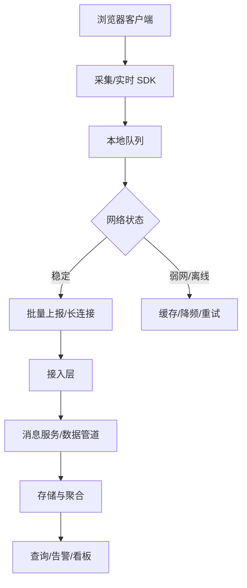
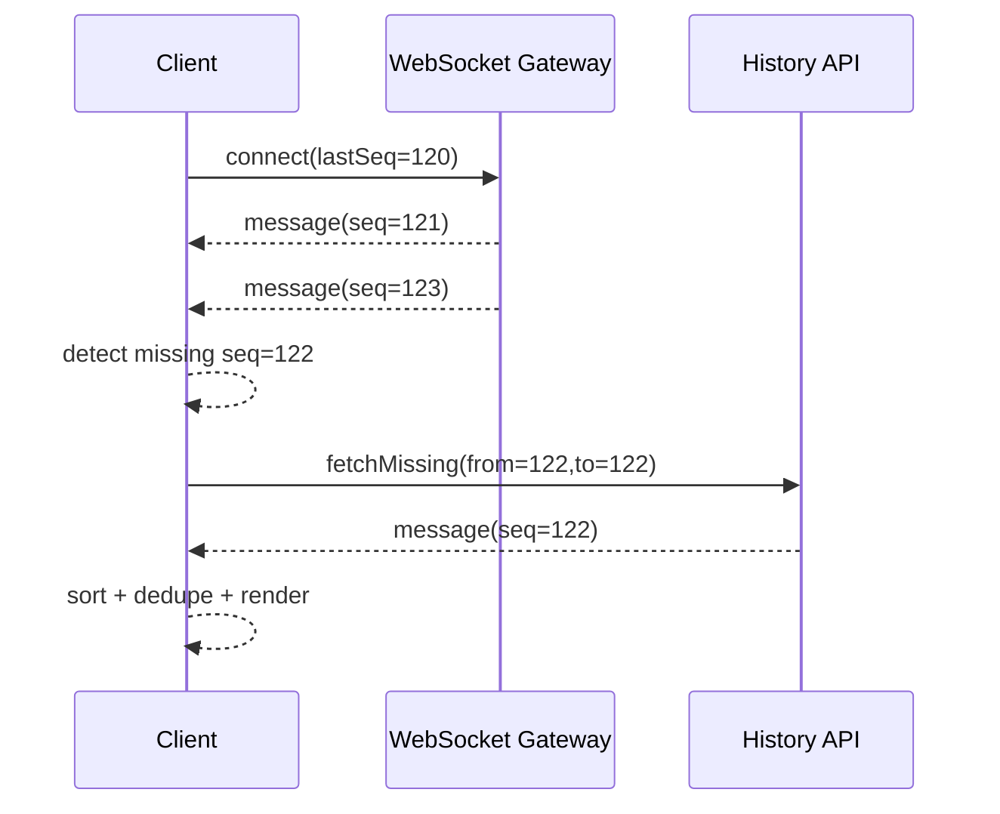

# IM 前端、直播间前端、埋点 SDK 和性能监控平台系统设计

## 场景

面试官让你设计一个 IM 前端、直播间前端、埋点 SDK 或性能监控平台。表面看这是四类题，底层都在考察相似能力：实时数据如何传输，消息如何保证顺序和去重，弱网如何恢复，客户端如何采集事件，数据如何上报、聚合、查询和告警。

这类题不能只说“用 WebSocket”或“上报到后端”。中高级答案要覆盖协议、状态、缓存、降级、可观测性和工程边界。

## 是什么

IM 前端关注会话列表、消息流、发送状态、已读未读、离线消息、重连补偿和多端同步。

直播间前端关注低延迟播放、弹幕、礼物、在线人数、互动消息、播放器状态和弱网降级。

埋点 SDK 关注事件采集、上下文补全、队列、采样、批量上报、失败重试和隐私合规。

性能监控平台关注 Web Vitals、资源、错误、长任务、接口耗时、Source Map 还原、聚合查询和告警。



## 为什么需要

实时系统的难点不是“收到消息”，而是网络抖动、多端状态、消息乱序、重复投递、发送失败和 UI 恢复。监控系统的难点不是“打点”，而是低侵入、低损耗、可追溯、可聚合和合规。

如果没有系统设计，IM 会出现消息重复、顺序错乱和发送状态不可信；直播间会出现卡顿、弹幕堆积和互动延迟；埋点会丢数据或拖慢业务；性能监控会有大量无法定位的噪声。

## 推荐做法

### 1. 实时链路用“增量推送 + 全量校准”

WebSocket/SSE 适合推送增量消息，但不能假设每条消息都可靠到达。客户端要保存 `lastSequence` 或 `lastMessageId`，重连后向服务端拉取缺失消息。



### 2. 消息状态显式建模

发送消息通常有本地临时 ID 和服务端消息 ID。状态至少包括 sending、sent、failed、received、read。失败后允许重试，重试要复用幂等键。

### 3. 直播间按优先级降级

直播间资源消耗高，要区分核心和非核心：视频播放和关键互动优先，弹幕、礼物动效、在线人数可以降频或合并。弱网下优先降清晰度、减少动画、降低消息频率。

### 4. SDK 上报要异步、批量和可丢弃

埋点和性能监控不能阻塞业务主流程。事件进入内存队列，按数量或时间批量上报。页面卸载时使用 `sendBeacon`。低价值事件可以采样或丢弃。

### 5. 监控数据必须带上下文

错误和性能事件至少带：release、route、user/session 匿名 ID、device、network、traceId、timestamp、页面可见性、采样率。没有上下文的监控数据很难排查。

## 代码示例

### IM 消息去重和排序

```ts
type Message = {
  clientId?: string;
  messageId: string;
  conversationId: string;
  sequence: number;
  content: string;
  createdAt: number;
};

export function mergeMessages(current: Message[], incoming: Message[]) {
  const map = new Map<string, Message>();

  for (const message of current) {
    map.set(message.messageId, message);
  }

  for (const message of incoming) {
    map.set(message.messageId, message);
  }

  return [...map.values()].sort((a, b) => a.sequence - b.sequence);
}
```

### 发送状态和幂等键

```ts
type LocalMessage = {
  clientId: string;
  serverId?: string;
  content: string;
  status: 'sending' | 'sent' | 'failed';
};

async function sendMessage(content: string) {
  const clientId = crypto.randomUUID();
  addLocalMessage({ clientId, content, status: 'sending' });

  try {
    const saved = await api.sendMessage({ clientId, content });
    markMessageSent(clientId, saved.messageId);
  } catch {
    markMessageFailed(clientId);
  }
}
```

服务端要把 `clientId` 当作幂等键，否则客户端重试仍可能生成重复消息。

### 埋点 SDK 队列

```ts
type EventPayload = {
  name: string;
  properties: Record<string, unknown>;
  timestamp: number;
};

class AnalyticsQueue {
  private queue: EventPayload[] = [];
  private timer: number | undefined;
  private flushing = false;

  track(name: string, properties: Record<string, unknown>) {
    this.queue.push({ name, properties, timestamp: Date.now() });

    if (this.queue.length >= 20) {
      void this.flush();
      return;
    }

    this.timer ??= window.setTimeout(() => void this.flush(), 5000);
  }

  async flush() {
    if (this.flushing) {
      return;
    }

    window.clearTimeout(this.timer);
    this.timer = undefined;

    const batch = this.queue.slice(0, this.queue.length);
    if (batch.length === 0) {
      return;
    }

    this.flushing = true;
    let shouldRetryLater = false;

    try {
      const response = await fetch('/collect', {
        method: 'POST',
        body: JSON.stringify(batch),
        keepalive: true,
        headers: { 'content-type': 'application/json' }
      });

      if (!response.ok) {
        throw new Error('Collect failed');
      }

      this.queue = this.queue.filter((event) => !batch.includes(event));
    } catch {
      shouldRetryLater = true;
    } finally {
      this.flushing = false;

      if (this.queue.length === 0) {
        return;
      }

      if (shouldRetryLater || this.queue.length < 20) {
        this.timer ??= window.setTimeout(() => void this.flush(), 5000);
      } else {
        void this.flush();
      }
    }
  }
}
```

### 页面卸载上报

```ts
window.addEventListener('visibilitychange', () => {
  if (document.visibilityState === 'hidden') {
    const payload = JSON.stringify(collectPendingEvents());
    navigator.sendBeacon('/collect', payload);
  }
});
```

## 反例与后果

### 反例 1：WebSocket 收到消息就直接 append

后果：乱序和重复消息会直接显示给用户，重连后更明显。

### 反例 2：发送失败只弹 toast，不保留本地消息

后果：用户不知道哪条消息失败，也无法针对单条消息重试。

### 反例 3：埋点同步上报

后果：业务交互被阻塞，弱网下尤其明显，还可能影响 INP。

### 反例 4：监控事件没有 release

后果：线上错误无法关联具体版本，Source Map 也可能无法匹配。

## 常见坑

- WebSocket 连接成功不代表鉴权和业务订阅成功，要区分连接态和订阅态。
- 心跳不能太频繁，否则移动端耗电和服务端压力都会上升。
- 消息 sequence 要按会话或房间定义，不要全局混用导致排序语义混乱。
- 直播弹幕和礼物动效要限流，否则高峰期会拖垮渲染线程。
- `sendBeacon` 有大小限制，适合小批量收尾上报。
- 埋点 SDK 要避免采集敏感字段，遵守用户授权和数据合规要求。

## 排查与验证

### IM 消息乱序

记录 messageId、sequence、serverTime 和 clientTime。模拟断网重连，检查缺失补拉和去重逻辑。

### 直播间卡顿

同时看播放器缓冲、主线程长任务、WebSocket 消息频率和 DOM 节点数量。弹幕卡顿不一定是视频流问题。

### 埋点丢失

检查页面隐藏、刷新、离线、接口 5xx、采样和浏览器 keepalive 限制。对关键事件要有服务端对账。

### 性能监控噪声过多

按 release、route、device、network、浏览器版本分组。过滤插件、爬虫、低价值错误，并设置采样策略。

## 面试怎么讲

30 秒版本：

> IM 和直播间的核心是实时链路可靠性：长连接推增量，重连后用 sequence 补拉缺失，客户端做去重排序和状态恢复。埋点和性能监控的核心是低侵入采集、批量上报、上下文补全和可查询告警。

1 分钟版本：

> 我会先区分实时系统和监控系统。实时系统要设计连接态、订阅态、消息 ID、sequence、心跳、重连、补偿和降级；UI 上要显式处理 sending、sent、failed、read。监控 SDK 要把事件放入队列，批量异步上报，页面隐藏时用 sendBeacon，并带上 release、route、device、network、traceId 等上下文。服务端再做聚合、查询和告警。

追问版本：

> 如果问消息可靠性，我会说前端通常不保证 exactly once，而是通过 at least once 投递加客户端幂等去重来接近用户感知的一致性。关键是 messageId 和 sequence 设计清楚，重连后能补拉缺口，发送重试有 clientId 幂等键。

## 延伸阅读

- [MDN: WebSocket](https://developer.mozilla.org/en-US/docs/Web/API/WebSocket)
- [MDN: Server-sent events](https://developer.mozilla.org/en-US/docs/Web/API/Server-sent_events)
- [MDN: Navigator.sendBeacon](https://developer.mozilla.org/en-US/docs/Web/API/Navigator/sendBeacon)
- [web.dev: Web Vitals](https://web.dev/articles/vitals)
- [W3C: Reporting API](https://www.w3.org/TR/reporting/)
