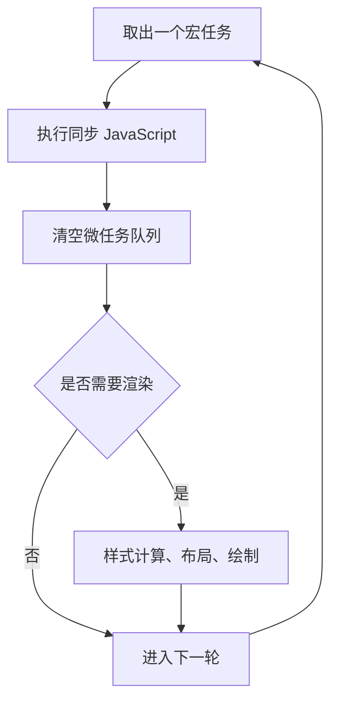

# 事件循环：宏任务、微任务与渲染时机

## 场景

你在做一个搜索页面：用户输入关键字后触发请求，结果回来后更新列表，同时页面里还有埋点、loading、动画和一个大数据量筛选逻辑。代码里混着 `setTimeout`、Promise、`async/await`、DOM 更新和 React 状态更新。

常见问题会很快出现：

- 为什么 Promise 回调比 `setTimeout` 更早执行？
- 为什么一段同步计算会让 loading 显示不出来？
- 为什么连续很多微任务会导致页面卡住？
- 为什么 DOM 更新了，但浏览器还没来得及绘制？
- 为什么 `await` 后面的代码不是立刻同步执行？

这些问题都需要从事件循环理解：浏览器如何调度 JavaScript、用户输入、网络回调、微任务和页面渲染。

## 是什么

JavaScript 在浏览器主线程上执行。主线程同一时刻只能做一件事：执行脚本、处理事件、计算样式、布局、绘制或响应用户输入。

事件循环负责协调这些工作。简化模型如下：



常见宏任务包括：

- script 首次执行。
- `setTimeout` / `setInterval` 回调。
- 用户交互事件。
- 网络、消息、I/O 相关回调。

常见微任务包括：

- Promise `.then` / `.catch` / `.finally`。
- `queueMicrotask`。
- MutationObserver 回调。
- `await` 之后恢复执行的部分。

一轮宏任务执行完后，浏览器会先清空微任务队列，再寻找机会渲染页面。

## 为什么需要

事件循环不是面试里的执行顺序题而已，它直接影响真实页面体验。

如果主线程被长任务占满，用户输入、点击、滚动和绘制都要等待。即使你先设置了 loading，再执行一个耗时同步任务，浏览器也可能没有机会把 loading 绘制出来。

如果递归创建大量微任务，浏览器会一直清空微任务队列，渲染被延后，页面看起来像卡死。

如果把耗时逻辑放在输入事件里同步执行，INP 会变差，用户会感觉输入延迟。

理解事件循环的价值是：知道什么时候代码会执行、什么时候页面能绘制、什么时候应该让出主线程。

## 推荐做法

### 1. 不要在一次任务里做太多同步计算

错误方向是把所有计算放进一次点击或输入事件里。

```ts
button.addEventListener('click', () => {
  showLoading();
  runExpensiveFilter();
  renderResult();
});
```

如果 `runExpensiveFilter` 很慢，loading 可能无法及时显示。可以把重计算拆分，或交给 Web Worker。

### 2. 用任务切片让出主线程

对于可以分批处理的数据，分片执行能让浏览器穿插处理输入和渲染。

```ts
async function processInChunks<T>(
  items: T[],
  worker: (item: T) => void,
  chunkSize = 500
) {
  for (let index = 0; index < items.length; index += chunkSize) {
    const chunk = items.slice(index, index + chunkSize);
    chunk.forEach(worker);

    await new Promise<void>((resolve) => {
      window.setTimeout(resolve, 0);
    });
  }
}
```

`setTimeout` 会把后续工作放到下一轮宏任务，给浏览器机会处理其它工作。

### 3. 区分微任务和下一帧

Promise 微任务不会让浏览器立刻绘制。`requestAnimationFrame` 的回调发生在下一次绘制之前，如果你想先让 loading 有机会真正绘制出来，再执行重任务，可以在 rAF 后再让出一个宏任务。

```ts
function afterNextPaint() {
  return new Promise<void>((resolve) => {
    requestAnimationFrame(() => {
      window.setTimeout(resolve, 0);
    });
  });
}

async function showLoadingThenWork() {
  setLoading(true);
  await afterNextPaint();
  runExpensiveWork();
  setLoading(false);
}
```

### 4. 高频交互中控制调度

搜索输入、滚动、拖拽等高频交互需要避免每次事件都做重活。

```ts
function debounce<T extends (...args: any[]) => void>(fn: T, delay: number) {
  let timer: number | undefined;

  return (...args: Parameters<T>) => {
    window.clearTimeout(timer);
    timer = window.setTimeout(() => fn(...args), delay);
  };
}
```

防抖适合搜索输入，节流或 `requestAnimationFrame` 更适合滚动和拖拽。

## 代码示例

下面是一个搜索框：输入时立即更新输入框，但请求和筛选延后，避免每个字符都触发重任务。

```tsx
import { useEffect, useMemo, useState } from 'react';

function useDebouncedValue<T>(value: T, delay: number) {
  const [debouncedValue, setDebouncedValue] = useState(value);

  useEffect(() => {
    const timer = window.setTimeout(() => {
      setDebouncedValue(value);
    }, delay);

    return () => {
      window.clearTimeout(timer);
    };
  }, [value, delay]);

  return debouncedValue;
}

export function SearchPanel({ items }: { items: string[] }) {
  const [keyword, setKeyword] = useState('');
  const debouncedKeyword = useDebouncedValue(keyword, 250);

  const results = useMemo(() => {
    const normalizedKeyword = debouncedKeyword.trim().toLowerCase();
    if (!normalizedKeyword) {
      return items;
    }

    return items.filter((item) => item.toLowerCase().includes(normalizedKeyword));
  }, [items, debouncedKeyword]);

  return (
    <section>
      <input
        value={keyword}
        onChange={(event) => setKeyword(event.target.value)}
        placeholder="Search"
      />
      <p>{results.length} results</p>
    </section>
  );
}
```

这个例子里，输入框状态同步更新，筛选逻辑等用户停顿后再执行。它不是替代虚拟列表或 Web Worker 的方案，但能避免很多低成本场景里的无意义计算。

## 反例与后果

### 反例 1：认为 Promise 会让代码异步到下一帧

```ts
setLoading(true);
Promise.resolve().then(() => {
  runExpensiveWork();
});
```

后果：Promise 回调是微任务，会在当前宏任务结束后、渲染前执行。耗时工作仍可能阻塞 loading 绘制。

### 反例 2：无限追加微任务

```ts
function loop() {
  queueMicrotask(loop);
}

loop();
```

后果：微任务队列一直不空，浏览器无法进入渲染阶段，页面会失去响应。

### 反例 3：输入事件里同步处理大数组

```ts
input.addEventListener('input', () => {
  const result = hugeList.filter(matchKeyword);
  render(result);
});
```

后果：每次键入都触发重计算，输入响应延迟，INP 变差。应该防抖、缓存、虚拟化、分片或交给 Worker。

## 常见坑

- `await` 后面的代码会进入微任务，不是继续同步执行。
- 微任务优先级高于下一轮宏任务，但过多微任务会推迟渲染。
- `setTimeout(fn, 0)` 不是立即执行，只是尽快放入后续任务。
- `requestAnimationFrame` 在下一次绘制前执行，适合做与视觉更新相关的读写。
- `requestIdleCallback` 只适合低优先级任务，不能依赖它一定及时执行。
- 浏览器事件循环和 Node.js 事件循环相似但不完全相同，面试时要说明上下文。

## 排查与验证

### 判断是否有长任务

Chrome Performance 面板中，超过 50ms 的任务会被标记为 Long Task。展开任务看是脚本、样式计算、布局还是绘制造成的。

### 判断 loading 为什么不显示

在设置 loading 后录制 Performance。如果后面紧跟长 JavaScript 任务，浏览器没有机会渲染，loading 就不会及时显示。

### 判断微任务是否过多

检查 Promise 链、递归 `queueMicrotask`、MutationObserver 和框架调度。大量微任务可能表现为主线程一直执行脚本，渲染阶段被推迟。

### 判断输入为什么卡

录制输入过程，看 Input 事件后是否有长任务。再检查是否在每次输入里做了同步过滤、排序、正则匹配或大规模 DOM 更新。

## 面试怎么讲

30 秒版本：

> 浏览器事件循环会不断取出宏任务执行，同步代码执行完后清空微任务队列，然后浏览器才有机会进行渲染。Promise 回调和 `await` 后续属于微任务，`setTimeout` 属于宏任务，所以 Promise 通常会比定时器先执行。

1 分钟版本：

> 一轮事件循环里，浏览器先执行一个宏任务，比如 script、定时器或用户事件。宏任务执行完后，会把微任务队列清空，例如 Promise 回调、`queueMicrotask`、`await` 后续。之后浏览器根据需要进行样式计算、布局和绘制。真实项目里，如果同步任务太长或微任务一直追加，浏览器就没机会响应输入和渲染页面。

追问版本：

> 如果问 loading 不显示，我会说设置 loading 只是更新状态或 DOM，浏览器要等当前任务和微任务完成后才可能绘制。如果后面立刻执行长任务，loading 会被阻塞。解决方式是拆分任务、用 `requestAnimationFrame` 等一帧、把重计算放到 Worker，或者从业务上做防抖和虚拟化。

## 延伸阅读

- [MDN: Event loop](https://developer.mozilla.org/en-US/docs/Web/JavaScript/Event_loop)
- [MDN: queueMicrotask](https://developer.mozilla.org/en-US/docs/Web/API/queueMicrotask)
- [MDN: requestAnimationFrame](https://developer.mozilla.org/en-US/docs/Web/API/window/requestAnimationFrame)
- [web.dev: Optimize long tasks](https://web.dev/articles/optimize-long-tasks)
- [web.dev: Interaction to Next Paint](https://web.dev/articles/inp)
