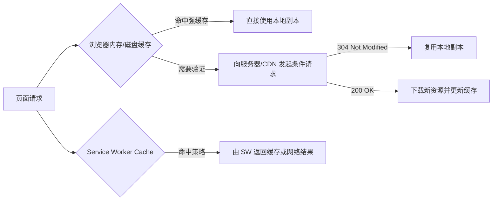

# HTTP 缓存：强缓存、协商缓存与 Service Worker

## 场景

你发布了一个前端应用。上线后出现几类典型问题：

- 用户刷新页面后仍然看到旧版本 JavaScript。
- 首页每次打开都重新下载同一批静态资源，首屏很慢。
- 接口数据明明更新了，但页面仍然显示旧数据。
- CDN 命中率很低，源站压力很高。
- PWA 或 Service Worker 上线后，用户版本更新不可控。

这些问题都和缓存策略有关。缓存不是简单地“让资源快一点”，它本质上是在性能、实时性、版本一致性和故障恢复之间做权衡。

## 是什么

HTTP 缓存是浏览器、代理、CDN 和服务器基于 HTTP Header 协商资源复用的一套机制。

前端常见缓存层次如下：



核心概念：

- 强缓存：浏览器在缓存有效期内不向服务器确认，直接使用本地缓存。
- 协商缓存：浏览器带条件请求问服务器资源是否变化，未变化返回 `304`。
- CDN 缓存：CDN 节点缓存资源，减少源站访问。
- Service Worker 缓存：由前端脚本控制的缓存层，可以自定义策略。

## 为什么需要

没有缓存，静态资源和重复接口每次都要重新下载，浪费带宽并拉长首屏时间。缓存配置不当，又会带来更严重的问题：用户拿不到新版本、接口数据过期、灰度期间资源版本混乱。

前端需要理解缓存，是因为前端产物有明显的版本特征：

- 带 hash 的 JS/CSS 文件内容变了文件名也变，适合长缓存。
- HTML 通常是入口文件，需要尽快感知新版本，不适合长强缓存。
- API 数据要按业务实时性设计缓存，不能照搬静态资源策略。
- Service Worker 能增强离线体验，但也可能让版本更新更复杂。

## 推荐做法

### 1. 静态资源使用内容 hash + 长强缓存

构建产物示例：

```text
assets/app.4f3a9c12.js
assets/vendor.91bd88a0.css
```

响应头：

```http
Cache-Control: public, max-age=31536000, immutable
```

文件名包含内容 hash 时，内容变化会生成新 URL。旧文件可以长期缓存，新版本通过新的 HTML 引用新文件。

### 2. HTML 使用短缓存或协商缓存

HTML 是版本入口。它决定加载哪些 JS/CSS 文件，不能长期强缓存。

```http
Cache-Control: no-cache
ETag: "html-v42"
```

`no-cache` 不是“不缓存”，而是可以存储，但使用前必须向服务器验证。

### 3. API 缓存按业务实时性设计

用户信息、权限、价格、库存、消息列表等数据实时性不同。缓存策略应该来自业务要求。

```http
Cache-Control: private, max-age=60
```

对于登录用户相关数据，通常不应该被共享缓存保存，使用 `private`。对于强实时数据，可以使用 `no-store`。

### 4. Service Worker 明确版本和更新策略

Service Worker 适合离线能力、弱网体验和资源预缓存，但必须设计更新策略。

```ts
self.addEventListener('activate', (event) => {
  event.waitUntil(
    caches.keys().then((keys) =>
      Promise.all(
        keys
          .filter((key) => key !== 'app-cache-v2')
          .map((key) => caches.delete(key))
      )
    )
  );
});
```

不要让旧缓存无限存在。升级时要清理旧版本，并告诉用户刷新或自动切换。

## 代码示例

下面是一个用于静态资源和 HTML 的 Nginx 配置示意。

```nginx
location /assets/ {
  add_header Cache-Control "public, max-age=31536000, immutable";
  try_files $uri =404;
}

location / {
  add_header Cache-Control "no-cache";
  try_files $uri /index.html;
}
```

接口侧可以按数据类型设置：

```ts
app.get('/api/public-config', (request, response) => {
  response.setHeader('Cache-Control', 'public, max-age=300, stale-while-revalidate=60');
  response.json(loadPublicConfig());
});

app.get('/api/me', (request, response) => {
  response.setHeader('Cache-Control', 'private, no-store');
  response.json(loadCurrentUser(request));
});
```

`public-config` 可以短时间共享缓存；`/api/me` 是用户私有数据，不应该被中间缓存保存。

## 反例与后果

### 反例 1：HTML 长强缓存

```http
Cache-Control: public, max-age=31536000
```

后果：用户长期使用旧 HTML，继续引用旧 JS/CSS。即使服务器已经发布新版本，用户也可能看不到更新。

### 反例 2：带 hash 静态资源不缓存

```http
Cache-Control: no-store
```

后果：每次访问都重新下载大体积 JS/CSS，首屏变慢，CDN 优势无法发挥。

### 反例 3：用户私有接口 public 缓存

```http
Cache-Control: public, max-age=600
```

后果：共享代理或 CDN 可能缓存用户私有数据，造成数据泄露风险。

### 反例 4：Service Worker 缓存不清理

```ts
caches.open('app-cache').then((cache) => cache.addAll(['/index.html', '/app.js']));
```

后果：缓存版本没有区分，旧资源可能长期存在，用户刷新也无法更新到新版本。

## 常见坑

- `no-cache` 表示使用前要验证，不等于不存储。
- `no-store` 才是尽量不存储，适合敏感数据或强实时数据。
- `ETag` 和 `Last-Modified` 都可用于协商缓存，`ETag` 精度通常更高。
- `immutable` 适合带 hash 的静态资源，不适合 HTML。
- CDN 可能覆盖或忽略源站缓存头，必须检查实际响应。
- Service Worker 的缓存优先级可能高于 HTTP 缓存排查直觉，要在 Application 面板检查。

## 排查与验证

### 看资源是否命中缓存

Chrome Network 面板里关注：

- Status 是否为 `200`、`304` 或 from memory/disk cache。
- Response Headers 的 `Cache-Control`、`ETag`、`Last-Modified`。
- Size 列是否显示 memory cache、disk cache。

### 看 CDN 是否命中

检查 CDN 自定义响应头，例如 `x-cache`、`cf-cache-status`、`x-cache-status`。不同 CDN 命名不同，以平台文档为准。

### 看用户为什么拿不到新版本

先检查 HTML 的缓存头，再检查 Service Worker 是否接管请求，最后检查 CDN 是否仍有旧 HTML。不要只看 JS 文件 hash。

### 看接口数据为什么旧

检查请求是否经过浏览器缓存、Service Worker、本地状态缓存、React Query/SWR 缓存、CDN 或后端缓存。接口旧数据不一定是 HTTP 缓存造成的。

## 面试怎么讲

30 秒版本：

> HTTP 缓存主要分强缓存和协商缓存。强缓存有效期内浏览器直接使用本地副本；协商缓存会带 `ETag` 或 `Last-Modified` 向服务器验证，未变化返回 304。前端静态资源通常用内容 hash 加长缓存，HTML 用短缓存或协商缓存。

1 分钟版本：

> 我会按资源类型设计缓存。带 hash 的 JS/CSS 可以 `max-age=31536000, immutable`，因为内容变化 URL 会变；HTML 是入口文件，应该 `no-cache` 或短缓存，保证能发现新版本；用户私有 API 不能 public 缓存，强实时数据可用 `no-store`。如果有 Service Worker，还要额外设计版本更新和旧缓存清理。

追问版本：

> 如果用户一直看到旧版本，我会从 HTML 缓存头开始查，再查 CDN 是否缓存旧 HTML，最后查 Service Worker 是否返回旧缓存。对于 304，我会确认 ETag 或 Last-Modified 是否正确变化。对于接口旧数据，我会区分 HTTP 缓存、前端内存缓存、数据请求库缓存和后端缓存，逐层验证。

## 延伸阅读

- [MDN: HTTP caching](https://developer.mozilla.org/en-US/docs/Web/HTTP/Caching)
- [MDN: Cache-Control](https://developer.mozilla.org/en-US/docs/Web/HTTP/Headers/Cache-Control)
- [MDN: ETag](https://developer.mozilla.org/en-US/docs/Web/HTTP/Headers/ETag)
- [web.dev: Service worker caching and HTTP caching](https://web.dev/articles/service-worker-caching-and-http-caching)
- [MDN: Cache API](https://developer.mozilla.org/en-US/docs/Web/API/Cache)
