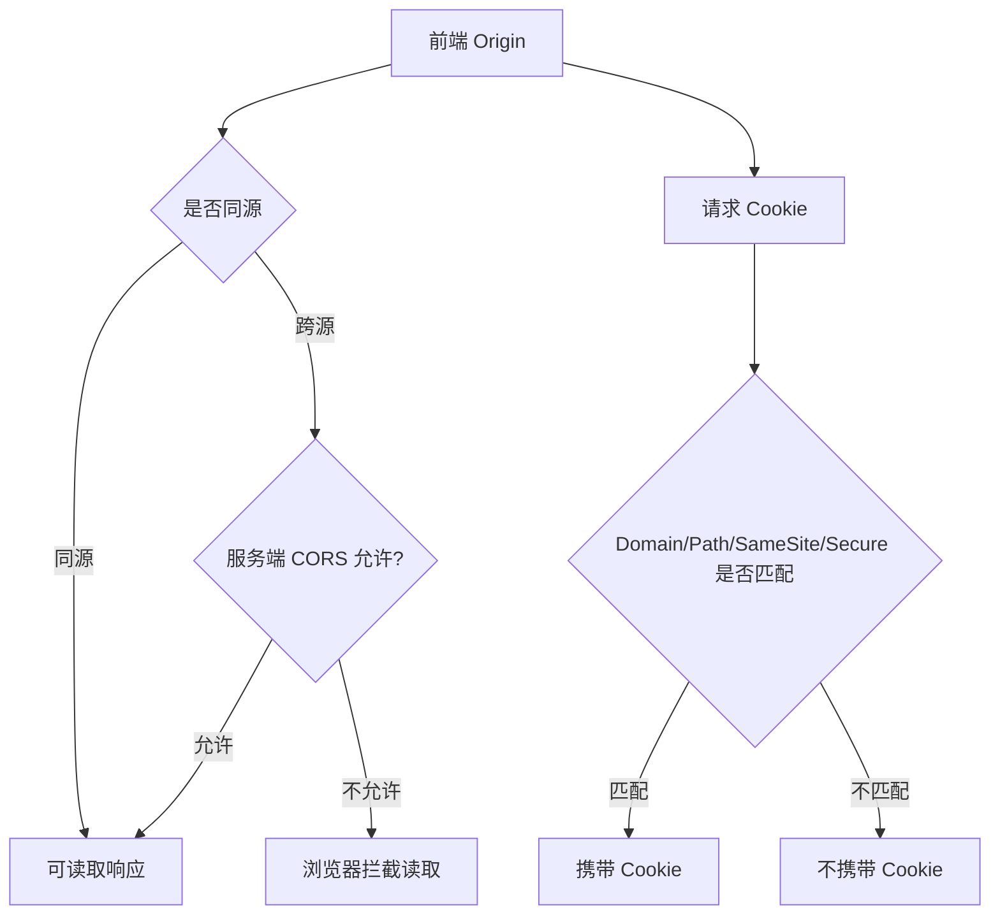

# 跨域与 CORS、Cookie、SameSite 和 Storage

## 场景

前端本地开发访问 `http://localhost:5173`，接口部署在 `https://api.example.com`。登录接口返回了 `Set-Cookie`，但浏览器后续请求没有带 Cookie；某个 POST 请求先发了 OPTIONS；线上 iframe 嵌入后登录态丢失；用户刷新后页面还能读到 localStorage 里的 token。

这些问题都和浏览器安全边界有关：同源策略、CORS、Cookie 发送规则和客户端存储。

## 是什么

同源策略限制一个 origin 的脚本读取另一个 origin 的响应。origin 由协议、域名和端口组成。

CORS 是服务端显式允许跨源读取响应的机制。它不是“让请求发出去”的机制，很多跨域请求已经发出，只是浏览器不允许前端读取结果。

Cookie 是浏览器按域名和路径自动携带的状态存储。SameSite 控制跨站请求是否携带 Cookie。Storage 包括 localStorage、sessionStorage、IndexedDB 等，由 JavaScript 主动读写。



## 为什么需要

浏览器默认不信任不同站点之间的脚本访问。如果没有同源策略，任意网站都可以读取用户在银行、邮箱或企业系统中的敏感数据。

CORS 和 Cookie 规则让服务端可以精确控制哪些前端能读取响应、哪些场景能携带登录态。Storage 则影响登录方案、缓存方案和安全风险。

## 推荐做法

### 1. 区分跨源和跨站

跨源看协议、域名、端口；跨站看可注册域名。`app.example.com` 和 `api.example.com` 是跨源，但通常是同站。SameSite 讨论的是跨站，不是跨源。

### 2. 带 Cookie 的 CORS 要同时配置前后端

前端要设置 credentials，服务端要允许具体 origin，不能用 `*`。

```ts
fetch('https://api.example.com/me', {
  credentials: 'include'
});
```

服务端响应示意：

```http
Access-Control-Allow-Origin: https://app.example.com
Access-Control-Allow-Credentials: true
Vary: Origin
```

### 3. 理解预检请求

非简单请求会先发送 OPTIONS 预检，例如自定义 header、`Content-Type: application/json`、PUT/DELETE。服务端必须正确响应允许的方法和 header。

```http
Access-Control-Allow-Methods: GET,POST,PUT,DELETE
Access-Control-Allow-Headers: content-type,authorization,x-request-id
Access-Control-Max-Age: 600
```

### 4. 登录态优先用 HttpOnly Cookie 承载

如果是传统 Web 登录态，优先考虑 `HttpOnly + Secure + SameSite` Cookie，降低 XSS 直接读取 token 的风险。前端不需要把访问令牌放进 localStorage。

### 5. Storage 按数据敏感度选择

- localStorage：长期保存，易用，但可被同源脚本读取，不适合敏感 token。
- sessionStorage：标签页级别，关闭标签页清除。
- IndexedDB：适合大量结构化数据、离线缓存。
- Cookie：自动随请求发送，适合服务端会话，但要控制 SameSite、Secure、HttpOnly。

## 代码示例

### Express CORS 配置

```ts
import cors from 'cors';
import express from 'express';

const app = express();
const allowedOrigins = new Set(['https://app.example.com', 'http://localhost:5173']);

app.use(
  cors({
    origin(origin, callback) {
      if (!origin || allowedOrigins.has(origin)) {
        callback(null, true);
        return;
      }

      callback(new Error('Not allowed by CORS'));
    },
    credentials: true,
    methods: ['GET', 'POST', 'PUT', 'DELETE'],
    allowedHeaders: ['content-type', 'authorization', 'x-request-id']
  })
);
```

### 设置安全 Cookie

```http
Set-Cookie: sid=opaque-session-id; Path=/; HttpOnly; Secure; SameSite=Lax; Max-Age=604800
```

第三方嵌入或跨站场景如果必须带 Cookie，通常需要：

```http
Set-Cookie: sid=opaque-session-id; Path=/; HttpOnly; Secure; SameSite=None
```

`SameSite=None` 必须配合 `Secure`，而且会受到浏览器第三方 Cookie 策略影响。

### 封装请求客户端

```ts
export async function request<T>(path: string, init: RequestInit = {}): Promise<T> {
  const response = await fetch(`${import.meta.env.VITE_API_BASE_URL}${path}`, {
    ...init,
    credentials: 'include',
    headers: {
      'content-type': 'application/json',
      ...init.headers
    }
  });

  if (!response.ok) {
    throw new Error(`Request failed: ${response.status}`);
  }

  return response.json() as Promise<T>;
}
```

## 反例与后果

### 反例 1：带凭证请求时服务端返回 `Access-Control-Allow-Origin: *`

后果：浏览器会拒绝响应，前端仍然拿不到数据。

### 反例 2：把长期 token 存在 localStorage

后果：一旦发生 XSS，攻击者可以直接读取并带走 token。

### 反例 3：用 CORS 当鉴权

后果：CORS 只限制浏览器读取响应，不能替代服务端鉴权。非浏览器客户端不受同样限制。

### 反例 4：不了解 SameSite 导致登录态丢失

后果：跨站跳转、iframe、第三方集成时 Cookie 不发送，表现为偶发未登录。

## 常见坑

- CORS 报错不一定代表请求没到服务端，要看 Network 面板。
- 预检请求不带业务 Cookie 是正常现象，不应该依赖 OPTIONS 做业务鉴权。
- `Access-Control-Allow-Headers` 必须覆盖前端实际发送的自定义 header。
- `SameSite=Lax` 对顶级 GET 导航较友好，但对 iframe 和部分跨站 POST 不发送。
- Cookie 的 Domain 设置过宽会扩大影响面，设置过窄会导致子域不可用。
- localStorage 是同步 API，大量读写会阻塞主线程。

## 排查与验证

### CORS 报错

先看 OPTIONS 是否成功，再看实际请求响应头。确认 `Origin`、`Access-Control-Allow-Origin`、`Access-Control-Allow-Credentials` 和 credentials 配置是否匹配。

### Cookie 没带上

在 Application 面板检查 Cookie 的 Domain、Path、Expires、Secure、SameSite。再看请求是否 HTTPS、是否跨站、fetch 是否设置 credentials。

### 登录态刷新丢失

确认登录态到底存在 Cookie、内存、localStorage 还是 sessionStorage。内存状态刷新必丢，sessionStorage 关闭标签页会丢。

### iframe 登录失败

检查 SameSite、第三方 Cookie 限制、Storage Access API、嵌入方和被嵌入方的域名关系。

## 面试怎么讲

30 秒版本：

> 同源策略限制跨源脚本读取响应，CORS 是服务端声明允许哪些 origin 读取响应。带 Cookie 的跨域请求需要前端 credentials 和服务端 Allow-Credentials，同时 Allow-Origin 不能是星号。Cookie 发送还受 Domain、Path、Secure、SameSite 影响。

1 分钟版本：

> 我会区分跨源和跨站。CORS 解决跨源响应读取，SameSite 控制跨站 Cookie 携带。登录态如果用 Cookie，建议 HttpOnly、Secure、合适的 SameSite；敏感 token 不放 localStorage，因为 XSS 能直接读取。排查时看 Network 的 Origin、预检响应头、实际请求响应头，以及 Application 面板里的 Cookie 属性。

追问版本：

> 如果问 CORS 是否安全机制，我会说它是浏览器侧的跨源读取控制，不是鉴权。服务端仍然必须做身份认证和权限校验，因为 curl、服务端请求或恶意客户端不依赖浏览器 CORS 保护。

## 延伸阅读

- [MDN: Same-origin policy](https://developer.mozilla.org/en-US/docs/Web/Security/Same-origin_policy)
- [MDN: CORS](https://developer.mozilla.org/en-US/docs/Web/HTTP/Guides/CORS)
- [MDN: Set-Cookie](https://developer.mozilla.org/en-US/docs/Web/HTTP/Headers/Set-Cookie)
- [web.dev: SameSite cookies explained](https://web.dev/articles/samesite-cookies-explained)
- [MDN: Web Storage API](https://developer.mozilla.org/en-US/docs/Web/API/Web_Storage_API)
