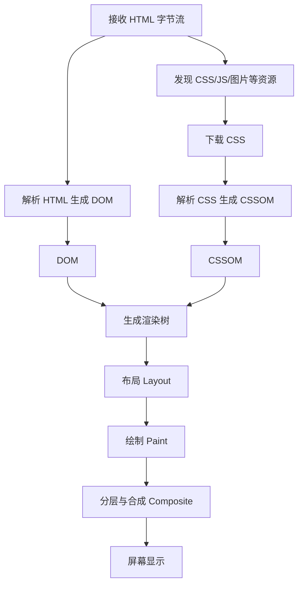

# 浏览器渲染流程：HTML/CSS/JS 如何变成页面

## 场景

你负责一个后台首页，用户反馈“白屏时间长、滚动卡、切换筛选条件时页面闪一下”。页面里有这些东西：

- 首屏 HTML、CSS、JavaScript bundle。
- 多张图片、图标字体和第三方统计脚本。
- 一个复杂表格和多个统计卡片。
- React 组件在接口返回后渲染列表。

如果只从框架层看，很容易把所有问题都归因于 React 重渲染。但浏览器真正展示页面前，还要经历网络下载、解析、样式计算、布局、绘制和合成。前端性能问题往往发生在这些环节的交界处。

## 是什么

浏览器渲染流程指的是浏览器把 HTML、CSS、JavaScript 和资源文件转成屏幕像素的过程。

核心链路可以简化为：



几个术语需要区分：

- DOM：HTML 解析后的节点树，描述文档结构。
- CSSOM：CSS 解析后的规则树，描述样式规则。
- 渲染树：DOM 和 CSSOM 结合后的可见节点树，不包含 `display: none` 的节点。
- Layout：计算每个盒子的尺寸和位置。
- Paint：把文字、颜色、边框、阴影等绘制成图层位图。
- Composite：把多个图层按顺序合成到屏幕。

## 为什么需要

理解渲染流程能帮助你解释很多真实问题。

首屏慢，可能不是 React 代码慢，而是 CSS 阻塞渲染、JavaScript bundle 太大、字体加载阻塞文本显示、图片没有尺寸导致布局抖动。

交互卡顿，可能不是某个组件写法差，而是事件处理里触发了大量同步布局，或者长任务占用了主线程，浏览器没有机会处理输入和绘制。

页面闪烁，可能是样式加载顺序、异步数据回来后布局高度变化、图片没有宽高、字体替换或 hydration 前后 DOM 不一致。

没有渲染流程的知识，优化容易变成“猜”。知道流程后，可以把问题定位到加载、脚本执行、样式计算、布局、绘制、合成或框架渲染中的具体环节。

## 推荐做法

### 1. 减少关键渲染路径上的阻塞资源

CSS 默认会阻塞渲染，因为浏览器需要 CSSOM 才能知道元素怎么显示。同步 JavaScript 也会阻塞 HTML 解析，因为脚本可能调用 `document.write` 或读取修改 DOM。

```html
<!-- 推荐：关键 CSS 保持小，非关键脚本延后执行 -->
<link rel="stylesheet" href="/styles/critical.css" />
<script src="/assets/main.js" defer></script>
```

`defer` 脚本会并行下载，等 HTML 解析完成后按顺序执行。对于不影响首屏的第三方脚本，通常应该延后加载。

### 2. 给图片和媒体稳定尺寸

没有尺寸的图片加载完成后会改变布局，造成 CLS。

```html

```

如果图片尺寸响应式变化，可以用 CSS 的 `aspect-ratio` 保持占位。

```css
.chartImage {
  aspect-ratio: 16 / 9;
  height: auto;
  max-width: 100%;
}
```

### 3. 避免强制同步布局

在同一个任务里交替读写布局信息，会迫使浏览器提前计算布局。

```tsx
function BadLayoutRead({ items }: { items: string[] }) {
  function handleClick() {
    const nodes = document.querySelectorAll('[data-row]');

    nodes.forEach((node) => {
      const height = (node as HTMLElement).offsetHeight;
      (node as HTMLElement).style.height = `${height + 4}px`;
    });
  }

  return <button onClick={handleClick}>Resize rows</button>;
}
```

更好的方式是批量读取，再批量写入，或者使用 CSS 完成布局变化。

```tsx
function BetterLayoutRead() {
  function handleClick() {
    const nodes = Array.from(document.querySelectorAll<HTMLElement>('[data-row]'));
    const heights = nodes.map((node) => node.offsetHeight);

    nodes.forEach((node, index) => {
      node.style.height = `${heights[index] + 4}px`;
    });
  }

  return <button onClick={handleClick}>Resize rows</button>;
}
```

### 4. 用 transform 和 opacity 做高频动画

改变 `width`、`height`、`top`、`left` 通常会触发布局或绘制。高频动画优先使用 `transform` 和 `opacity`，更容易走合成路径。

```css
.drawer {
  transform: translateX(100%);
  transition: transform 180ms ease;
}

.drawerOpen {
  transform: translateX(0);
}
```

这不是说 `transform` 永远免费，而是它通常比频繁触发布局的属性更可控。

## 代码示例

下面是一个非首屏卡片列表的写法，重点是让布局稳定、脚本不阻塞、图片懒加载、错误状态可恢复。首屏或 LCP 候选图片不应默认懒加载。

```tsx
type Product = {
  id: string;
  name: string;
  imageUrl: string;
  price: number;
};

function ProductGrid({ products }: { products: Product[] }) {
  if (products.length === 0) {
    return <p>No products found.</p>;
  }

  return (
    <ul className="productGrid">
      {products.map((product) => (
        <li className="productCard" key={product.id}>
          
          <h3>{product.name}</h3>
          <p>{product.price}</p>
        </li>
      ))}
    </ul>
  );
}
```

```css
.productGrid {
  display: grid;
  gap: 16px;
  grid-template-columns: repeat(auto-fit, minmax(240px, 1fr));
  list-style: none;
  margin: 0;
  padding: 0;
}

.productCard {
  border: 1px solid #ddd;
  border-radius: 8px;
  padding: 12px;
}

.productImage {
  aspect-ratio: 16 / 9;
  display: block;
  height: auto;
  object-fit: cover;
  width: 100%;
}
```

这个例子没有复杂技巧，但它避免了三个常见渲染问题：列表 key 不稳定、图片无尺寸导致布局抖动、CSS 布局缺少响应式约束。

## 反例与后果

### 反例 1：同步脚本阻塞 HTML 解析

```html
<head>
  <script src="/analytics-heavy.js"></script>
</head>
```

后果：浏览器解析 HTML 时遇到脚本会暂停，下载并执行脚本后才继续解析。首屏内容可能迟迟不能构建 DOM。

### 反例 2：图片没有尺寸

```html

```

后果：图片下载完成前浏览器不知道它占多少空间，加载后可能把下方内容挤开，造成 CLS 和用户误点。

### 反例 3：在滚动事件中频繁触发布局

```ts
window.addEventListener('scroll', () => {
  const top = element.getBoundingClientRect().top;
  element.style.height = `${top + 100}px`;
});
```

后果：滚动频率很高，同步读写布局会造成主线程压力，用户会感到滚动卡顿。

## 常见坑

- DOM 构建完成不代表页面已经绘制完成。
- CSS 不只是“样式文件”，它会影响首屏渲染路径。
- `display: none` 的元素不会进入渲染树，但 `visibility: hidden` 仍会占布局空间。
- 改变几何属性通常会触发布局，改变视觉属性可能只触发绘制，`transform` 和 `opacity` 更容易只走合成。
- 字体加载可能造成 FOIT 或 FOUT，需要根据业务选择 `font-display` 策略。
- React 重渲染只是 JavaScript 层工作，最终是否卡顿还取决于浏览器布局、绘制和合成成本。

## 排查与验证

### Chrome Performance

用 Performance 录制页面加载或交互，重点看：

- Main 线程是否有长任务。
- 是否频繁出现 Recalculate Style 和 Layout。
- Paint 和 Composite Layers 是否耗时异常。
- 交互期间是否有脚本阻塞输入响应。

### Lighthouse 和 Web Vitals

用 Lighthouse 看 LCP、CLS、TBT 等指标。线上还需要接入真实用户监控，因为本地机器和网络条件通常比真实用户好。

### Network 面板

检查关键 CSS、JS、字体、图片是否阻塞首屏。看资源体积、优先级、缓存命中和 waterfall 中的等待关系。

### Layout Shift 调试

Chrome DevTools 可以高亮 Layout Shift 区域。重点检查图片、广告位、异步插入内容、字体替换和骨架屏尺寸。

## 面试怎么讲

30 秒版本：

> 浏览器会先解析 HTML 生成 DOM，解析 CSS 生成 CSSOM，再结合生成渲染树。之后经过布局计算位置尺寸、绘制生成像素，最后把图层合成到屏幕。CSS 和同步 JS 都可能阻塞关键渲染路径。

1 分钟版本：

> 页面展示不是 DOM 一生成就结束。浏览器需要下载资源、构建 DOM 和 CSSOM、生成渲染树、布局、绘制和合成。性能问题要看发生在哪个阶段：首屏慢可能是关键资源阻塞，交互卡可能是主线程长任务或强制同步布局，页面抖动可能是图片无尺寸或字体替换。优化时我会用 Performance、Network 和 Web Vitals 先定位，再做针对性处理。

追问版本：

> 如果问回流和重绘，我会说布局会重新计算元素几何信息，成本通常更高；重绘只更新视觉像素；合成则是把已有图层组合起来。实际项目里我会避免在高频事件中交替读写布局，给媒体资源稳定尺寸，关键 CSS 控制体积，非关键脚本延后，并用真实指标验证优化效果。

## 延伸阅读

- [MDN: Critical rendering path](https://developer.mozilla.org/en-US/docs/Web/Performance/Critical_rendering_path)
- [web.dev: Rendering performance](https://web.dev/articles/rendering-performance)
- [web.dev: Optimize Cumulative Layout Shift](https://web.dev/articles/optimize-cls)
- [Chrome DevTools: Performance panel](https://developer.chrome.com/docs/devtools/performance)
- [MDN: HTMLScriptElement.defer](https://developer.mozilla.org/en-US/docs/Web/API/HTMLScriptElement/defer)
