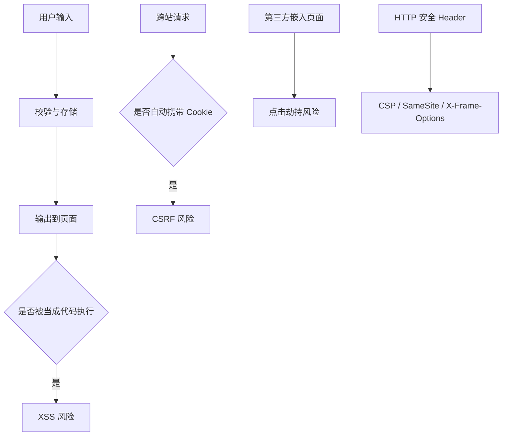

# Web 安全：XSS、CSRF、点击劫持、CSP 和 Cookie 安全属性

## 场景

你负责一个后台管理系统，里面有富文本公告、用户评论、文件预览、登录态 Cookie 和多个管理操作。安全问题通常不会在开发阶段自然暴露，但一旦出事，影响可能是账号被盗、越权操作、数据泄露或供应链脚本被利用。

前端最常被问到的安全问题包括：

- 用户输入如何导致 XSS？
- 为什么有 Cookie 登录态时要防 CSRF？
- `HttpOnly`、`Secure`、`SameSite` 分别解决什么问题？
- CSP 能防什么，不能防什么？
- iframe 嵌入为什么会有点击劫持风险？

## 是什么

前端安全不是只靠前端代码解决，而是浏览器机制、服务端策略、HTTP Header、输入输出处理和鉴权设计一起构成的防线。



常见风险：

- XSS：攻击者把恶意脚本注入页面并执行。
- CSRF：攻击者诱导用户浏览器带着登录态发起非预期请求。
- 点击劫持：攻击者把页面放进透明 iframe，诱导用户点击。
- 敏感信息泄露：Token、Cookie、Source Map、错误日志或第三方脚本泄露数据。

## 为什么需要

浏览器为了便利性提供了很多自动能力：自动解析 HTML、自动执行脚本、自动携带 Cookie、允许嵌入 iframe。这些能力如果缺少边界，就会被攻击者利用。

安全设计的目标不是“永远不出问题”，而是降低攻击面，并让单点失误不至于直接变成严重事故。

例如：即使页面某处出现 XSS，如果 Cookie 设置了 `HttpOnly`，攻击脚本也不能直接读取 Cookie；如果配置了 CSP，外部恶意脚本执行会被限制；如果敏感操作要求 CSRF Token 或 SameSite Cookie，跨站伪造请求更难成功。

## 推荐做法

### 1. XSS：默认转义，谨慎 HTML 注入

React 默认会转义文本内容。

```tsx
function Comment({ content }: { content: string }) {
  return <p>{content}</p>;
}
```

如果必须渲染富文本，要使用可信的 HTML sanitizer，并限制允许标签和属性。

```tsx
import DOMPurify from 'dompurify';

function RichText({ html }: { html: string }) {
  return (
    <article
      dangerouslySetInnerHTML={{ __html: DOMPurify.sanitize(html) }}
    />
  );
}
```

### 2. Cookie 登录态使用安全属性

```http
Set-Cookie: session=abc; HttpOnly; Secure; SameSite=Lax; Path=/
```

- `HttpOnly`：禁止 JavaScript 读取 Cookie，降低 XSS 盗取 Cookie 的风险。
- `Secure`：只在 HTTPS 下发送。
- `SameSite`：限制跨站请求携带 Cookie，降低 CSRF 风险。

### 3. CSRF：SameSite + Token + 幂等语义

对于会改变数据的请求，不要只依赖 Cookie。可以加 CSRF Token，并确保服务端校验 Origin/Referer。

```ts
async function submitTransfer(input: TransferInput, csrfToken: string) {
  return fetch('/api/transfer', {
    method: 'POST',
    credentials: 'include',
    headers: {
      'Content-Type': 'application/json',
      'X-CSRF-Token': csrfToken
    },
    body: JSON.stringify(input)
  });
}
```

### 4. CSP 降低脚本执行风险

```http
Content-Security-Policy: default-src 'self'; script-src 'self'; object-src 'none'; base-uri 'self'; frame-ancestors 'none'
```

CSP 可以限制脚本、样式、图片、iframe 等资源来源。实际项目里要结合第三方脚本逐步收紧，并监控 violation report。

### 5. 点击劫持：禁止被未授权 iframe 嵌入

```http
X-Frame-Options: DENY
Content-Security-Policy: frame-ancestors 'none'
```

如果业务需要被特定域嵌入，用 `frame-ancestors` 配置明确 allowlist。

## 代码示例

下面是 Express 中常见安全 Header 的示意配置。

```ts
app.use((request, response, next) => {
  response.setHeader('X-Content-Type-Options', 'nosniff');
  response.setHeader('Referrer-Policy', 'strict-origin-when-cross-origin');
  response.setHeader('Content-Security-Policy', [
    "default-src 'self'",
    "script-src 'self'",
    "object-src 'none'",
    "base-uri 'self'",
    "frame-ancestors 'none'"
  ].join('; '));
  next();
});

app.post('/api/profile', validateCsrfToken, updateProfileHandler);
```

真实项目中不要直接复制这段 CSP，需要根据静态资源域名、监控 SDK、图片 CDN、字体域名和 iframe 需求调整。

## 反例与后果

### 反例 1：直接渲染用户输入 HTML

```tsx
function BadPreview({ html }: { html: string }) {
  return <div dangerouslySetInnerHTML={{ __html: html }} />;
}
```

后果：攻击者可以注入脚本，读取页面信息、发起操作或冒充用户行为。

### 反例 2：Token 存 localStorage 且页面存在 XSS

后果：攻击脚本可以直接读取 Token 并发送到攻击者服务器。localStorage 不是敏感凭证的安全保险箱。

### 反例 3：敏感操作只靠 Cookie

后果：如果 SameSite 配置不当，攻击者可能诱导用户浏览器跨站发起带 Cookie 的请求。

### 反例 4：允许任意域 iframe 嵌入

后果：攻击页面可以用透明遮罩诱导用户点击真实按钮，造成非预期操作。

## 常见坑

- 前端校验不能替代服务端校验。
- React 默认转义文本，但 `dangerouslySetInnerHTML` 会绕过保护。
- CSP 不能修复所有 XSS，只是降低执行面和影响面。
- `SameSite=None` 必须配合 `Secure`。
- CORS 不是安全访问控制的完整方案，它主要约束浏览器读取跨域响应。
- 第三方脚本拥有页面执行权，要控制来源、权限和加载时机。

## 排查与验证

### XSS 验证

对输入点测试 HTML、事件属性、URL 协议和富文本边界。检查输出是否被转义或 sanitizer 处理。

### CSRF 验证

构造跨站表单或 fetch 场景，确认敏感请求是否需要 CSRF Token，Cookie 的 SameSite 是否符合预期。

### Header 检查

用 Network 面板检查 CSP、X-Frame-Options、Set-Cookie、Referrer-Policy、X-Content-Type-Options。

### 线上监控

逐步启用 CSP report-only，收集 violation，再切到 enforce。避免一次性上线过严策略导致业务脚本失效。

## 面试怎么讲

30 秒版本：

> 前端常见安全问题主要有 XSS、CSRF 和点击劫持。XSS 是恶意脚本被注入并执行，核心防护是输出转义、HTML sanitizer 和 CSP；CSRF 是利用浏览器自动携带 Cookie 发起请求，防护靠 SameSite、CSRF Token 和服务端校验；点击劫持用 frame-ancestors 或 X-Frame-Options 限制嵌入。

1 分钟版本：

> 我会把安全当成多层防线。用户输入默认不可信，输出到页面要转义；必须渲染富文本时用 sanitizer。Cookie 登录态要设置 HttpOnly、Secure、SameSite。敏感操作需要 CSRF Token，服务端校验 Origin 或 Referer。CSP 用来限制脚本来源和 iframe 嵌入，即使出现单点问题也降低影响面。

追问版本：

> 如果问 Token 存哪里，我会先区分威胁模型。localStorage 容易被 XSS 读取，HttpOnly Cookie 不能被 JS 读取但要处理 CSRF。没有绝对通用答案，关键是配合 XSS 防护、SameSite、CSRF Token、短过期、刷新机制和服务端风控。

## 延伸阅读

- [OWASP: Cross Site Scripting](https://owasp.org/www-community/attacks/xss/)
- [OWASP: Cross-Site Request Forgery](https://owasp.org/www-community/attacks/csrf)
- [MDN: Content-Security-Policy](https://developer.mozilla.org/en-US/docs/Web/HTTP/Headers/Content-Security-Policy)
- [MDN: Set-Cookie](https://developer.mozilla.org/en-US/docs/Web/HTTP/Headers/Set-Cookie)
- [MDN: X-Frame-Options](https://developer.mozilla.org/en-US/docs/Web/HTTP/Headers/X-Frame-Options)
