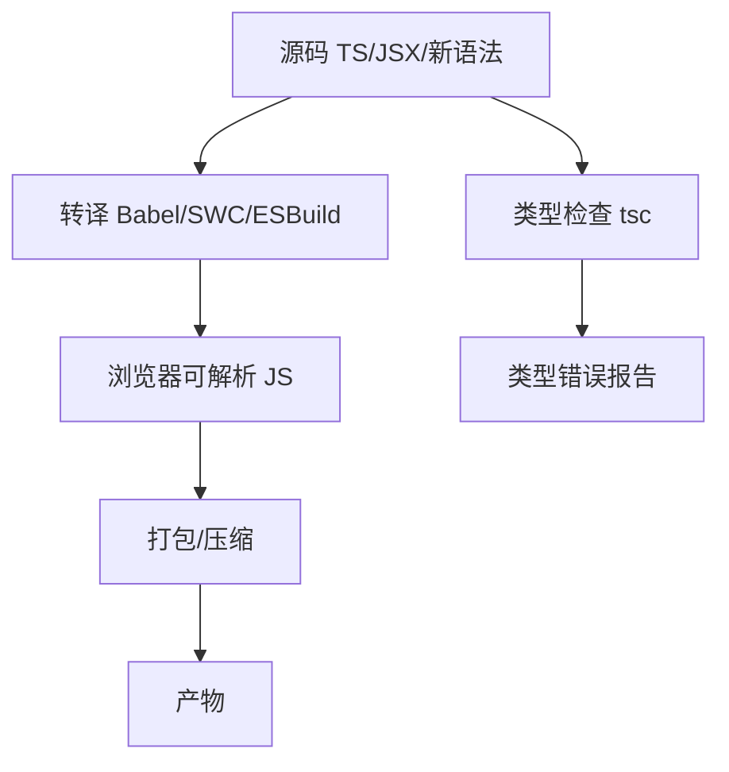

# Babel、SWC、ESBuild 和 TypeScript 编译边界

## 场景

项目构建很快，但 CI 上才发现类型错误；本地能跑，低版本浏览器线上报语法错误；用了 Babel 之后以为 TypeScript 类型也被检查了。前端工具链里“编译”这个词经常混用，导致职责边界不清。

要排查这类问题，需要区分：语法转译、类型检查、polyfill 注入、打包优化和压缩分别是谁负责。

## 是什么

常见工具职责：

- Babel：JavaScript/JSX 语法转译，插件生态强。
- SWC：Rust 实现的快速转译和压缩工具。
- ESBuild：Go 实现的快速转译、打包和压缩工具。
- TypeScript tsc：类型检查和 TS 编译，也可只 emit 声明文件。



## 为什么需要

很多现代构建工具为了速度，会用 SWC 或 ESBuild 做转译，但不做完整类型检查。这意味着 `vite build` 能成功，不代表 TypeScript 类型完全正确。

同样，语法转译也不等于 polyfill。把可选链转成旧语法，不代表浏览器自动支持 `Promise.allSettled` 或 `Array.prototype.at`。

## 推荐做法

### 1. CI 单独运行 typecheck

```json
{
  "scripts": {
    "typecheck": "tsc --noEmit",
    "build": "vite build"
  }
}
```

不要把“构建通过”当成“类型正确”。

### 2. 明确目标浏览器

```json
{
  "browserslist": [">0.5%", "last 2 versions", "not dead"]
}
```

目标环境决定是否需要转译某些语法和注入 polyfill。

### 3. 区分语法降级和 API polyfill

```ts
const value = user?.profile?.name;
```

这种语法可以被转译。但如果使用：

```ts
Promise.allSettled(tasks);
```

旧浏览器需要对应 polyfill，单纯转译不一定解决。

### 4. 库项目生成声明文件

```json
{
  "scripts": {
    "build:types": "tsc --emitDeclarationOnly"
  }
}
```

组件库或工具库要输出 `.d.ts`，让使用方获得类型信息。

## 代码示例

一个 Vite 项目常见脚本：

```json
{
  "scripts": {
    "dev": "vite",
    "build": "vite build",
    "typecheck": "tsc --noEmit",
    "verify": "npm run typecheck && npm run build"
  }
}
```

这样能同时覆盖快速构建和完整类型检查。

## 反例与后果

### 反例 1：只用 ESBuild 转译 TypeScript

后果：类型错误不会阻塞构建。ESBuild 会擦除类型并输出 JS。

### 反例 2：以为 Babel 自动补全部 API

后果：旧浏览器遇到新 API 报错。需要 core-js、按需 polyfill 或限制目标环境。

### 反例 3：库不输出声明文件

后果：使用方只能得到 any 或缺失类型，TypeScript 价值下降。

## 常见坑

- Babel/SWC/ESBuild 通常只做转译，不等价于完整类型检查。
- `tsc --noEmit` 适合应用项目做类型检查。
- Polyfill 会增加体积，要按目标环境和使用 API 控制。
- 不同工具对 decorators、class fields 等提案支持可能有差异。
- Source Map 要和转译链路匹配，否则线上定位会偏移。

## 排查与验证

### 类型错误漏到主分支

检查 CI 是否运行 `tsc --noEmit`，以及 tsconfig 是否覆盖了所有源码。

### 旧浏览器报错

检查报错语法或 API。语法问题看 target 和转译配置，API 问题看 polyfill。

### 构建结果和预期不一致

检查工具链顺序：TypeScript、Babel/SWC、PostCSS、打包器和压缩器是否重复或遗漏处理。

## 面试怎么讲

30 秒版本：

> Babel、SWC、ESBuild 主要做语法转译和部分优化，TypeScript 的 tsc 才负责完整类型检查。现代构建为了速度常用 ESBuild/SWC 转译 TS，所以 CI 里要单独跑 `tsc --noEmit`。

1 分钟版本：

> 我会把工具链拆成几层：语法转译、类型检查、polyfill、打包和压缩。转译解决浏览器是否能解析语法，polyfill 解决运行时 API 是否存在，类型检查解决 TS 类型正确性。不同工具侧重点不同，不能把 build 通过等同于所有检查通过。

追问版本：

> 如果问 Babel 和 polyfill，我会说 Babel 默认主要处理语法，比如可选链、箭头函数；像 Promise.allSettled 这种 API 需要 polyfill。是否注入 polyfill 要根据 browserslist、core-js 和使用策略决定，否则会在兼容性和包体积之间失控。

## 延伸阅读

- [Babel Docs](https://babeljs.io/docs/)
- [SWC Docs](https://swc.rs/docs/getting-started)
- [ESBuild Docs](https://esbuild.github.io/)
- [TypeScript Compiler Options](https://www.typescriptlang.org/tsconfig/)
