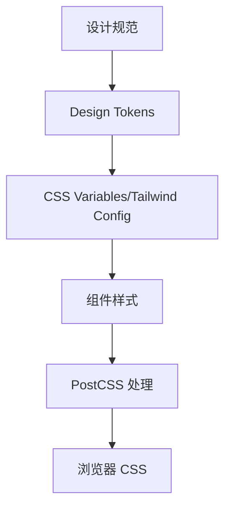

# CSS 工程化：PostCSS、CSS Modules、Tailwind 和样式隔离

## 场景

项目变大后，样式问题不再只是写 CSS：全局样式互相覆盖、组件库主题难统一、移动端兼容要加前缀、设计 token 和业务样式脱节。CSS 工程化要解决的是团队如何稳定、可维护地写样式。

## 是什么

CSS 工程化是一组工具和约定：

- PostCSS：CSS 转换管线，例如 autoprefixer、preset-env。
- CSS Modules：局部作用域 class，减少全局冲突。
- Tailwind：原子化工具类，提升约束和组合效率。
- Design Tokens：颜色、字号、间距、圆角等设计变量。
- 样式隔离：控制样式影响范围。



## 为什么需要

没有工程化约束，CSS 很容易变成全局共享状态。一个页面的 reset 影响另一个页面，一个组件的样式依赖父级结构，主题切换要改大量文件。工程化的目标是降低样式冲突、提高复用、保证设计一致性。

## 推荐做法

### 1. 用 PostCSS 处理兼容和未来语法

```js
module.exports = {
  plugins: {
    'postcss-preset-env': {},
    autoprefixer: {}
  }
};
```

兼容范围应由 browserslist 决定，不要手写大量前缀。

### 2. 组件样式用 CSS Modules 隔离

```css
.root {
  display: grid;
  gap: var(--space-3);
}
```

```tsx
import styles from './Card.module.css';

export function Card({ children }: { children: React.ReactNode }) {
  return <section className={styles.root}>{children}</section>;
}
```

### 3. Tailwind 适合约束化快速组合

Tailwind 的价值不是少写 CSS，而是把设计约束变成工具类系统。适合后台、运营页面和高频组合 UI。

### 4. Token 用 CSS 变量承载运行时主题

```css
:root {
  --color-primary: #1677ff;
  --space-3: 12px;
}

[data-theme='dark'] {
  --color-primary: #69b1ff;
}
```

CSS 变量天然支持运行时切换主题。

## 代码示例

组件库 token 到组件样式：

```css
.button {
  background: var(--color-primary);
  border-radius: var(--radius-md);
  color: var(--color-on-primary);
  padding: var(--space-2) var(--space-3);
}
```

这样设计变量改变时，组件自动跟随。

## 反例与后果

### 反例 1：全局 class 命名随意

后果：`.title`、`.content` 这类类名很容易冲突。

### 反例 2：组件内部写死颜色

后果：主题切换和设计调整要改大量组件。

### 反例 3：Tailwind 和自定义 CSS 无边界混用

后果：同一规则多个来源，排查覆盖困难。

## 常见坑

- CSS Modules 不隔离 CSS 变量和全局选择器。
- Tailwind 要配合设计约束，否则会变成散乱工具类。
- Token 要区分语义 token 和基础 token，例如 primary vs blue-500。
- CSS-in-JS 可能带来运行时成本和 SSR 样式顺序问题。

## 排查与验证

### 样式冲突

用 DevTools 查看最终规则来源，确认是否全局选择器或加载顺序导致覆盖。

### 主题不一致

检查组件是否绕过 token 写死颜色、间距和字号。

### 构建后样式缺失

检查 CSS Modules class 名、Tailwind content 扫描范围和 purge 配置。

## 面试怎么讲

30 秒版本：

> CSS 工程化解决样式冲突、兼容处理、主题一致性和团队协作问题。PostCSS 处理转换，CSS Modules 做局部隔离，Tailwind 提供约束化工具类，Design Token 统一设计变量。

1 分钟版本：

> 我会按项目特点选择方案。组件库更重视 token、主题和样式隔离；业务后台可以用 Tailwind 提升组合效率；普通组件用 CSS Modules 避免全局污染。PostCSS 和 browserslist 负责兼容处理。关键是有边界和规范，而不是工具越多越好。

追问版本：

> 如果问 Tailwind 和 CSS Modules 取舍，我会说 Tailwind 适合快速组合和统一设计约束，CSS Modules 适合组件局部样式和复杂选择器。两者可以共存，但要明确哪些场景用工具类，哪些场景写模块 CSS，避免重复覆盖。

## 延伸阅读

- [PostCSS](https://postcss.org/)
- [Autoprefixer](https://github.com/postcss/autoprefixer)
- [CSS Modules](https://github.com/css-modules/css-modules)
- [Tailwind CSS](https://tailwindcss.com/docs)
