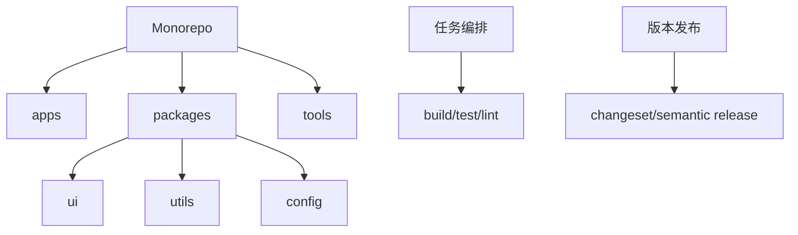

# Monorepo、包管理器、依赖版本治理和发布策略

## 场景

一个团队维护多个前端应用、组件库、工具包和业务 SDK。多个仓库时，跨仓库改动难协调，组件库升级慢，版本不一致。改成 Monorepo 后，又遇到依赖提升、构建缓存、发布顺序和权限边界问题。

Monorepo 不是银弹，它解决协作和共享问题，同时引入工程治理成本。

## 是什么

Monorepo 是把多个项目或包放在同一个仓库中管理。常见配套能力包括 workspace、任务编排、增量构建、版本发布和依赖治理。



常见工具：pnpm workspace、npm/yarn workspace、Turborepo、Nx、Changesets。

## 为什么需要

Monorepo 适合多项目共享代码且需要原子变更的团队。例如组件库 API 改动可以和业务应用改动在同一个 PR 中完成，CI 可以只测试受影响项目。

如果项目之间关系弱，或者团队没有构建缓存、权限、发布流程治理，Monorepo 可能变成更大的混乱仓库。

## 推荐做法

### 1. 用 workspace 明确包边界

```yaml
packages:
  - apps/*
  - packages/*
  - tools/*
```

每个 package 都应该有清晰职责，不要所有代码都放进 shared。

### 2. 统一基础配置

```text
packages/
  tsconfig/
  eslint-config/
  ui/
  utils/
apps/
  admin/
  portal/
```

把 TypeScript、ESLint、构建配置沉淀为内部包，减少复制粘贴。

### 3. 控制依赖版本

同一个依赖在多个应用里版本漂移，会导致包体积、类型和运行时问题。使用 package manager 的 overrides 或 constraints 控制关键依赖。

```json
{
  "pnpm": {
    "overrides": {
      "react": "18.3.1"
    }
  }
}
```

### 4. 发布使用 changeset

```bash
pnpm changeset
pnpm changeset version
pnpm changeset publish
```

Changesets 能记录每个包的版本变化和 changelog，适合组件库、SDK、工具包发布。

## 代码示例

一个 package 的依赖声明：

```json
{
  "name": "@acme/ui",
  "version": "1.2.0",
  "main": "dist/index.cjs",
  "module": "dist/index.js",
  "types": "dist/index.d.ts",
  "peerDependencies": {
    "react": ">=18"
  }
}
```

组件库应该把 React 放在 peerDependencies，避免使用方打进多份 React。

## 反例与后果

### 反例 1：shared 包无边界

后果：所有业务都往 shared 塞代码，依赖方向混乱，任何改动影响全仓库。

### 反例 2：组件库依赖 React dependencies

后果：应用可能出现多份 React，导致 hooks 错误或包体积膨胀。

### 反例 3：全量 CI

后果：仓库变大后 CI 变慢。应按受影响范围增量执行。

## 常见坑

- Monorepo 不等于没有模块边界。
- 依赖提升可能掩盖某个包缺少依赖声明的问题。
- 内部包循环依赖会让构建和发布顺序复杂。
- peerDependencies、dependencies、devDependencies 要分清。
- 发布策略要明确固定版本还是独立版本。

## 排查与验证

### 依赖缺失

在干净环境安装构建，检查包是否依赖了未声明的提升依赖。

### CI 慢

检查是否全量跑所有任务。引入 affected graph、缓存和任务并行。

### 版本冲突

用 lockfile 和 package manager why 命令检查同一依赖是否出现多个版本。

## 面试怎么讲

30 秒版本：

> Monorepo 把多个应用和包放在一个仓库中，适合共享代码和原子变更。它需要 workspace、任务编排、增量 CI、依赖治理和发布策略配套，否则容易变成大仓库混乱。

1 分钟版本：

> 我会先看项目之间是否有强共享和协同发布需求。Monorepo 里要明确 apps、packages、tools 边界，公共配置抽成内部包，CI 只跑受影响项目，组件库用 peerDependencies 管 React 这类宿主依赖，发布用 changeset 记录版本和 changelog。

追问版本：

> 如果问 pnpm 的价值，我会说它通过内容寻址存储和严格 node_modules 结构减少重复安装，并更容易暴露幽灵依赖。对 Monorepo 来说，workspace 协议和依赖隔离能帮助治理包边界。

## 延伸阅读

- [pnpm Workspaces](https://pnpm.io/workspaces)
- [Turborepo Docs](https://turbo.build/repo/docs)
- [Nx Docs](https://nx.dev/)
- [Changesets](https://github.com/changesets/changesets)
