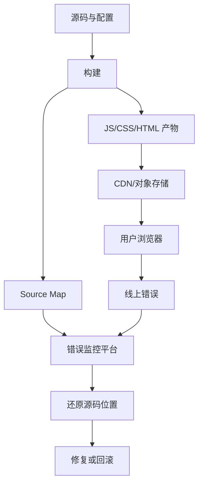
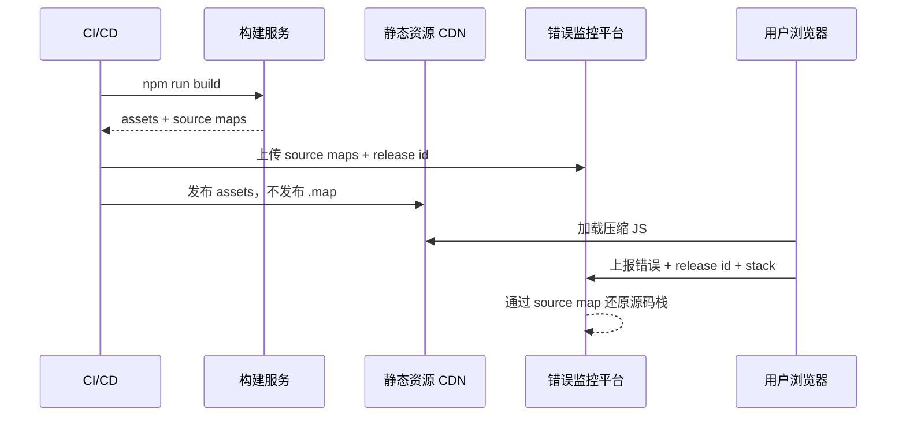

# Source Map、环境变量、构建产物分析和发布回滚

## 场景

一个 React 应用上线后，监控平台开始出现大量 `Minified React error #418`、`Cannot read properties of undefined`。线上文件是压缩后的 `assets/index-a8f3c1.js`，报错行列只能定位到一行几万列的 bundle。与此同时，灰度环境能正常访问，正式环境接口却指向了测试域名。此时需要同时回答三个问题：错误代码来自哪里，构建产物是否异常，能否快速回滚到上一个稳定版本。

## 是什么

Source Map 是构建产物和源码之间的映射文件。浏览器或监控平台可以通过它把压缩后的行列号还原到源码文件、函数和位置。

环境变量是构建和运行时配置的输入，例如 API Base URL、功能开关、部署环境、监控 DSN。前端环境变量通常会被打进静态产物，所以它不是秘密管理工具。

构建产物分析是观察 bundle 大小、模块组成、重复依赖、拆包结果和资源加载顺序的过程。发布回滚是当线上版本异常时，将流量或静态资源版本切回稳定版本的机制。



## 为什么需要

前端发布的本质是把源码转换成一组静态资源，并通过 CDN、HTML 模板、服务端路由或网关分发给用户。只要任一环节缺少版本、配置或可观测性，线上问题就会变得难以定位。

没有 Source Map，线上错误只能靠猜。没有环境变量边界，测试配置可能泄露到生产。没有产物分析，依赖膨胀和错误拆包会悄悄拖慢首屏。没有回滚机制，小问题也可能演变成长时间故障。

## 推荐做法

### 1. Source Map 只上传到监控平台，不直接公开

生产环境建议生成 Source Map，但不要让用户直接从 CDN 下载。更稳妥的做法是构建后上传到 Sentry、Datadog、Bugsnag 等平台，并在上传完成后删除或不发布 `.map` 文件。



### 2. 用 release id 贯穿构建、监控和回滚

每次构建都应该有唯一版本号，例如 Git commit SHA、CI build number 或语义化版本。这个版本号要写入产物、监控初始化和发布记录。

```ts
export const release = {
  version: import.meta.env.VITE_APP_VERSION,
  commit: import.meta.env.VITE_GIT_SHA,
  env: import.meta.env.MODE
};
```

线上报错时，先根据 release id 确认用户访问的是哪一次构建，再用对应 Source Map 还原堆栈。回滚时也应该回滚到明确版本，而不是重新构建一次“看起来一样”的代码。

### 3. 明确构建时变量和运行时变量

前端环境变量有两类：

- 构建时变量：构建时被替换进代码，例如 `import.meta.env.VITE_API_BASE_URL`。
- 运行时变量：页面加载后从 HTML、配置接口或全局对象读取，例如 `window.__APP_CONFIG__`。

构建时变量适合不会频繁变化的配置。运行时变量适合灰度开关、接口域名、租户配置等需要不重新构建就能调整的内容。

### 4. 每次发布前检查产物体积和拆包结果

构建分析至少关注：入口 chunk 是否过大、是否引入重复依赖、是否把管理后台代码打进公共包、是否意外引入全量 locale 或图标库。

### 5. 回滚要优先切版本，不优先重新发布

前端回滚常见方式：

- HTML 入口回滚到上一版本资源引用。
- CDN 静态资源按版本目录保留，切换当前版本指针。
- 灰度系统把流量切回旧版本。
- 功能开关关闭新功能。

如果错误来自配置或功能开关，优先调整运行时配置。如果错误来自构建产物或代码，优先回滚入口版本。

## 代码示例

Vite 中注入版本信息：

```ts
// vite.config.ts
import { defineConfig } from 'vite';
import react from '@vitejs/plugin-react';
import { execSync } from 'node:child_process';

const gitSha = execSync('git rev-parse --short HEAD').toString().trim();

export default defineConfig({
  plugins: [react()],
  define: {
    __APP_VERSION__: JSON.stringify(process.env.npm_package_version),
    __GIT_SHA__: JSON.stringify(gitSha)
  },
  build: {
    sourcemap: true,
    rollupOptions: {
      output: {
        manualChunks: {
          react: ['react', 'react-dom']
        }
      }
    }
  }
});
```

监控初始化时带上 release：

```ts
import * as Sentry from '@sentry/react';

declare const __APP_VERSION__: string;
declare const __GIT_SHA__: string;

Sentry.init({
  dsn: import.meta.env.VITE_SENTRY_DSN,
  environment: import.meta.env.MODE,
  release: `${__APP_VERSION__}-${__GIT_SHA__}`,
  tracesSampleRate: 0.1
});
```

运行时配置示例：

```html
<script>
  window.__APP_CONFIG__ = {
    apiBaseUrl: 'https://api.example.com',
    featureFlags: {
      newCheckout: false
    }
  };
</script>
```

```ts
type AppConfig = {
  apiBaseUrl: string;
  featureFlags: Record<string, boolean>;
};

export function getAppConfig(): AppConfig {
  return window.__APP_CONFIG__;
}
```

## 反例与后果

### 反例 1：把 `.map` 文件直接发布到公网

后果：源码结构、内部注释、接口路径和业务逻辑可能被直接查看。即使代码不是密钥，也会扩大攻击面。

### 反例 2：把密钥写进前端环境变量

后果：前端产物可以被用户下载，任何打包进 JS 的 token 都等同于公开。

### 反例 3：线上异常后重新构建旧 commit 发布

后果：依赖解析、构建时间、环境变量都可能变化，生成的产物不一定等于原来的稳定版本。

### 反例 4：只看 gzip 总大小，不看模块组成

后果：公共 chunk 可能被无关页面污染，首屏加载变慢却难以发现根因。

## 常见坑

- `sourceMappingURL` 指向公网 `.map`，导致 Source Map 暴露。
- Source Map 上传时 release id 和运行时代码里的 release id 不一致，监控平台无法还原。
- 使用 `VITE_`、`NEXT_PUBLIC_`、`REACT_APP_` 前缀的变量都会进入客户端，不能放密钥。
- CDN 缓存 HTML 时间过长，回滚入口后用户仍拿到旧 HTML。
- 构建产物使用 hash 文件名，但 HTML 没有版本化，导致资源引用和缓存策略不一致。
- 灰度版本和正式版本共用同一份运行时配置，排查时难以区分。

## 排查与验证

### 线上错误无法还原源码

检查错误事件里的 release、dist、文件 URL、行列号是否和上传的 Source Map 对应。再检查构建后文件是否被 CDN 或压缩工具二次改写。

### 生产接口指向错误环境

先在浏览器 Network 面板确认实际请求域名，再查构建产物中的配置来源。如果配置来自构建时变量，需要重新发布；如果来自运行时配置，可以直接切配置并刷新缓存。

### 产物突然变大

用 bundle analyzer 对比两次构建，重点查新增的大依赖、重复版本、全量导入和公共 chunk 污染。再检查是否关闭了 tree shaking 或误用了 CommonJS 包。

### 回滚是否生效

验证入口 HTML 的资源 URL、应用里展示的 release id、监控平台新事件版本、CDN 命中情况。只看到代码仓库回到旧 commit 不代表用户已经访问旧版本。

## 面试怎么讲

30 秒版本：

> Source Map 用来把线上压缩代码的错误堆栈还原到源码。生产环境可以生成，但应该上传到监控平台，不直接公开。发布时我会用 release id 串起构建产物、Source Map、监控和回滚，这样线上问题能定位到具体版本。

1 分钟版本：

> 我会把前端发布看成可观测、可追溯、可回滚的静态资源发布链路。环境变量分构建时和运行时，密钥不能进客户端；构建后要分析 bundle，避免入口过大和重复依赖；Source Map 只上传到监控平台，release id 必须和运行时代码一致。回滚时优先切回旧版本入口或灰度流量，而不是重新构建旧代码。

追问版本：

> 如果问为什么不要公开 Source Map，我会强调它会暴露源码结构和业务细节。我的做法是构建生成 Source Map，CI 上传到监控平台，CDN 只发布压缩资源。监控事件带 release 和文件 URL，平台用对应 Source Map 还原堆栈。这样兼顾线上排障和安全边界。

## 延伸阅读

- [MDN: Source map](https://developer.mozilla.org/en-US/docs/Glossary/Source_map)
- [Vite: Env Variables and Modes](https://vite.dev/guide/env-and-mode)
- [Vite: Build Options](https://vite.dev/config/build-options)
- [Sentry: Source Maps](https://docs.sentry.io/platforms/javascript/sourcemaps/)
- [webpack-bundle-analyzer](https://github.com/webpack-contrib/webpack-bundle-analyzer)
