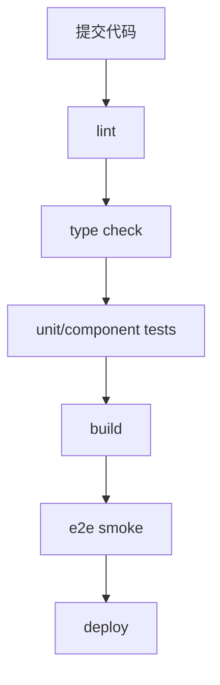

# 前端测试与 CI：单测、组件测试、E2E 和质量门禁

## 场景

项目多人协作后，问题开始变多：组件改动影响了别的页面，接口 mock 和真实环境不一致，发布前才发现类型错误，线上回归只能靠人工点页面。

测试和 CI 的目标不是追求 100% 覆盖率，而是把高风险路径自动化验证，减少低级回归，并让发布过程可重复。

## 是什么

前端测试可以按层次划分：

- 单元测试：验证纯函数、工具方法、状态转换。
- 组件测试：验证组件行为、交互和渲染分支。
- 集成测试：验证多个模块协作。
- E2E 测试：从用户视角验证关键路径。
- 静态检查：TypeScript、ESLint、格式化和依赖检查。



## 为什么需要

没有自动化验证时，团队只能靠人工经验保证质量。随着项目变大，人工回归会越来越慢，而且容易漏掉边界场景。

好的测试策略会把不同风险放到合适层级：纯逻辑用单测，关键组件用组件测试，核心业务链路用 E2E，类型和规范用 CI gate。

## 推荐做法

### 1. 纯逻辑优先单测

```ts
export function formatPrice(value: number, currency = 'CNY') {
  return new Intl.NumberFormat('zh-CN', {
    style: 'currency',
    currency
  }).format(value);
}
```

```ts
import { expect, it } from 'vitest';
import { formatPrice } from './formatPrice';

it('formats CNY price', () => {
  expect(formatPrice(12)).toContain('12.00');
});
```

### 2. 组件测试关注行为，不测实现细节

```tsx
it('submits keyword when pressing enter', async () => {
  const onSearch = vi.fn();
  render(<SearchInput onSearch={onSearch} />);

  await userEvent.type(screen.getByRole('textbox'), 'react{enter}');

  expect(onSearch).toHaveBeenCalledWith('react');
});
```

测试用户可观察行为，而不是内部 state 名称或函数调用顺序。

### 3. E2E 只覆盖关键路径

```ts
test('user can create order', async ({ page }) => {
  await page.goto('/orders');
  await page.getByRole('button', { name: 'Create' }).click();
  await page.getByLabel('Title').fill('New order');
  await page.getByRole('button', { name: 'Submit' }).click();
  await expect(page.getByText('New order')).toBeVisible();
});
```

E2E 成本高、速度慢、容易受环境影响，不适合覆盖所有分支。

### 4. CI 使用分层 gate

```yaml
name: CI

on: [pull_request]

jobs:
  verify:
    runs-on: ubuntu-latest
    steps:
      - uses: actions/checkout@v4
      - uses: actions/setup-node@v4
        with:
          node-version: 22
          cache: npm
      - run: npm ci
      - run: npm run lint
      - run: npm run typecheck
      - run: npm test -- --run
      - run: npm run build
```

CI 要快，失败信息要清晰。慢 E2E 可以做 smoke 或夜间任务。

## 代码示例

一个请求状态 reducer 很适合单测。

```ts
type State<T> =
  | { type: 'idle' }
  | { type: 'loading' }
  | { type: 'success'; data: T }
  | { type: 'error'; message: string };

type Action<T> =
  | { type: 'start' }
  | { type: 'resolve'; data: T }
  | { type: 'reject'; message: string };

export function reducer<T>(state: State<T>, action: Action<T>): State<T> {
  switch (action.type) {
    case 'start':
      return { type: 'loading' };
    case 'resolve':
      return { type: 'success', data: action.data };
    case 'reject':
      return { type: 'error', message: action.message };
    default:
      return state;
  }
}
```

测试状态转换比测试整个页面更稳定。

## 反例与后果

### 反例 1：只靠快照测试

后果：快照经常无意义变化，不能证明交互正确，团队容易机械更新快照。

### 反例 2：E2E 覆盖所有细节

后果：测试慢、脆弱、维护成本高，CI 排队时间长。

### 反例 3：CI 只 build 不 typecheck

后果：某些构建工具只转译 TypeScript，不做完整类型检查，类型错误可能漏到主分支。

## 常见坑

- 测试要覆盖风险，不是覆盖实现细节。
- Mock 太多会让测试脱离真实行为。
- E2E 要控制数据准备和清理，否则容易 flaky。
- CI 失败要能快速定位，否则团队会绕过它。
- 覆盖率是参考指标，不是质量本身。

## 排查与验证

### 测试 flaky

检查是否依赖真实时间、网络、随机数据、测试顺序或动画。优先使用稳定等待条件，而不是固定 sleep。

### CI 太慢

拆分 lint/typecheck/unit/build，缓存依赖，E2E 做 smoke 或并行。

### 测试价值低

看失败是否能指出真实问题。如果测试只在实现细节变化时失败，需要调整到用户行为或业务规则层。

## 面试怎么讲

30 秒版本：

> 前端测试要分层。纯函数和状态转换用单测，组件行为用组件测试，关键用户路径用 E2E，TypeScript、lint、build 放到 CI 作为质量门禁。目标是覆盖高风险路径，不是盲目追求覆盖率。

1 分钟版本：

> 我会把测试和风险对应起来。业务规则和 reducer 用单测最快；复杂表单和组件交互用 Testing Library 测用户行为；登录、下单、支付这类核心链路用 E2E smoke。CI 上至少跑 lint、typecheck、unit test 和 build，E2E 根据成本做 PR smoke 或定时全量。

追问版本：

> 如果问 flaky，我会检查测试是否依赖固定时间、网络、动画或共享状态。解决方式包括稳定 mock、隔离数据、用可观察条件等待、减少不必要 E2E。测试失败应该帮助定位问题，而不是成为团队忽略的噪音。

## 延伸阅读

- [Vitest Guide](https://vitest.dev/guide/)
- [Testing Library Docs](https://testing-library.com/docs/)
- [Playwright Docs](https://playwright.dev/docs/intro)
- [GitHub Actions Docs](https://docs.github.com/actions)
