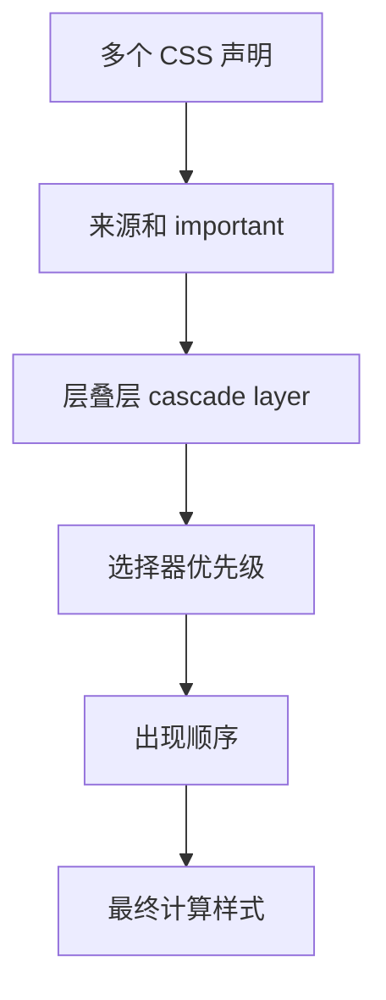

# CSS 层叠、优先级、继承和样式隔离

## 场景

项目里一个按钮在 A 页面是蓝色，在 B 页面突然变成红色；组件库升级后，业务样式被覆盖；为了修一个样式，代码里开始出现越来越多的 `!important`。这些问题通常不是某个属性写错，而是层叠、优先级、作用域和加载顺序没有设计好。

## 是什么

CSS 的最终样式由层叠算法决定。浏览器会综合来源、重要性、层叠层、选择器优先级、代码顺序和继承关系，决定某个属性最终取哪个值。



样式隔离则是控制样式影响范围，避免一个模块的样式意外影响另一个模块。常见方案包括命名规范、CSS Modules、Shadow DOM、CSS-in-JS、原子化 CSS 和 cascade layers。

## 为什么需要

CSS 是全局语言。一个普通选择器可能影响整个页面，一个组件库样式可能被业务覆盖，一个 reset 可能影响第三方组件。

理解层叠规则能帮助你稳定地排查“为什么这个样式不生效”。理解样式隔离能帮助团队在多人协作中控制样式影响面。

## 推荐做法

### 1. 控制选择器复杂度

```css
.button {
  color: white;
}

.buttonPrimary {
  background: #1677ff;
}
```

避免写过深的选择器：

```css
.page .panel .toolbar div button.primary span {
  color: white;
}
```

深选择器难复用、难覆盖，也更容易和结构耦合。

### 2. 少用 `!important`

`!important` 会提高声明优先级，短期能修问题，长期会制造更高优先级战争。它适合工具类兜底、第三方样式覆盖等少数场景。

### 3. 使用 CSS Modules 做组件级隔离

```css
/* Button.module.css */
.root {
  border-radius: 6px;
}

.primary {
  background: #1677ff;
}
```

```tsx
import styles from './Button.module.css';

export function Button() {
  return <button className={`${styles.root} ${styles.primary}`}>Save</button>;
}
```

构建后类名会被局部化，减少全局冲突。

### 4. 用 cascade layers 管理来源顺序

```css
@layer reset, base, components, utilities;

@layer reset {
  * { box-sizing: border-box; }
}

@layer components {
  .button { padding: 8px 12px; }
}

@layer utilities {
  .hidden { display: none; }
}
```

层叠层让团队明确 reset、基础样式、组件样式和工具类的覆盖关系。

## 代码示例

一个组件库和业务样式共存的策略：

```css
@layer reset, vendor, app, overrides;

@import url('./reset.css') layer(reset);
@import url('./vendor.css') layer(vendor);

@layer app {
  .userCard {
    display: grid;
    gap: 8px;
  }
}

@layer overrides {
  .vendorButton {
    border-radius: 6px;
  }
}
```

这比在多个文件里凭加载顺序互相覆盖更可控。

## 反例与后果

### 反例 1：全局标签选择器影响业务

```css
button {
  border: none;
}
```

后果：所有按钮，包括组件库和第三方组件都会受影响。

### 反例 2：不断追加 `!important`

后果：下一次覆盖只能写更强的选择器或更多 `!important`，样式系统失控。

### 反例 3：组件样式依赖父页面结构

后果：组件移动位置后样式失效，复用成本变高。

## 常见坑

- 行内样式优先级高于普通样式，但低于带 `!important` 的声明。
- 继承只适用于部分属性，如 color、font，margin 不会继承。
- CSS Modules 只隔离类名，不隔离全局元素选择器和 CSS 变量。
- Shadow DOM 隔离更强，但会影响主题、弹层和跨边界样式定制。
- 加载顺序仍然重要，尤其是同优先级规则。

## 排查与验证

### 样式不生效

用 DevTools Computed 面板查看被哪个规则覆盖。按来源、优先级、顺序逐层排查。

### 样式污染

搜索全局选择器、reset、`!important` 和过宽的类名。检查是否缺少 CSS Modules 或命名空间。

### 组件库覆盖困难

优先查组件库是否提供 token、变量、className、slot 或主题 API，不要直接写脆弱的深选择器。

## 面试怎么讲

30 秒版本：

> CSS 最终样式由层叠决定，主要看来源、important、层叠层、选择器优先级和代码顺序。样式隔离是为了控制影响范围，常见方案有命名规范、CSS Modules、Shadow DOM、CSS-in-JS 和 cascade layers。

1 分钟版本：

> 我排查样式问题会先用 DevTools 看 computed 样式和被覆盖规则，再判断是优先级、加载顺序还是继承问题。工程上会控制选择器复杂度，减少 important，组件样式用 CSS Modules 或命名空间隔离，跨团队样式用 cascade layers 明确覆盖顺序。

追问版本：

> 如果问 CSS Modules 是否完全隔离，我会说它主要隔离 class 名，不会隔离全局标签选择器、CSS 变量和运行时插入样式。隔离强度更高可以用 Shadow DOM，但会带来主题和弹层穿透问题，所以要按组件类型取舍。

## 延伸阅读

- [MDN: Cascade and inheritance](https://developer.mozilla.org/en-US/docs/Learn/CSS/Building_blocks/Cascade_and_inheritance)
- [MDN: Specificity](https://developer.mozilla.org/en-US/docs/Web/CSS/CSS_cascade/Specificity)
- [MDN: @layer](https://developer.mozilla.org/en-US/docs/Web/CSS/@layer)
- [CSS Modules](https://github.com/css-modules/css-modules)
