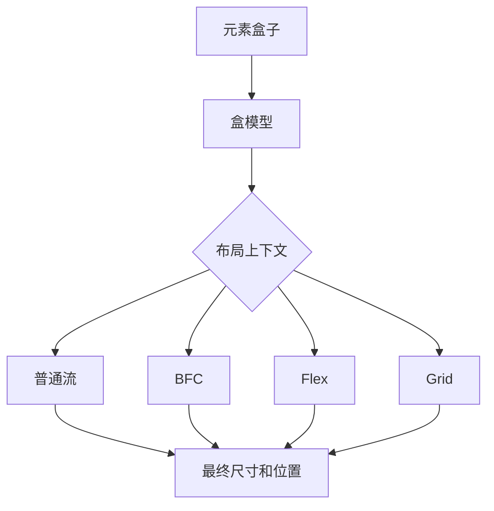

# CSS 布局：盒模型、BFC、Flex 和 Grid

## 场景

你在做一个后台页面：左侧固定导航，右侧是内容区；内容区上方有筛选栏，中间是表格，下方是分页。页面还要适配不同宽度，表格旁边有浮动操作区，卡片之间有间距。

常见问题包括：margin 合并导致间距不对、父容器高度塌陷、内容溢出、Flex 子项被压缩、Grid 响应式列宽异常。CSS 布局的核心是理解盒子如何参与格式化上下文，而不是记住零散属性。

## 是什么

CSS 布局可以从几个层次理解：

- 盒模型：元素内容、内边距、边框、外边距如何计算尺寸。
- 正常文档流：块级、行内、行内块元素如何排列。
- 格式化上下文：BFC、IFC、Flex formatting context、Grid formatting context。
- 现代布局：Flex 适合一维布局，Grid 适合二维布局。



## 为什么需要

布局问题通常不是“属性没背熟”，而是没有理解上下文。比如 margin 合并只发生在特定块级布局场景；浮动元素脱离普通流会造成父容器高度塌陷；Flex 子项默认 `min-width: auto` 可能导致文本撑破容器。

理解这些规则后，排查布局问题会更像工程分析，而不是反复试 CSS。

## 推荐做法

### 1. 明确盒模型

项目里通常建议全局使用 `border-box`，让元素声明宽度包含 padding 和 border。

```css
*,
*::before,
*::after {
  box-sizing: border-box;
}
```

### 2. 用 BFC 处理隔离问题

BFC 是块级格式化上下文。常见触发方式包括 `overflow: auto`、`display: flow-root`、浮动、绝对定位、Flex/Grid 子项等。

```css
.cardList {
  display: flow-root;
}
```

`flow-root` 可以创建新的 BFC，常用于包含浮动、阻止 margin 穿透等场景，比用 `overflow: hidden` 更语义化。

### 3. Flex 处理一维对齐

```css
.toolbar {
  display: flex;
  align-items: center;
  justify-content: space-between;
  gap: 12px;
}

.toolbarTitle {
  min-width: 0;
  overflow: hidden;
  text-overflow: ellipsis;
  white-space: nowrap;
}
```

Flex 子项里经常需要 `min-width: 0`，否则长文本可能撑开容器。

### 4. Grid 处理二维布局

```css
.dashboard {
  display: grid;
  gap: 16px;
  grid-template-columns: repeat(auto-fit, minmax(240px, 1fr));
}
```

Grid 适合卡片墙、页面主结构、表单网格等二维布局。

## 代码示例

下面是一个常见后台布局。

```css
.shell {
  display: grid;
  grid-template-columns: 240px minmax(0, 1fr);
  min-height: 100vh;
}

.sidebar {
  border-right: 1px solid #e5e7eb;
}

.content {
  min-width: 0;
  padding: 24px;
}

.filters {
  display: flex;
  flex-wrap: wrap;
  gap: 12px;
}

.tableRegion {
  margin-top: 16px;
  overflow: auto;
}
```

这里 `minmax(0, 1fr)` 和 `min-width: 0` 都是为了避免内容区被长内容撑破。

## 反例与后果

### 反例 1：用 margin 撑父容器

父子元素 margin 合并时，子元素 margin 可能穿透父元素，导致间距和预期不一致。可以用 padding、border、BFC 或 `display: flow-root` 处理。

### 反例 2：用浮动做现代布局

浮动适合文字环绕，不适合复杂页面结构。用浮动做布局容易出现高度塌陷和清除浮动问题。

### 反例 3：Flex 容器内长文本不设 `min-width: 0`

后果：长文本撑开布局，按钮被挤出屏幕。

## 常见坑

- `width: 100%` 在默认盒模型下不包含 padding 和 border。
- margin 合并只发生在特定块级上下文中，Flex/Grid 中不会按同样方式合并。
- `overflow: hidden` 会创建 BFC，但也可能裁剪内容。
- Flex 是一维布局，Grid 是二维布局，不要强行用 Flex 拼复杂网格。
- `position: absolute` 会脱离普通流，父容器不会因它撑开高度。

## 排查与验证

### 看盒模型

用 DevTools Elements 面板查看盒模型，确认 content、padding、border、margin 的实际尺寸。

### 看布局上下文

检查父元素是否是 Flex/Grid/BFC，子元素的布局规则取决于上下文。

### 看溢出来源

遇到横向滚动，逐层检查 `min-width`、长文本、固定宽度、表格和图片尺寸。

## 面试怎么讲

30 秒版本：

> CSS 布局先看盒模型和格式化上下文。BFC 是独立的块级布局环境，可以用于包含浮动、阻止 margin 合并等。Flex 适合一维对齐，Grid 适合二维布局，复杂页面结构通常两者结合使用。

1 分钟版本：

> 我排查布局问题会先看元素属于哪个布局上下文。普通流里可能有 margin 合并和浮动高度塌陷；创建 BFC 可以隔离一些影响；Flex 要注意主轴、交叉轴、收缩和 `min-width: 0`；Grid 更适合卡片和页面二维结构。真实项目里我会优先用语义清晰的布局模型，而不是用 float 或大量 absolute 拼页面。

追问版本：

> 如果问 BFC 触发条件，我会说常见有 `display: flow-root`、`overflow` 非 visible、浮动、绝对定位、Flex/Grid 子项等。现在更推荐 `flow-root` 表达创建块级格式化上下文的意图，避免 `overflow: hidden` 带来的裁剪副作用。

## 延伸阅读

- [MDN: CSS box model](https://developer.mozilla.org/en-US/docs/Learn/CSS/Building_blocks/The_box_model)
- [MDN: Block formatting context](https://developer.mozilla.org/en-US/docs/Web/CSS/CSS_display/Block_formatting_context)
- [MDN: Flexbox](https://developer.mozilla.org/en-US/docs/Learn/CSS/CSS_layout/Flexbox)
- [MDN: CSS Grid Layout](https://developer.mozilla.org/en-US/docs/Web/CSS/CSS_grid_layout)
