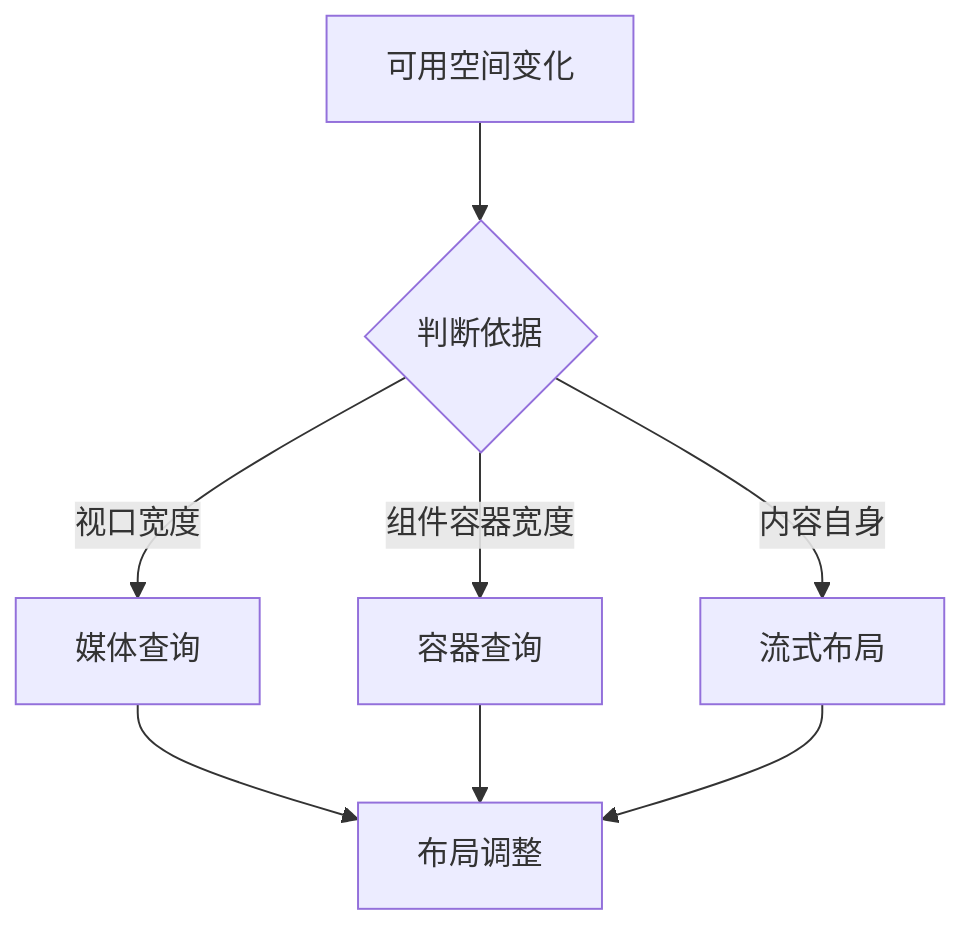

# 响应式设计、容器查询和移动端适配

## 场景

一个管理后台需要同时在桌面、平板和移动端使用。卡片在宽屏是四列，在窄屏是单列；一个筛选面板在主内容区很宽时横向排列，在侧栏里变成纵向排列。只用视口宽度判断时，同一个组件放在不同容器里表现不一致。

响应式设计要解决的是：界面如何根据可用空间和设备能力稳定变化，而不是为每个设备单独写一套页面。

## 是什么

响应式设计是一组让布局适应不同屏幕、窗口和容器尺寸的技术组合。



常用能力：

- 流式布局：百分比、`fr`、`minmax`、`clamp`。
- 媒体查询：根据 viewport 或设备特征调整样式。
- 容器查询：根据组件所在容器尺寸调整样式。
- 响应式图片：不同屏幕加载合适尺寸图片。

## 为什么需要

设备尺寸、浏览器窗口、嵌入容器和字体缩放都可能变化。固定宽度布局会导致横向滚动、内容溢出、按钮不可见和布局抖动。

媒体查询适合页面级布局，比如移动端导航、整体栅格变化。容器查询适合组件级布局，比如同一个卡片在主区域和侧栏里根据容器宽度自适应。

## 推荐做法

### 1. 先写弹性布局，再加断点

```css
.cardGrid {
  display: grid;
  gap: 16px;
  grid-template-columns: repeat(auto-fit, minmax(240px, 1fr));
}
```

很多布局不需要写断点，交给 Grid 的 `auto-fit` 和 `minmax` 就能处理。

### 2. 页面级变化用媒体查询

```css
.shell {
  display: grid;
  grid-template-columns: 240px minmax(0, 1fr);
}

@media (max-width: 768px) {
  .shell {
    grid-template-columns: 1fr;
  }

  .sidebar {
    display: none;
  }
}
```

### 3. 组件级变化用容器查询

```css
.userCardContainer {
  container-type: inline-size;
}

.userCard {
  display: grid;
  gap: 12px;
}

@container (min-width: 480px) {
  .userCard {
    grid-template-columns: 80px 1fr;
  }
}
```

容器查询让组件关注自己实际可用空间，而不是全局 viewport。

### 4. 图片按尺寸和密度适配

```html

```

## 代码示例

一个响应式筛选栏：宽容器横向排列，窄容器纵向排列。

```css
.filterPanelWrapper {
  container-type: inline-size;
}

.filterPanel {
  display: grid;
  gap: 12px;
}

@container (min-width: 640px) {
  .filterPanel {
    align-items: end;
    grid-template-columns: repeat(3, minmax(0, 1fr)) auto;
  }
}
```

这个组件放在全宽页面和窄侧栏里都能根据自己的容器调整，而不是依赖屏幕宽度。

## 反例与后果

### 反例 1：固定宽度

```css
.panel {
  width: 1200px;
}
```

后果：窄屏出现横向滚动，嵌入小容器时布局溢出。

### 反例 2：所有组件都依赖 viewport

后果：同一个组件在侧栏和主区域无法表现不同，复用性差。

### 反例 3：只隐藏内容适配移动端

后果：移动端信息缺失，用户无法完成同样任务。响应式不是简单删内容。

## 常见坑

- 不要按具体设备型号设计断点，优先按内容何时破布局来定断点。
- 容器查询需要给祖先设置 `container-type`。
- `100vw` 会包含滚动条宽度，可能导致横向滚动。
- 移动端要考虑触控目标尺寸，不只是布局宽度。
- 响应式图片要保留 width/height 或 aspect-ratio，避免 CLS。

## 排查与验证

### 断点是否合理

拖拽 viewport，观察内容在哪些宽度开始挤压或溢出，以内容为依据调整断点。

### 组件复用问题

把组件放进不同宽度容器测试。如果组件依赖 viewport 导致表现不合理，考虑容器查询。

### 移动端操作

用真实设备或 DevTools 检查触控目标、键盘弹出、横向滚动和安全区域。

## 面试怎么讲

30 秒版本：

> 响应式设计不是给每个设备写一套页面，而是用流式布局、媒体查询、容器查询和响应式资源，让页面根据可用空间调整。媒体查询适合页面级布局，容器查询适合组件级自适应。

1 分钟版本：

> 我会先用弹性布局，比如 Grid 的 minmax 和 auto-fit，减少硬断点。页面整体结构变化用媒体查询；组件在不同容器中复用时用容器查询。图片用 srcset 和 sizes，保留尺寸避免 CLS。断点按内容破坏点设计，而不是按设备型号。

追问版本：

> 如果问容器查询和媒体查询区别，我会说媒体查询看 viewport 或设备特征，容器查询看组件所在容器的尺寸。组件库和卡片组件更适合容器查询，因为同一个组件可能出现在主区域、侧栏、弹窗等不同空间里。

## 延伸阅读

- [MDN: Responsive design](https://developer.mozilla.org/en-US/docs/Learn/CSS/CSS_layout/Responsive_Design)
- [MDN: Container queries](https://developer.mozilla.org/en-US/docs/Web/CSS/CSS_containment/Container_queries)
- [MDN: Responsive images](https://developer.mozilla.org/en-US/docs/Learn/HTML/Multimedia_and_embedding/Responsive_images)
- [web.dev: Responsive design](https://web.dev/learn/design/)
