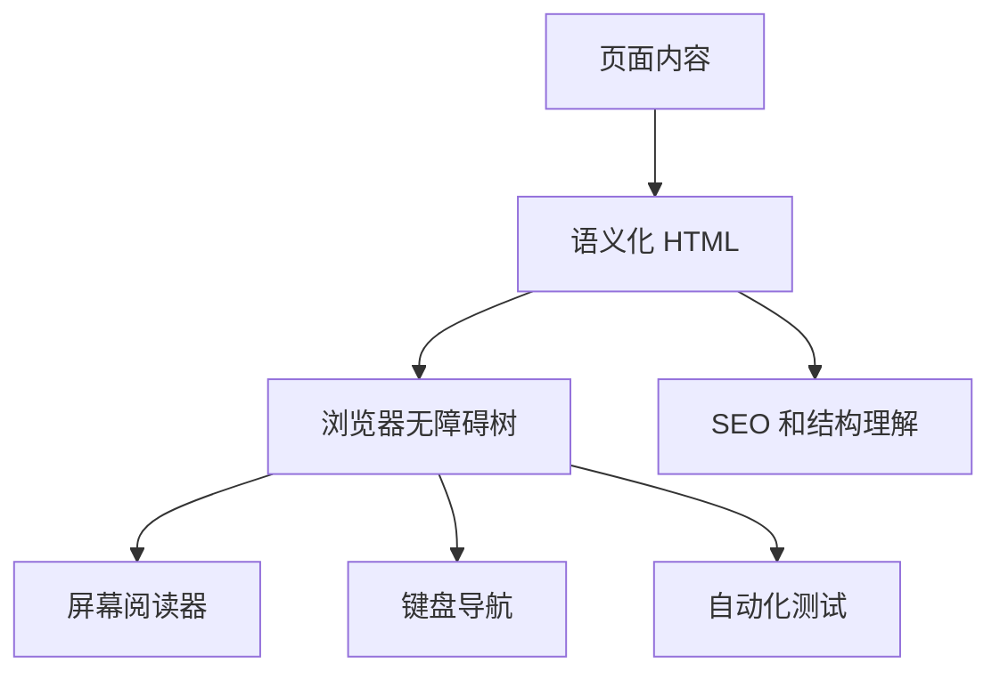

# HTML 语义化、表单和可访问性

## 场景

你在做一个后台表单和一个公开落地页。页面视觉上看起来没问题，但键盘无法完整操作，屏幕阅读器读不出按钮含义，表单错误提示和字段没有关联，搜索引擎也难以理解页面结构。

这类问题不是“视觉还原度”能覆盖的。HTML 语义化和可访问性决定了页面能否被浏览器、辅助技术、搜索引擎和自动化测试正确理解。

## 是什么

语义化是用符合含义的 HTML 元素表达内容结构，而不是只用 `div` 和 `span` 拼界面。

可访问性是让不同能力、设备和输入方式的用户都能理解和操作页面，包括键盘、屏幕阅读器、语音控制、高对比度模式等。



## 为什么需要

语义化和可访问性不是“公益加分项”。它们直接影响：

- 表单是否可用。
- 键盘用户是否能完成操作。
- 自动化测试是否能通过 role 和 label 找到元素。
- SEO 是否能理解页面结构。
- 法规和企业合规要求。

更实际的一点：语义正确的页面通常更容易测试、更容易维护，也更少依赖脆弱的 class 选择器。

## 推荐做法

### 1. 用正确元素表达结构

```html
<header>...</header>
<nav aria-label="Main navigation">...</nav>
<main>
  <h1>Order Management</h1>
  <section aria-labelledby="filters-title">
    <h2 id="filters-title">Filters</h2>
  </section>
</main>
```

页面应该有清晰标题层级。不要为了视觉大小跳过标题级别，视觉样式可以用 CSS 控制。

### 2. 表单字段必须有 label

```tsx
function EmailField() {
  return (
    <div>
      <label htmlFor="email">Email</label>
      <input id="email" name="email" type="email" autoComplete="email" />
    </div>
  );
}
```

`placeholder` 不能替代 label。用户输入后 placeholder 会消失，屏幕阅读器也不能稳定依赖它。

### 3. 错误提示和字段关联

```tsx
function PasswordField({ error }: { error?: string }) {
  return (
    <div>
      <label htmlFor="password">Password</label>
      <input
        id="password"
        type="password"
        aria-invalid={Boolean(error)}
        aria-describedby={error ? 'password-error' : undefined}
      />
      {error && <p id="password-error">{error}</p>}
    </div>
  );
}
```

这样辅助技术能知道字段处于错误状态，并能读到错误原因。

### 4. 交互控件优先使用原生元素

按钮用 `button`，链接用 `a`。不要用 `div` 模拟所有交互。

```tsx
<button type="button" onClick={saveDraft}>
  Save draft
</button>

<a href="/orders/123">View order</a>
```

原生控件自带键盘行为、焦点管理和语义。

## 代码示例

下面是一个可访问的搜索表单。

```tsx
function OrderSearchForm({ onSearch }: { onSearch: (keyword: string) => void }) {
  const [keyword, setKeyword] = useState('');

  return (
    <form
      role="search"
      onSubmit={(event) => {
        event.preventDefault();
        onSearch(keyword);
      }}
    >
      <label htmlFor="order-keyword">Search orders</label>
      <input
        id="order-keyword"
        name="keyword"
        value={keyword}
        onChange={(event) => setKeyword(event.target.value)}
      />
      <button type="submit">Search</button>
    </form>
  );
}
```

这个表单可以被键盘提交，也可以被测试通过 `getByRole('search')` 和 `getByLabelText` 找到。

## 反例与后果

### 反例 1：用 div 模拟按钮

```tsx
<div onClick={submit}>Submit</div>
```

后果：默认不能通过键盘触发，没有按钮语义，屏幕阅读器也无法正确识别。

### 反例 2：只有 placeholder 没有 label

后果：输入后提示消失，辅助技术难以识别字段用途，错误提示也难以关联。

### 反例 3：图片缺少 alt

后果：屏幕阅读器不知道图片含义。装饰图片可以用空 `alt=""`，信息图片必须提供含义。

## 常见坑

- `aria-*` 不能替代正确 HTML。优先使用原生语义。
- `button` 在表单内默认是 submit，不提交时要写 `type="button"`。
- 焦点样式不要随意去掉，键盘用户需要知道当前位置。
- 弹窗打开后要管理焦点，关闭后要把焦点还给触发元素。
- 颜色不能作为唯一状态提示，还要有文本或图标语义。

## 排查与验证

### 键盘测试

只用 Tab、Shift+Tab、Enter、Space、Esc 操作页面，确认所有交互可达、焦点顺序合理。

### DevTools Accessibility

检查元素 role、name、description 是否符合预期。重点看按钮、输入框、弹窗和错误提示。

### 自动化检查

使用 axe、Lighthouse 或 Testing Library 的 role/label 查询。能通过语义查询的组件通常更健壮。

## 面试怎么讲

30 秒版本：

> HTML 语义化是用正确标签表达内容结构，比如 header、nav、main、button、label。可访问性关注键盘、屏幕阅读器和不同用户能否理解和操作页面。原生语义优先，ARIA 是补充，不是替代。

1 分钟版本：

> 我做表单时会保证每个字段有 label，错误提示通过 aria-describedby 和字段关联，按钮使用 button 并设置正确 type。交互组件要支持键盘和焦点管理。语义化不仅对无障碍有价值，也让自动化测试、SEO 和维护更稳定。

追问版本：

> 如果问 div 能不能做按钮，我会说技术上能模拟，但要补 role、tabIndex、键盘事件和焦点状态，成本高且容易漏。能用 button 就应该用 button，因为它自带语义和交互行为。

## 延伸阅读

- [MDN: HTML elements reference](https://developer.mozilla.org/en-US/docs/Web/HTML/Reference/Elements)
- [MDN: Accessibility](https://developer.mozilla.org/en-US/docs/Web/Accessibility)
- [WAI-ARIA Authoring Practices Guide](https://www.w3.org/WAI/ARIA/apg/)
- [web.dev: Learn Accessibility](https://web.dev/learn/accessibility)
