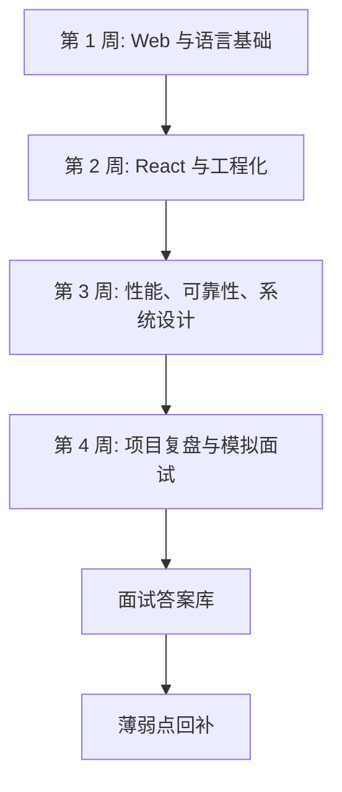

# 前端面试 30 天路径：从知识补齐到可追问表达

## 场景

你有开发经验，但准备中高级前端面试时发现问题不在“完全不会”，而在表达不稳定：知道 React，但说不清 render 和 commit；写过性能优化，但讲不出指标和验证；做过工程化，但只能列工具名。

30 天路径的目标不是刷完所有题，而是把核心知识转成三类产出：

- 系统理解：能解释机制和边界。
- 项目表达：能结合真实场景讲方案和权衡。
- 追问能力：能承接面试官继续深入。

## 是什么

这是一套 4 周复习节奏：先补主干，再做专题，再整理项目，最后模拟面试。



每天至少要有一个可检查输出：一段面试答案、一张流程图、一段代码示例、一份项目复盘或一次模拟追问记录。

## 为什么需要

中高级面试通常不是单点问答，而是连续追问：

- 你说 React 重新渲染，那真实 DOM 是否也重建？
- 你说做过性能优化，指标是什么，怎么验证？
- 你说封装了组件，为什么这么抽象，有什么代价？
- 你说请求做了取消，旧请求晚返回怎么办？

如果只背答案，很容易在追问时断掉。30 天计划的重点是把知识点组织成“结论 -> 机制 -> 场景 -> 反例 -> 验证”的表达链路。

## 推荐做法

### 第 1 周：Web 与语言主干

- Day 1-2：浏览器渲染流程、事件循环。
- Day 3：HTTP 缓存、跨域、Cookie 和 Storage。
- Day 4：Promise、async/await、异常传播、并发控制。
- Day 5：TypeScript 类型系统、泛型、类型收窄。
- Day 6：手写题：防抖、节流、深拷贝、并发限制。
- Day 7：复盘输出 10 个 1 分钟答案。

### 第 2 周：React 与工程化

- Day 8-9：React 渲染模型、Hooks 原理。
- Day 10：状态管理和 Server State。
- Day 11：React 性能优化、memo、虚拟列表。
- Day 12：组件设计、表单、受控/非受控。
- Day 13：Vite/Webpack、构建、Tree shaking、Source Map。
- Day 14：模拟 React + 工程化追问。

### 第 3 周：性能、可靠性、系统设计

- Day 15：Core Web Vitals 和性能排查。
- Day 16：请求状态、重试、取消、竞态控制。
- Day 17：前端安全：XSS、CSRF、CSP。
- Day 18：权限系统、菜单系统、动态路由。
- Day 19：组件库、埋点 SDK、性能监控平台。
- Day 20：大型表格、低代码、IM 前端选一个深挖。
- Day 21：输出 2 个系统设计题答案。

### 第 4 周：项目复盘与模拟面试

- Day 22-24：整理 2-3 个项目复盘。
- Day 25：准备“最难问题、最大收益、最失败经历”。
- Day 26：模拟基础知识面。
- Day 27：模拟 React 和工程化面。
- Day 28：模拟项目和系统设计面。
- Day 29：补薄弱点，压缩答案。
- Day 30：最终复盘和面试清单。

## 代码示例

可以用下面模板记录每天输出。

```md
# Day N 复习记录

## 今日主题

## 核心结论

## 机制图或代码

## 30 秒答案

## 1 分钟答案

## 追问题

## 需要回补
```

项目复盘建议用 STAR 的增强版：

```md
# 项目复盘

## 背景

## 问题和约束

## 方案选择

## 关键实现

## 权衡和失败处理

## 指标和结果

## 面试表达
```

## 反例与后果

### 反例 1：只刷题不复盘项目

后果：基础题能答，但项目追问时讲不出业务背景、权衡和结果。

### 反例 2：只看文章不输出答案

后果：读的时候觉得懂，面试时无法组织语言。必须把知识压缩成口头答案。

### 反例 3：每天换方向

后果：知识点没有形成链路。更好的方式是按模块连续复习，再统一模拟追问。

## 常见坑

- 不要把 30 天计划排成资料阅读清单，要排成产出清单。
- 不要只准备“标准答案”，要准备反例、边界和项目关联。
- 不要忽略验证方法。中高级面试很容易问“你怎么证明有效”。
- 不要把系统设计题讲成工具堆叠，要讲需求、约束、数据流和风险。

## 排查与验证

### 判断某个知识点是否过关

用 4 个问题验证：

- 能否 30 秒讲清结论？
- 能否画出流程图或状态图？
- 能否给出项目例子？
- 能否说出反例和排查方式？

### 判断项目复盘是否过关

看是否有指标和权衡。如果只有“我用了某技术”，还不够。需要讲为什么选它、不选什么、结果如何、失败怎么处理。

### 判断模拟面试是否有效

每次模拟后记录卡住的问题，并回链到具体文章或项目复盘。没有回补动作的模拟面试价值有限。

## 面试怎么讲

30 秒版本：

> 我准备面试会先按 Web 基础、JavaScript/TypeScript、React、工程化、性能可靠性和项目复盘建立主干，再把每个主题压缩成 30 秒、1 分钟和追问版答案。重点不是背题，而是能讲机制、场景、反例和验证。

1 分钟版本：

> 我的复习节奏是先补底层机制，比如渲染流程、事件循环、缓存和异步；再补 React 渲染、Hooks、状态管理和工程化；最后整理性能、可靠性和系统设计。每个主题都要输出一段面试表达和一个项目关联例子。模拟面试后把卡住的问题回补到知识库。

追问版本：

> 如果面试官追问项目，我会按背景、约束、方案、权衡、指标、结果来讲，而不是只说用了某个库。比如性能优化我会先说明指标是 LCP/INP/CLS 哪个变差，再讲定位链路、优化手段和上线后的 p75 改善。

## 延伸阅读

- [React Docs](https://react.dev/learn)
- [MDN Web Docs](https://developer.mozilla.org/)
- [web.dev](https://web.dev/)
- [TypeScript Handbook](https://www.typescriptlang.org/docs/handbook/intro.html)
