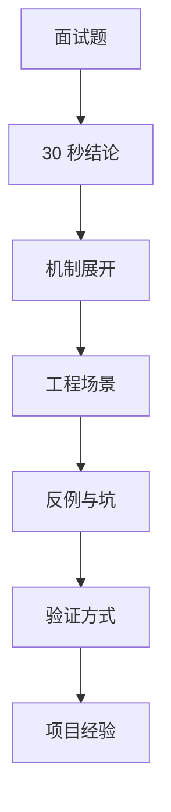

# 高频八股题背后的工程问题与面试答案库

## 场景

准备中高级前端面试时，很多题看起来是“八股”：事件循环、闭包、React Hooks、浏览器缓存、性能优化、XSS、Webpack/Vite。真正面试时，面试官通常不是只想听定义，而是看你能否把概念和真实工程问题连接起来。

这篇文章把高频题组织成可复述的答案模板：先给 30 秒结论，再展开机制，最后准备追问里的边界、反例和项目经验。

## 是什么

面试答案库不是背诵材料，而是知识索引。每个问题都要能回答三层：

- 概念是什么。
- 工程上解决什么问题。
- 真实项目里如何验证和取舍。



## 为什么需要

中高级面试的风险不是完全不会，而是会讲成零散概念。比如只说“宏任务和微任务执行顺序”，但讲不出它和渲染时机、Promise 错误、React 状态更新有什么关系；只说“useMemo 优化性能”，但讲不出它的成本和失效场景。

答案库能帮助你把知识压缩成稳定表达，避免现场临时组织语言。

## 推荐做法

### 1. 每题按固定结构准备

```text
问题：React 为什么需要 key？

30 秒：key 帮 React 在同级列表 diff 时识别节点身份，决定复用、移动还是销毁。

1 分钟：React diff 默认按同级比较，key 是稳定身份。稳定 key 能保留组件状态并减少错误复用；index key 在插入、删除、排序时会让状态错位。

追问：如果列表永不重排，index 可以接受；可编辑列表、动画列表、分页合并列表不要用 index。
```

### 2. 用“问题 -> 机制 -> 代价 -> 验证”回答

任何技术方案都有代价。面试中讲出代价和验证方式，可信度会明显更高。

### 3. 准备能落到项目的例子

每个模块至少准备一个项目案例，例如：首屏优化、复杂表单、长列表、权限系统、监控排障、构建提速。

## 代码示例

### React：为什么不要滥用 useMemo

30 秒：

> `useMemo` 用来缓存计算结果，避免每次 render 都做昂贵计算，或稳定传给子组件的引用。但它本身也有依赖比较和内存成本，不应该给所有表达式都加。

1 分钟：

> 我会先用 Profiler 确认瓶颈。如果是昂贵计算，可以用 `useMemo`；如果是子组件因为引用变化重渲染，可以配合 `memo` 稳定 props。简单计算不需要缓存。`useMemo` 也不应该承载业务语义，因为 React 可以丢弃缓存，语义上它只是性能优化提示。

反例：

```tsx
const fullName = useMemo(() => `${firstName} ${lastName}`, [firstName, lastName]);
```

这种简单字符串拼接没有必要缓存。

### 浏览器：事件循环怎么联系渲染

30 秒：

> JavaScript 在主线程上按任务执行，宏任务执行完会清空微任务队列，然后浏览器在合适时机进行渲染。微任务过多会推迟渲染，长任务会阻塞输入和绘制。

1 分钟：

> `setTimeout`、I/O、事件回调通常进入任务队列，Promise then、queueMicrotask 进入微任务队列。一次任务执行结束后，浏览器会先清空微任务，再考虑渲染。如果在微任务里不断追加微任务，页面可能迟迟不能绘制。排查卡顿时我会看 Performance 面板里的长任务、Recalculate Style、Layout 和 Paint。

验证：

```ts
console.log('start');
setTimeout(() => console.log('timeout'));
Promise.resolve().then(() => console.log('promise'));
console.log('end');
```

输出顺序是 `start -> end -> promise -> timeout`。

### 工程化：Vite 为什么开发快

30 秒：

> Vite 开发环境利用浏览器原生 ESM，启动时不需要先把整个应用打包；依赖预构建用 esbuild，源码按需转换，所以冷启动和热更新更快。

1 分钟：

> Webpack dev server 更偏先构建模块图再服务应用，项目大时启动成本高。Vite 把源码请求交给浏览器按需加载，只转换当前请求的模块；第三方依赖相对稳定，用 esbuild 预构建成 ESM。生产构建仍然通常用 Rollup 做打包优化。代价是对 CommonJS、动态导入、老旧浏览器和特殊插件生态要额外处理。

### 性能：如何做首屏优化

30 秒：

> 首屏优化要先看指标和瓶颈：TTFB、LCP、资源加载、JS 执行、渲染阻塞。常用手段是减少关键资源、代码分割、预加载关键资源、图片优化、SSR/SSG、延后非关键脚本。

1 分钟：

> 我会先用 Lighthouse、Performance 和线上 RUM 找到 LCP 元素和关键路径。如果瓶颈是网络，就优化缓存、CDN、压缩和资源优先级；如果瓶颈是 JS，就拆包、延迟非关键代码、减少主线程长任务；如果瓶颈是图片，就用合适尺寸、格式和 preload。优化后要对比 P75 指标，而不是只看本机一次结果。

### 安全：XSS 和 CSRF 怎么防

30 秒：

> XSS 是恶意脚本在页面执行，核心防御是输出转义、避免危险 HTML、CSP 和 HttpOnly Cookie。CSRF 是借用户登录态发起非预期请求，核心防御是 SameSite Cookie、CSRF Token 和服务端校验请求来源。

1 分钟：

> React 默认转义文本能降低 XSS 风险，但 `dangerouslySetInnerHTML`、富文本、第三方脚本仍要谨慎。Cookie 登录态要用 HttpOnly、Secure、SameSite。CSRF 不能只靠前端判断，服务端要校验 token、Origin/Referer 或使用 SameSite。CORS 不是 CSRF 防护，也不是鉴权。

## 反例与后果

### 反例 1：只背定义

后果：追问到项目场景、边界和验证时容易断。

### 反例 2：把优化手段当默认答案

后果：例如一问性能就说 `useMemo`，但没有指标和瓶颈，会显得经验不足。

### 反例 3：回避方案缺点

后果：中高级面试会继续追问代价。主动讲清楚取舍更可信。

## 常见坑

- 不要把所有题都答成源码细节，先讲工程问题。
- 不要只说“看情况”，要说明看哪些条件和指标。
- 不要把浏览器、React、工程化割裂，它们经常在一个问题里同时出现。
- 不要编项目经验，准备真实做过或能自洽解释的案例。
- 不要把“会用工具”当成“理解原理”。

## 排查与验证

### 检查一个答案是否合格

用下面清单自测：

- 能否 30 秒说清楚结论？
- 能否画出机制链路？
- 能否讲一个真实业务场景？
- 能否说出反例和坑？
- 能否说明怎么验证效果？
- 能否承接至少两个追问？

### 模拟追问

准备每题的追问版本。例如事件循环可以追问：微任务过多会怎样、requestAnimationFrame 在哪里、React setState 是否同步、长任务怎么拆。

## 面试怎么讲

通用开场：

> 我先给结论，再补一下机制和项目里的处理方式。

通用展开：

> 这个问题本质上是在解决某个工程风险。我的理解是先识别边界，再选择方案，最后通过指标或工具验证。

通用收尾：

> 这个方案不是没有代价，主要风险是……所以我会用……来约束或验证。

## 延伸阅读

- [MDN Web Docs](https://developer.mozilla.org/)
- [React Documentation](https://react.dev/)
- [web.dev](https://web.dev/)
- [TypeScript Handbook](https://www.typescriptlang.org/docs/)
- [Vite Guide](https://vite.dev/guide/)
