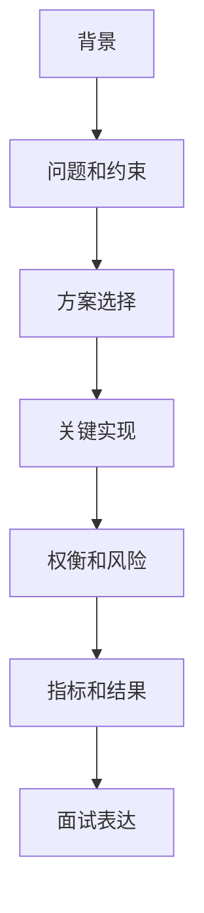

# 项目复盘模板：背景、难点、方案、权衡、指标和结果

## 场景

中高级前端面试里，项目追问通常比八股更能区分水平。很多候选人会说“我负责了某系统，用了 React、TypeScript、Vite”，但面试官继续问：为什么这么设计？难点是什么？有量化结果吗？失败怎么处理？这时如果没有复盘结构，回答很容易变成流水账。

项目复盘的目标是把真实经历整理成可追问、可验证、能体现判断力的表达。

## 是什么

一个完整项目复盘至少包含六部分：



它不是项目文档，也不是简历条目，而是为面试追问准备的高密度材料。

## 为什么需要

项目经验能证明你是否真的处理过复杂问题。好的复盘能展示：

- 你是否理解业务目标。
- 你是否能识别约束和风险。
- 你是否能做方案权衡。
- 你是否能用指标证明结果。
- 你是否能从失败中总结经验。

没有复盘时，项目表达容易停留在工具和职责上，难以体现深度。

## 推荐做法

### 1. 用固定结构整理项目

```md
# 项目名称

## 背景

## 问题和约束

## 方案选择

## 关键实现

## 权衡和风险

## 指标和结果

## 面试 1 分钟版本

## 可能追问
```

### 2. 每个项目只突出 1-2 个难点

不要把所有细节都塞进一个回答。一个性能项目就重点讲指标、定位、优化和验证；一个组件库项目就重点讲抽象边界、API 设计、发布和兼容。

### 3. 准备指标

常见指标包括：

- 性能：LCP、INP、CLS、包体积、接口耗时。
- 质量：错误率、回归数量、测试覆盖关键路径。
- 效率：构建时间、发布时间、组件复用率。
- 业务：转化率、完成率、工单量下降。

### 4. 准备权衡

面试官经常问“为什么不用另一个方案”。复盘时要提前写清楚备选方案和放弃原因。

## 代码示例

一个性能优化项目的复盘片段：

```md
## 背景
营销落地页 p75 LCP 超过 4s，投放流量转化率下降。

## 问题和约束
首屏 hero 图大，第三方脚本阻塞，不能改服务端渲染框架。

## 方案选择
先通过 Performance 和 RUM 确认 LCP 元素，再做图片格式转换、preload、第三方脚本延后和首屏 JS 拆分。

## 指标和结果
p75 LCP 从 4.2s 降到 2.6s，首屏 JS 下降 32%。
```

## 反例与后果

### 反例 1：只说技术栈

后果：无法体现你解决了什么问题，也无法承接方案权衡追问。

### 反例 2：没有指标

后果：优化是否有效只能靠主观描述，说服力弱。

### 反例 3：把团队成果全部说成个人成果

后果：追问细节时容易露出不真实。应该明确自己的职责和协作边界。

## 常见坑

- 项目复盘不是越长越好，要突出关键难点。
- 不要只讲成功，也要准备失败、回滚和风险处理。
- 不要讲无法解释的技术名词。
- 不要回避业务背景，中高级面试关注技术如何服务目标。
- 简历上的每个项目都要能承接 10 分钟追问。

## 排查与验证

### 判断复盘是否完整

用 5 个问题检查：

- 项目解决了什么业务问题？
- 最大技术难点是什么？
- 为什么选择这个方案？
- 如何证明有效？
- 如果重做会怎么改？

### 模拟追问

每个项目至少准备这些追问：

- 这个方案有什么缺点？
- 当时还有哪些备选方案？
- 遇到过线上问题吗？
- 如何回滚？
- 如何推广给团队使用？

## 面试怎么讲

30 秒版本：

> 项目复盘我会按背景、问题、方案、实现、权衡、指标和结果来讲。重点不是罗列技术栈，而是说明我解决了什么问题、为什么这么做、结果如何。

1 分钟版本：

> 以性能优化项目为例，我会先讲业务背景和指标问题，再讲如何用工具定位瓶颈，之后说明做了哪些优化、为什么优先这些方案，最后给出上线后的 p75 指标变化。如果有失败或回滚，也会说明风险处理。

追问版本：

> 如果面试官问“你负责了哪部分”，我会明确自己的边界，比如我负责性能数据采集、资源拆分和首屏链路优化，后端缓存由服务端同学负责。这样既真实，也方便深入讲自己真正做过的细节。

## 延伸阅读

- [STAR method](https://en.wikipedia.org/wiki/Situation,_task,_action,_result)
- [Google: Technical writing](https://developers.google.com/tech-writing)
