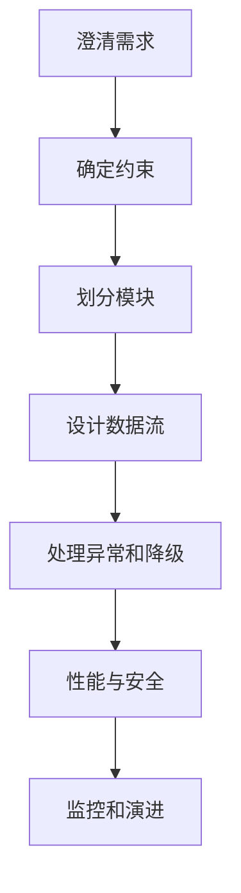

# 前端系统设计题答案模板

## 场景

中高级前端面试经常会问：设计一个后台管理系统、组件库、埋点 SDK、低代码平台、IM 前端或性能监控平台。很多回答会直接进入技术选型，忽略需求、约束、数据流、失败处理和演进路径。

系统设计题不是考“背架构名词”，而是看你能否把复杂问题拆成边界清晰、可落地、可权衡的方案。

## 是什么

一个前端系统设计回答可以按这个结构组织：



## 为什么需要

系统设计题没有唯一答案。结构化回答能让面试官看到你的判断过程：你知道什么必须先问，什么可以后做，哪些方案有代价，如何验证结果。

## 推荐做法

### 1. 先澄清需求

不要一上来就说 React、Redux、微前端。先问：用户是谁？核心流程是什么？规模多大？实时性要求如何？是否多端？是否有权限和审计？

### 2. 画模块边界

常见模块包括：

- 路由和权限。
- 数据请求和缓存。
- 状态管理。
- 组件和设计系统。
- 错误处理和监控。
- 构建发布和灰度。

### 3. 讲数据流

说明数据从哪里来，如何缓存，如何更新，失败如何恢复。

### 4. 明确非功能要求

包括性能、安全、可访问性、可靠性、可维护性、可观测性。

## 代码示例

回答模板：

```md
## 1. 需求澄清

## 2. 核心模块

## 3. 数据流和状态管理

## 4. 异常、降级和恢复

## 5. 性能、安全和可观测性

## 6. 方案权衡

## 7. 演进计划
```

示例：设计埋点 SDK。

```md
需求：采集 PV、点击、曝光、性能和错误。
约束：不能阻塞业务，不能上传敏感数据，弱网要缓存重试。
模块：事件模型、采集 API、队列、采样、上报、插件、调试工具。
异常：sendBeacon 失败走 fetch keepalive，本地队列有上限。
安全：字段白名单和脱敏。
监控：SDK 自身错误率和上报成功率。
```

## 反例与后果

### 反例 1：直接堆技术栈

后果：面试官看不到你对需求和边界的理解。

### 反例 2：只讲正常流程

后果：缺少异常、降级、监控和安全，方案不完整。

### 反例 3：不讲权衡

后果：像背答案。系统设计的价值在于说明为什么这样选。

## 常见坑

- 不要默认所有题都需要微前端。
- 不要忽略权限和数据安全。
- 不要只讲前端状态，不讲服务端接口和缓存。
- 不要忘记灰度、回滚和监控。
- 不要把 MVP 和长期演进混在一起。

## 排查与验证

### 判断答案是否完整

检查是否覆盖：需求、模块、数据流、异常、性能、安全、监控、权衡。

### 模拟追问

对每个方案问：如果流量扩大 10 倍怎么办？如果接口失败怎么办？如果要灰度怎么办？如果有权限怎么办？

## 面试怎么讲

30 秒版本：

> 我回答前端系统设计会先澄清需求和约束，再拆模块、讲数据流、异常降级、性能安全和监控，最后讲权衡和演进。不会一开始就堆技术栈。

1 分钟版本：

> 比如设计埋点 SDK，我会先确认采集事件类型、上报实时性、隐私要求和流量规模。然后拆成事件模型、采集 API、队列、采样、上报、插件和调试模块。异常上要处理弱网缓存、sendBeacon 失败、队列上限；安全上要脱敏；监控上要看 SDK 自身错误率和上报成功率。

追问版本：

> 如果问如何取舍，我会区分 MVP 和长期方案。MVP 先保证核心链路可用和可观测，长期再做插件化、灰度、采样策略和多端统一。系统设计不是一次做到最复杂，而是能解释演进路径。

## 延伸阅读

- [Frontend System Design Guide](https://www.greatfrontend.com/system-design)
- [Martin Fowler: Software Architecture Guide](https://martinfowler.com/architecture/)
