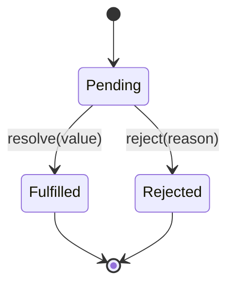

# Promise、async/await、异常传播和并发控制

## 场景

你在做一个文件管理页面：进入页面后要拉取目录树、文件列表、权限信息和最近操作记录。用户可以批量上传文件、取消请求、重试失败任务，还可以在搜索框里快速输入关键字。

如果异步逻辑处理不好，很容易出现这些问题：

- 多个请求互相依赖，代码嵌套很深。
- 某个请求失败后，错误没有被捕获，页面一直 loading。
- 用户快速切换目录，旧请求比新请求晚返回，覆盖了新数据。
- 批量上传一次性发出几百个请求，把浏览器和后端都打满。
- `try/catch` 没抓到 Promise 里的错误。

这些问题背后是同一个主题：JavaScript 异步任务如何表达完成、失败、顺序和并发边界。

## 是什么

Promise 是 JavaScript 表达异步结果的对象。它有三种状态：

- pending：进行中。
- fulfilled：已成功，并带有结果值。
- rejected：已失败，并带有失败原因。

状态一旦从 pending 变成 fulfilled 或 rejected，就不能再改变。

`async/await` 是 Promise 的语法糖。`async` 函数总是返回 Promise；`await` 会等待一个 Promise settle，并把后续代码放到异步恢复流程中。



异常传播规则可以简化理解为：

- `throw` 会让当前 async 函数返回 rejected Promise。
- `await` 一个 rejected Promise 会在当前位置抛出异常。
- `.then` 回调抛错，会进入后续 `.catch`。
- 没有被处理的 rejected Promise 会变成 unhandled rejection。

## 为什么需要

前端项目里的异步不只是“调接口”。真实系统还要处理加载态、错误态、取消、重试、超时、竞态、并发限制和局部降级。

如果只会写 `await fetch()`，很容易漏掉这些边界：

- 请求失败后没有恢复路径，用户只能刷新页面。
- 多个请求之间顺序不清楚，导致状态互相覆盖。
- 批量任务没有并发限制，造成接口拥塞。
- 错误被吞掉，监控系统看不到真实失败。

掌握 Promise 和 async/await 的目标不是写出更短的代码，而是能明确表达“什么时候开始、什么时候完成、失败如何传播、多个任务如何组合”。

## 推荐做法

### 1. 用 `try/catch` 包住真正需要兜底的 await

```ts
async function loadUser(userId: string) {
  try {
    const user = await fetchUser(userId);
    return { status: 'success' as const, user };
  } catch (error) {
    return {
      status: 'error' as const,
      message: error instanceof Error ? error.message : 'Unknown error'
    };
  }
}
```

不要在底层函数里随便吞掉错误。如果上层需要统一展示错误、打日志或重试，底层应该抛出有意义的错误。

### 2. 根据关系选择串行或并行

互相依赖的任务用串行：

```ts
async function loadUserProjects(userId: string) {
  const user = await fetchUser(userId);
  const projects = await fetchProjects(user.organizationId);
  return { user, projects };
}
```

互不依赖的任务用并行：

```ts
async function loadDashboard() {
  const [profile, permissions, recentFiles] = await Promise.all([
    fetchProfile(),
    fetchPermissions(),
    fetchRecentFiles()
  ]);

  return { profile, permissions, recentFiles };
}
```

`Promise.all` 的特点是任意一个失败，整体立即失败。如果需要保留部分成功结果，用 `Promise.allSettled`。

### 3. 用 AbortController 取消过期请求

```ts
async function searchFiles(keyword: string, signal: AbortSignal) {
  const response = await fetch(`/api/files?keyword=${encodeURIComponent(keyword)}`, {
    signal
  });

  if (!response.ok) {
    throw new Error(`Search failed: ${response.status}`);
  }

  return response.json() as Promise<FileItem[]>;
}
```

在 React effect 中使用时，组件卸载或参数变化时调用 `abort()`，避免旧请求继续占用资源或覆盖新结果。

### 4. 给批量任务加并发限制

批量上传、批量下载、批量校验都不应该无限并发。

```ts
async function runWithLimit<T, R>(
  items: T[],
  limit: number,
  worker: (item: T, index: number) => Promise<R>
) {
  const results: R[] = [];
  let nextIndex = 0;

  async function runWorker() {
    while (nextIndex < items.length) {
      const currentIndex = nextIndex;
      nextIndex += 1;
      results[currentIndex] = await worker(items[currentIndex], currentIndex);
    }
  }

  const workers = Array.from(
    { length: Math.min(limit, items.length) },
    () => runWorker()
  );

  await Promise.all(workers);
  return results;
}
```

这段代码保证最多只有 `limit` 个任务同时进行，并保持结果顺序。

## 代码示例

下面是一个带超时、取消和错误归一化的请求工具。

```ts
type ApiResult<T> =
  | { ok: true; data: T }
  | { ok: false; error: string; retriable: boolean };

export async function requestJson<T>(
  url: string,
  options: RequestInit & { timeoutMs?: number } = {}
): Promise<ApiResult<T>> {
  const { timeoutMs = 10000, signal, ...init } = options;
  const controller = new AbortController();
  const timeout = window.setTimeout(() => controller.abort(), timeoutMs);

  if (signal) {
    signal.addEventListener('abort', () => controller.abort(), { once: true });
  }

  try {
    const response = await fetch(url, {
      ...init,
      signal: controller.signal
    });

    if (!response.ok) {
      return {
        ok: false,
        error: `HTTP ${response.status}`,
        retriable: response.status >= 500 || response.status === 429
      };
    }

    return { ok: true, data: (await response.json()) as T };
  } catch (error) {
    if (error instanceof DOMException && error.name === 'AbortError') {
      return { ok: false, error: 'Request aborted', retriable: false };
    }

    return {
      ok: false,
      error: error instanceof Error ? error.message : 'Unknown error',
      retriable: true
    };
  } finally {
    window.clearTimeout(timeout);
  }
}
```

调用方可以根据 `ok` 做类型收窄：

```ts
const result = await requestJson<User>('/api/me');

if (!result.ok) {
  showToast(result.retriable ? 'Network error, retry later.' : result.error);
  return;
}

renderUser(result.data);
```

## 反例与后果

### 反例 1：忘记 await，try/catch 抓不到错误

```ts
async function submit() {
  try {
    saveForm();
  } catch (error) {
    showError(error);
  }
}
```

如果 `saveForm` 返回 Promise，且内部异步失败，这个 `try/catch` 抓不到，因为没有 `await`。应写成 `await saveForm()` 或返回 Promise 给上层处理。

### 反例 2：把可并行任务写成串行

```ts
const profile = await fetchProfile();
const permissions = await fetchPermissions();
const recentFiles = await fetchRecentFiles();
```

如果三者互不依赖，总耗时会变成三个请求耗时相加。应使用 `Promise.all` 并行。

### 反例 3：无限并发

```ts
await Promise.all(files.map((file) => uploadFile(file)));
```

后果：文件数量一多，会同时创建大量请求，可能触发浏览器连接限制、后端限流、内存上涨和失败率升高。批量任务应该设置并发上限。

### 反例 4：吞掉错误

```ts
async function loadData() {
  try {
    return await fetchData();
  } catch {
    return null;
  }
}
```

后果：上层不知道失败原因，监控也拿不到异常。除非业务明确允许静默降级，否则应该返回结构化错误或重新抛出。

## 常见坑

- `async` 函数里 `throw` 出来的错误会变成 rejected Promise。
- `try/catch` 只能捕获已经 `await` 的 Promise 错误，不能捕获未等待的异步错误。
- `Promise.all` 适合全成功才继续的场景；部分成功可用 `Promise.allSettled`。
- `Promise.race` 不会自动取消输掉的 Promise，需要配合 `AbortController`。
- `finally` 适合清理 loading、定时器、锁和临时状态，但不要在里面覆盖原始错误。
- 并发控制不是性能优化细节，而是可靠性边界。

## 排查与验证

### 页面一直 loading

检查每条异步路径是否都有成功和失败分支，`finally` 是否正确关闭 loading。Network 面板看请求是否 pending、失败或被取消。

### 错误没有弹出

检查是否忘记 `await`，或者 Promise 链中间是否缺少 `return`。浏览器控制台里的 unhandled rejection 是重要线索。

### 旧数据覆盖新数据

检查请求是否有取消机制或请求序号保护。快速切换筛选条件，观察旧请求是否晚返回并覆盖新状态。

### 批量任务失败率高

检查是否无限并发。用 Network 面板看同时请求数量、HTTP 429/5xx、请求排队时间和后端限流日志。

## 面试怎么讲

30 秒版本：

> Promise 用来表达异步任务的成功或失败，状态一旦确定就不会改变。async/await 是 Promise 的语法糖，`await` rejected Promise 会像同步代码一样抛错，所以可以用 try/catch 处理。真实项目里还要考虑并行、串行、取消、超时和并发限制。

1 分钟版本：

> 我会根据任务关系选择组合方式。互不依赖的请求用 `Promise.all` 并行，允许部分失败用 `Promise.allSettled`，需要超时或取消用 `AbortController`，批量任务加并发限制。错误处理上，底层要保留有意义的错误，上层负责展示、重试或降级，不能随便吞掉异常。

追问版本：

> 如果问竞态，我会说典型场景是用户快速切换筛选条件，旧请求晚于新请求返回并覆盖新数据。解决方式可以是参数变化时 abort 旧请求，或者给请求加递增序号，只接受最新一次结果。并发方面，无限 `Promise.all` 会造成资源拥塞，我会用并发池控制上限，并对 429、5xx 做重试和退避。

## 延伸阅读

- [MDN: Promise](https://developer.mozilla.org/en-US/docs/Web/JavaScript/Reference/Global_Objects/Promise)
- [MDN: async function](https://developer.mozilla.org/en-US/docs/Web/JavaScript/Reference/Statements/async_function)
- [MDN: Promise.all](https://developer.mozilla.org/en-US/docs/Web/JavaScript/Reference/Global_Objects/Promise/all)
- [MDN: Promise.allSettled](https://developer.mozilla.org/en-US/docs/Web/JavaScript/Reference/Global_Objects/Promise/allSettled)
- [MDN: AbortController](https://developer.mozilla.org/en-US/docs/Web/API/AbortController)
