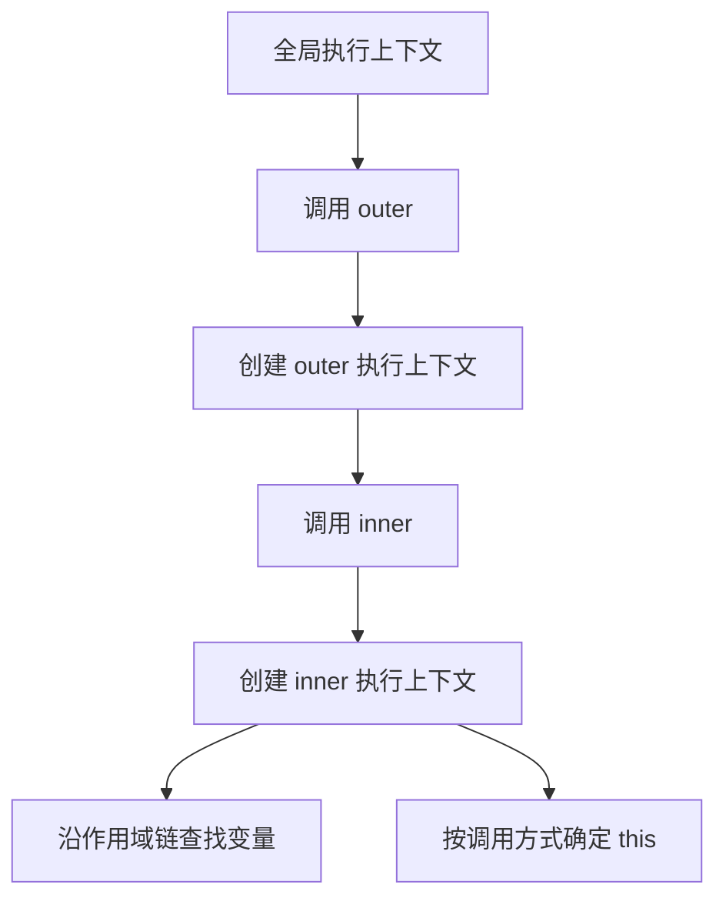
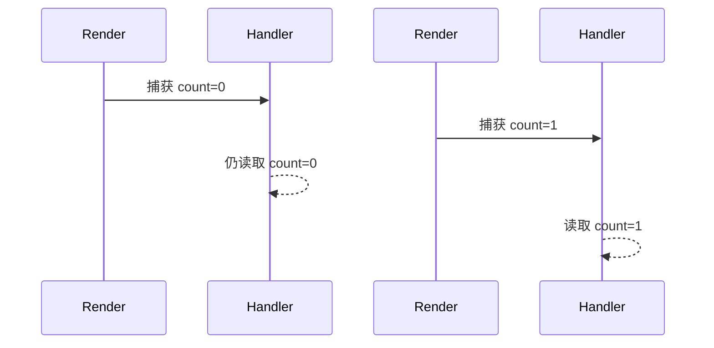

# 执行上下文、作用域、调用栈和 this 绑定

## 场景

一个 React 组件里点击按钮后回调拿不到预期对象；一个定时器里的 `this` 变成了 `window`；一个闭包读取到旧变量；线上报错栈显示函数层层嵌套但不知道调用顺序。很多 JavaScript 问题都可以回到三个概念：代码在哪里定义、在哪里调用、调用时的执行上下文是什么。

## 是什么

执行上下文是 JavaScript 执行一段代码时创建的运行环境。它包含变量环境、词法环境、作用域链、`this` 绑定等信息。

调用栈是执行上下文的栈结构。函数调用时入栈，执行结束后出栈。

作用域决定变量查找规则。词法作用域在代码定义时确定，不在调用时动态改变。

`this` 是函数调用时绑定的值。普通函数的 `this` 由调用方式决定，箭头函数没有自己的 `this`，会捕获外层词法环境的 `this`。



## 为什么需要

理解执行上下文能解释变量提升、闭包、调用栈、递归、异常栈和异步回调。理解 `this` 能避免方法丢失、回调绑定错误和类组件事件处理问题。

如果只记规则不理解模型，很容易在对象方法、事件回调、定时器、Promise 和 React 闭包里混淆“定义位置”和“调用位置”。

## 推荐做法

### 1. 变量查找看定义位置，this 看调用方式

词法作用域由代码写在哪里决定；普通函数的 `this` 由函数怎么被调用决定。这是最重要的分界。

### 2. 避免依赖隐式 this

业务代码中优先使用明确参数、箭头函数、类字段或显式绑定，减少方法作为回调传递后丢失 `this`。

### 3. 调试时先看调用栈

报错时先读 stack trace，从最内层错误位置向外看调用链。异步边界会切断同步调用栈，需要结合 async stack 和日志 trace。

### 4. React 中关注闭包快照

函数组件每次 render 都创建新的执行环境。事件处理器和 effect 回调会捕获当次 render 的变量值。



## 代码示例

### 作用域链

```ts
const globalName = 'global';

function outer() {
  const outerName = 'outer';

  function inner() {
    const innerName = 'inner';
    return `${globalName}/${outerName}/${innerName}`;
  }

  return inner();
}
```

`inner` 能访问 `outerName`，不是因为 `inner` 被 `outer` 调用，而是因为 `inner` 定义在 `outer` 的词法作用域内。

### this 由调用方式决定

```ts
const user = {
  name: 'Ada',
  sayName() {
    return this.name;
  }
};

user.sayName(); // 'Ada'

const say = user.sayName;
say(); // strict mode 下 this 是 undefined
```

方法被取出来单独调用后，调用点不再是 `user.sayName()`，`this` 丢失。

### 显式绑定

```ts
const boundSay = user.sayName.bind(user);
boundSay(); // 'Ada'
```

### 箭头函数捕获外层 this

```ts
class Timer {
  count = 0;

  start() {
    window.setInterval(() => {
      this.count += 1;
    }, 1000);
  }
}
```

箭头函数没有自己的 `this`，这里捕获的是 `start` 执行时的 `this`。

### React 闭包快照

```tsx
function Counter() {
  const [count, setCount] = React.useState(0);

  function alertLater() {
    window.setTimeout(() => {
      alert(count);
    }, 1000);
  }

  return (
    <>
      <button onClick={() => setCount((value) => value + 1)}>+</button>
      <button onClick={alertLater}>Alert later</button>
    </>
  );
}
```

`setTimeout` 里的 `count` 是点击时那次 render 的值。如果需要读取最新值，可以用 ref 保存。

## 反例与后果

### 反例 1：把对象方法直接当回调传入

```ts
button.addEventListener('click', user.sayName);
```

后果：调用时 `this` 不再是 `user`，方法读取错误对象或报错。

### 反例 2：认为箭头函数 this 会随调用对象改变

后果：箭头函数的 `this` 已经在定义时捕获，`call/apply/bind` 不能改变它。

### 反例 3：在 React effect 里遗漏依赖

后果：effect 回调捕获旧变量，表现为数据不更新或逻辑使用旧状态。

## 常见坑

- `var` 是函数作用域，`let/const` 是块级作用域。
- 函数声明会提升，`let/const` 声明存在暂时性死区。
- `this` 和作用域链不是一回事。
- `call/apply/bind` 对箭头函数的 `this` 无效。
- DOM 事件监听中的普通函数 `this` 通常指向当前元素，React 事件处理不依赖这种行为。
- 异步回调不是保留调用栈，而是保留闭包引用。

## 排查与验证

### this 丢失

在函数入口打印 `this`，再看调用点是否是 `obj.method()`。如果方法被解构、赋值或传参，通常会丢失隐式绑定。

### 闭包读旧值

检查函数是在第几次 render 创建的，是否缺少 effect 依赖，是否需要函数式 setState 或 ref。

### 栈溢出

查看调用栈是否递归没有终止条件，或 getter/setter 相互触发。

### 异步错误定位困难

开启浏览器 async stack traces，给异步任务加 traceId，避免只依赖最终报错位置。

## 面试怎么讲

30 秒版本：

> 执行上下文是 JS 执行代码时的运行环境，函数调用会创建新的上下文并压入调用栈。变量查找走词法作用域链，看函数定义位置；普通函数的 this 看调用方式，箭头函数没有自己的 this，会捕获外层 this。

1 分钟版本：

> 我会把作用域和 this 分开讲。作用域是词法的，代码写在哪里就决定能访问哪些变量；this 是调用时绑定的，`obj.fn()`、`fn()`、`new fn()`、`call/apply/bind` 都不同。箭头函数没有自己的 this，所以常用于回调。React 函数组件每次 render 都是新的闭包环境，事件和 effect 会捕获那次 render 的值，这也是依赖数组和 stale closure 问题的来源。

追问版本：

> 如果问方法为什么会丢 this，我会说隐式绑定只在调用表达式是 `obj.method()` 时成立。一旦把 `method` 取出来赋值或传给回调，调用点变成普通函数调用，this 就不再指向原对象。解决方式是 bind、箭头函数包装，或让函数不依赖 this。

## 延伸阅读

- [MDN: Execution context](https://developer.mozilla.org/en-US/docs/Glossary/Execution_context)
- [MDN: Scope](https://developer.mozilla.org/en-US/docs/Glossary/Scope)
- [MDN: this](https://developer.mozilla.org/en-US/docs/Web/JavaScript/Reference/Operators/this)
- [MDN: Closures](https://developer.mozilla.org/en-US/docs/Web/JavaScript/Guide/Closures)
- [React: State as a Snapshot](https://react.dev/learn/state-as-a-snapshot)
