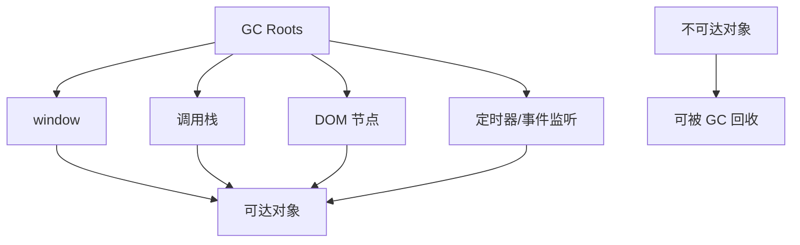

# 内存泄漏、垃圾回收和前端性能陷阱

## 场景

一个后台页面打开半小时后越来越卡，切换路由后内存没有下降，重复打开弹窗后事件监听越来越多。刷新页面能恢复，但用户不能接受长期使用变慢。

这类问题通常和内存泄漏、长生命周期引用、未清理副作用有关。

## 是什么

JavaScript 使用垃圾回收自动释放不可达对象。最核心的判断是可达性：如果对象能从全局对象、当前调用栈、闭包、DOM、定时器、事件监听等根对象访问到，它就不会被回收。



内存泄漏是指不再需要的对象仍然被引用，导致 GC 无法回收。

## 为什么需要

前端应用越来越像长期运行的客户端。后台系统、编辑器、看板、IM、低代码平台可能连续运行几个小时。一次小泄漏在短页面里不明显，在长期会话里会累积成明显卡顿甚至崩溃。

理解 GC 和引用链，能帮助你从“感觉卡”定位到具体对象为什么还活着。

## 推荐做法

### 1. 清理事件监听和订阅

```tsx
useEffect(() => {
  function handleResize() {
    setWidth(window.innerWidth);
  }

  window.addEventListener('resize', handleResize);
  return () => {
    window.removeEventListener('resize', handleResize);
  };
}, []);
```

### 2. 清理定时器

```tsx
useEffect(() => {
  const timer = window.setInterval(refreshData, 5000);
  return () => window.clearInterval(timer);
}, []);
```

### 3. 取消请求或忽略过期结果

```tsx
useEffect(() => {
  const controller = new AbortController();
  fetchData(controller.signal).then(setData).catch(ignoreAbortError);
  return () => controller.abort();
}, []);
```

### 4. 控制缓存大小

```ts
class LruCache<K, V> {
  private map = new Map<K, V>();

  constructor(private maxSize: number) {}

  set(key: K, value: V) {
    this.map.delete(key);
    this.map.set(key, value);
    if (this.map.size > this.maxSize) {
      const oldest = this.map.keys().next().value;
      this.map.delete(oldest);
    }
  }
}
```

无上限缓存是前端内存上涨的常见原因。

## 代码示例

一个会泄漏的弹窗订阅：

```tsx
function BadDialog() {
  useEffect(() => {
    eventBus.on('save', handleSave);
  }, []);

  return <div>Dialog</div>;
}
```

修复方式：

```tsx
function Dialog() {
  useEffect(() => {
    eventBus.on('save', handleSave);
    return () => {
      eventBus.off('save', handleSave);
    };
  }, []);

  return <div>Dialog</div>;
}
```

每次挂载都订阅，就必须在卸载时取消订阅。

## 反例与后果

### 反例 1：全局数组保存页面对象

```ts
const debugRecords: unknown[] = [];
debugRecords.push(largePageState);
```

后果：页面卸载后状态仍被全局数组引用，无法回收。

### 反例 2：定时器持有闭包

后果：定时器回调引用组件状态或大对象，未清理时会让整条引用链继续存活。

### 反例 3：Detached DOM

后果：DOM 节点从页面移除，但仍被 JS 引用，节点和相关数据无法回收。

## 常见坑

- 闭包不是泄漏本身，长期存活的闭包持有无用对象才是问题。
- React 组件卸载不代表所有异步任务自动停止。
- Map、数组、全局 store、日志队列都可能成为泄漏根源。
- DevTools 打开的 console 引用也可能影响本地观察结果。
- WeakMap 适合以对象为 key 的弱引用缓存，但不能替代所有缓存策略。

## 排查与验证

### Memory 面板

用 Chrome DevTools 录制 heap snapshot。重复执行“打开页面 -> 关闭页面 -> GC”，观察对象数量是否持续上涨。

### Allocation instrumentation

录制一段操作，查看哪些构造函数持续分配且不释放。

### Detached DOM

在 heap snapshot 中搜索 detached，检查 DOM 节点是否被事件监听、闭包或缓存引用。

### 线上监控

浏览器内存 API 支持有限，但可以用长任务、崩溃率、页面停留时长和用户反馈间接发现问题。

## 面试怎么讲

30 秒版本：

> JavaScript 垃圾回收主要基于可达性，不可达对象会被回收。内存泄漏是对象已经不需要了，但仍被全局变量、闭包、事件监听、定时器、缓存或 DOM 引用，导致无法回收。

1 分钟版本：

> 前端常见泄漏包括事件监听未解绑、定时器未清理、请求完成后更新卸载组件、全局缓存无上限、Detached DOM。React 里我会在 effect cleanup 中释放订阅、定时器和请求。排查时用 Memory heap snapshot 对比操作前后对象是否持续增长。

追问版本：

> 如果问闭包是否导致泄漏，我会说闭包只是保存词法环境，不必然泄漏。只有当闭包被长期引用，并且闭包里持有不再需要的大对象时，才会导致 GC 无法回收。关键是看引用链。

## 延伸阅读

- [MDN: Memory management](https://developer.mozilla.org/en-US/docs/Web/JavaScript/Memory_management)
- [Chrome DevTools: Memory problems](https://developer.chrome.com/docs/devtools/memory-problems)
- [web.dev: Monitor memory usage](https://web.dev/articles/monitor-total-page-memory-usage)
