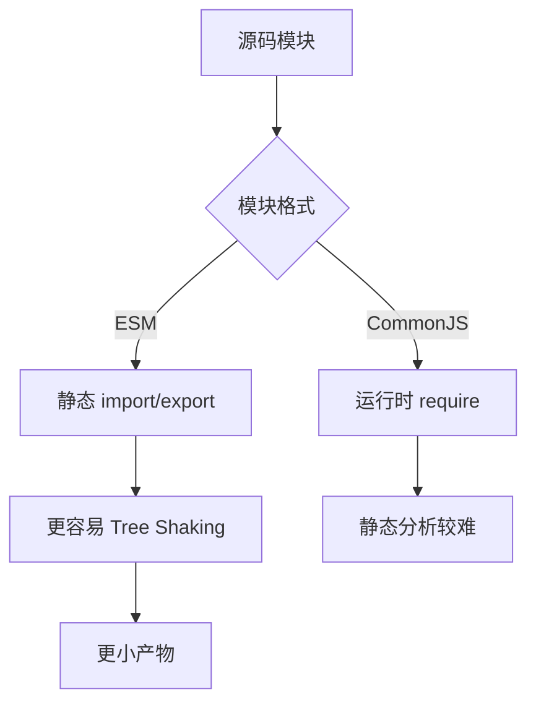

# ESM、CommonJS、循环依赖和 Tree Shaking

## 场景

你在排查一个前端包体积问题：明明只用了组件库的一个 Button，产物里却出现了整套组件；把工具函数从 CommonJS 包换成 ESM 包后，bundle 立刻变小；某两个模块互相 import 后，线上出现 undefined。

这些问题都和模块系统有关。模块不仅影响代码组织，也影响构建分析、Tree Shaking、循环依赖和运行时行为。

## 是什么

JavaScript 常见模块系统主要有 ESM 和 CommonJS。

- ESM：`import` / `export`，静态结构，浏览器和现代构建工具原生支持。
- CommonJS：`require` / `module.exports`，运行时加载，Node.js 传统模块格式。



Tree Shaking 是构建工具移除未使用导出的优化。它依赖模块结构可静态分析，并且要求模块副作用可判断。

## 为什么需要

模块系统决定了构建工具能否理解依赖图。ESM 的导入导出在编译阶段就能确定，因此 Rollup、Webpack、Vite 更容易判断哪些导出未被使用。

CommonJS 可以动态 require，甚至根据条件拼路径，灵活但更难静态分析。对于前端产物，依赖 ESM 版本通常更有利于体积优化。

## 推荐做法

### 1. 业务代码优先使用 ESM

```ts
export function formatDate(value: Date) {
  return value.toISOString().slice(0, 10);
}

export function formatPrice(value: number) {
  return `¥${value.toFixed(2)}`;
}
```

```ts
import { formatPrice } from './formatters';
```

构建工具可以分析只使用了 `formatPrice`。

### 2. 库包提供清晰的 exports

```json
{
  "name": "@acme/ui",
  "type": "module",
  "exports": {
    ".": "./dist/index.js",
    "./button": "./dist/button.js"
  },
  "sideEffects": ["*.css"]
}
```

明确入口能减少深层路径依赖混乱。`sideEffects` 要谨慎声明，CSS 通常是副作用。

### 3. 避免无意义的 barrel 全量副作用

```ts
export * from './Button';
export * from './Modal';
export * from './Table';
```

barrel 文件可以改善导入体验，但如果里面执行了副作用代码或引入了全局样式，Tree Shaking 可能受影响。

### 4. 控制循环依赖

循环依赖不一定立刻报错，但会让模块初始化顺序变复杂。


解决方式通常是抽出共同依赖、反转依赖方向、拆分类型和运行时代码。

## 代码示例

下面是一个导致 Tree Shaking 失效的模式。

```ts
// bad.ts
export const utils = {
  formatPrice(value: number) {
    return `¥${value}`;
  },
  track(event: string) {
    window.analytics.track(event);
  }
};
```

如果只使用 `utils.formatPrice`，构建工具未必能安全删除 `track`。

更好的方式是拆成命名导出：

```ts
export function formatPrice(value: number) {
  return `¥${value}`;
}

export function track(event: string) {
  window.analytics.track(event);
}
```

## 反例与后果

### 反例 1：动态 require

```js
const moduleName = process.env.FEATURE;
const feature = require(`./features/${moduleName}`);
```

后果：构建工具难以静态确定依赖，可能打进整个目录。

### 反例 2：错误声明 `sideEffects: false`

后果：全局样式、polyfill 或注册逻辑可能被删除，线上功能异常。

### 反例 3：循环依赖里读取未初始化导出

后果：运行时拿到 undefined 或半初始化对象，问题往往只在特定路径触发。

## 常见坑

- ESM import 是静态声明，但导入绑定是 live binding。
- CommonJS 导出是对象赋值模型，和 ESM 互操作时可能出现 default 差异。
- TypeScript 的 `import type` 可以避免类型导入变成运行时依赖。
- Tree Shaking 不等于压缩，通常还需要 minifier 删除死代码。
- 包体积问题要看最终 bundle，而不是只看源码 import 行。

## 排查与验证

### 包体积异常

用 bundle analyzer 查看具体模块来源。检查是否引入 CommonJS 版本、全量组件库、locale、图标库或 barrel 副作用。

### Tree Shaking 不生效

检查依赖是否 ESM、是否有副作用声明、是否使用动态访问或对象聚合导出。

### 循环依赖

用 madge、dependency-cruiser 或构建告警定位循环。优先抽离共享类型、常量或接口层。

## 面试怎么讲

30 秒版本：

> ESM 是静态 import/export，更利于构建工具分析依赖和 Tree Shaking；CommonJS 是运行时 require，更灵活但静态分析困难。Tree Shaking 依赖 ESM 结构和正确的副作用声明。

1 分钟版本：

> 我会优先使用 ESM 和命名导出，避免动态 require 和把很多函数塞进一个对象导出。库包要正确配置 exports 和 sideEffects，CSS、polyfill 这类副作用不能误删。循环依赖要看模块初始化顺序，通常通过抽公共模块或拆类型依赖解决。

追问版本：

> 如果问为什么只引一个函数却打进整个库，我会检查是不是引到了 CommonJS 入口、barrel 文件有副作用、包没有 sideEffects 声明，或者导出方式让构建工具无法静态分析。最终以 bundle analyzer 的产物为准。

## 延伸阅读

- [MDN: JavaScript modules](https://developer.mozilla.org/en-US/docs/Web/JavaScript/Guide/Modules)
- [Node.js: CommonJS modules](https://nodejs.org/api/modules.html)
- [Webpack: Tree Shaking](https://webpack.js.org/guides/tree-shaking/)
- [Rollup: ES module syntax](https://rollupjs.org/introduction/)
