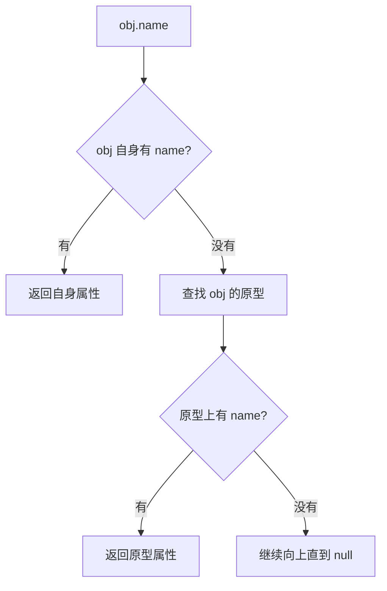

# JavaScript 原型链与闭包：对象模型和作用域机制

## 场景

你在面试里经常会遇到这些问题：`new` 做了什么、`class` 和原型有什么关系、为什么方法能从父类继承、闭包为什么会保留变量、React Hooks 里为什么会出现旧闭包。

这些问题表面是八股，实际对应 JavaScript 两个核心机制：对象如何共享能力，函数如何记住创建时的词法环境。

## 是什么

原型链是 JavaScript 对象属性查找和能力复用的机制。每个对象都有内部原型，访问属性时，如果对象自身没有，就沿着原型链向上查找。

闭包是函数和其词法环境的组合。函数创建时，会记住它能访问的外层变量；即使外层函数执行结束，这些变量仍可能被内部函数引用。



## 为什么需要

原型链让对象之间可以共享方法，避免每个实例都复制一份函数。`class` 只是更接近传统面向对象写法的语法，本质仍然基于原型。

闭包让函数可以封装状态和行为，比如计数器、防抖、模块私有变量、函数工厂。React 函数组件和 Hooks 也大量依赖闭包，但这也会带来旧值问题。

## 推荐做法

### 1. 理解 `new` 的过程

```ts
function create<T extends object>(Constructor: new (...args: any[]) => T, ...args: any[]) {
  const instance = Object.create(Constructor.prototype);
  const result = Constructor.apply(instance, args);
  return typeof result === 'object' && result !== null ? result : instance;
}
```

`new` 大致做了：创建对象、连接原型、绑定 `this` 执行构造函数、返回对象。

### 2. `class` 仍然是原型机制

```ts
class User {
  constructor(public name: string) {}

  sayHi() {
    return `Hi, ${this.name}`;
  }
}

const user = new User('Ada');
```

`sayHi` 在 `User.prototype` 上，不在每个实例自身上。

### 3. 用闭包封装私有状态

```ts
function createCounter() {
  let count = 0;

  return {
    increment() {
      count += 1;
      return count;
    },
    getValue() {
      return count;
    }
  };
}
```

`count` 不暴露在外部，但两个方法都能访问它。

### 4. 处理旧闭包问题

```tsx
function Counter() {
  const [count, setCount] = useState(0);

  function addLater() {
    window.setTimeout(() => {
      setCount((value) => value + 1);
    }, 1000);
  }

  return <button onClick={addLater}>{count}</button>;
}
```

异步回调里依赖旧状态时，用函数式更新避免捕获旧 `count`。

## 代码示例

手写防抖就是闭包的典型应用。

```ts
function debounce<T extends (...args: any[]) => void>(fn: T, delay: number) {
  let timer: number | undefined;

  return (...args: Parameters<T>) => {
    window.clearTimeout(timer);
    timer = window.setTimeout(() => {
      fn(...args);
    }, delay);
  };
}
```

返回函数记住了 `timer`，每次调用都能清理上一次定时器。

## 反例与后果

### 反例 1：把方法写到每个实例上

```ts
function User(name: string) {
  this.name = name;
  this.sayHi = function () {
    return this.name;
  };
}
```

后果：每个实例都会创建一份 `sayHi`，浪费内存。共享方法应放到原型上。

### 反例 2：异步闭包读取旧值

```tsx
setTimeout(() => {
  setCount(count + 1);
}, 1000);
```

后果：`count` 是创建回调时那次渲染的快照，可能不是最新值。

### 反例 3：闭包持有大对象不释放

后果：如果回调长期被引用，闭包里的大对象也无法回收，可能造成内存泄漏。

## 常见坑

- `__proto__` 是访问原型的历史接口，正式操作优先用 `Object.getPrototypeOf`。
- `prototype` 是函数对象上的属性，用于创建实例的原型。
- 箭头函数没有自己的 `this`，不能当普通构造函数使用。
- 闭包不是内存泄漏本身，长期持有不再需要的数据才是问题。
- React 函数组件每次 render 都会创建新的闭包。

## 排查与验证

### 原型属性查找

用 `Object.hasOwn` 判断属性是否在对象自身，用 `Object.getPrototypeOf` 查看原型链。

### this 丢失

如果方法传给回调后 `this` 变成 undefined，检查调用位置。类方法可用箭头函数、bind 或在调用时保留接收者。

### 闭包旧值

检查异步回调、事件监听、定时器和 Promise 回调是在第几次渲染创建的。React 中优先考虑函数式更新、依赖数组或 ref。

## 面试怎么讲

30 秒版本：

> 原型链是对象属性查找机制，对象自身没有属性时会沿原型向上查找。class 本质仍基于原型。闭包是函数和词法环境的组合，函数可以访问创建时外层作用域里的变量。

1 分钟版本：

> new 会创建对象、把对象原型指向构造函数 prototype、绑定 this 执行构造函数并返回对象。原型适合共享方法。闭包适合封装状态，比如防抖里的 timer，但异步闭包也可能捕获旧值，React 里常用函数式更新或 ref 处理。

追问版本：

> 如果问闭包和内存泄漏，我会说闭包只是保留词法环境，不等于泄漏。只有当长期存活的回调持有不再需要的大对象，导致 GC 无法回收时才是泄漏。排查时要看引用链，而不是看到闭包就认为有问题。

## 延伸阅读

- [MDN: Inheritance and the prototype chain](https://developer.mozilla.org/en-US/docs/Web/JavaScript/Inheritance_and_the_prototype_chain)
- [MDN: Closures](https://developer.mozilla.org/en-US/docs/Web/JavaScript/Closures)
- [MDN: new operator](https://developer.mozilla.org/en-US/docs/Web/JavaScript/Reference/Operators/new)
