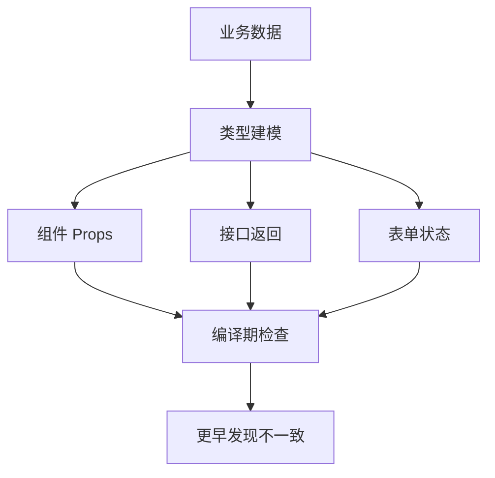

# TypeScript 类型系统：泛型、类型收窄和工程实践

## 场景

一个中后台项目里，接口返回、表单字段、权限配置、路由参数和组件 props 都在快速变化。没有类型约束时，问题通常不是编译时报错，而是运行时才发现：某个字段可能为空、枚举值拼错、接口结构变了但页面没改、通用组件 props 越堆越乱。

TypeScript 的价值不是“给 JavaScript 加类型注释”，而是把一部分业务约束前移到开发阶段，让重构、协作和复用更可控。

## 是什么

TypeScript 是 JavaScript 的静态类型超集。它在编译阶段检查类型，最终输出 JavaScript。

常用能力包括：

- 联合类型和交叉类型：表达“多种可能”和“组合能力”。
- 类型收窄：通过条件判断把宽类型缩小到具体类型。
- 泛型：表达输入和输出之间的类型关系。
- 条件类型、映射类型、工具类型：批量转换和复用类型规则。



## 为什么需要

大型前端项目的复杂度主要来自边界：接口边界、组件边界、模块边界、状态边界。TypeScript 最适合在这些边界上发挥作用。

没有类型时，调用方只能靠文档和记忆传参。字段变更后，影响范围不清楚。通用组件被多人复用后，错误用法很难及时发现。

有类型后，类型系统可以回答：这个字段是否必填、这个状态是否覆盖了所有分支、这个函数返回什么、这个组件 props 是否互斥、这个接口变化影响哪些地方。

## 推荐做法

### 1. 用联合类型表达状态机

```ts
type RequestState<T> =
  | { status: 'idle' }
  | { status: 'loading' }
  | { status: 'success'; data: T }
  | { status: 'error'; message: string };
```

这样比多个布尔值更可靠。`status` 决定当前分支能访问哪些字段。

### 2. 用类型收窄消除不确定性

```ts
function renderUser(state: RequestState<User>) {
  if (state.status === 'success') {
    return state.data.name;
  }

  if (state.status === 'error') {
    return state.message;
  }

  return 'Loading...';
}
```

TypeScript 会根据 `status` 自动收窄类型，避免在 loading 状态访问不存在的 `data`。

### 3. 用泛型表达关系，而不是只写 any

```ts
async function requestJson<T>(url: string): Promise<T> {
  const response = await fetch(url);
  if (!response.ok) {
    throw new Error(`HTTP ${response.status}`);
  }
  return response.json() as Promise<T>;
}

const user = await requestJson<User>('/api/me');
```

泛型的重点是把调用方指定的类型传递到返回值，而不是让函数内部失去约束。

### 4. 用工具类型减少重复

```ts
type User = {
  id: string;
  name: string;
  email: string;
  role: 'admin' | 'member';
};

type CreateUserInput = Omit<User, 'id'>;
type UpdateUserInput = Partial<Pick<User, 'name' | 'email' | 'role'>>;
```

工具类型适合表达从已有模型派生出来的新模型，减少字段重复和更新遗漏。

## 代码示例

下面是一个类型安全的表格列配置。

```tsx
type Column<T> = {
  key: keyof T;
  title: string;
  render?: (value: T[keyof T], row: T) => React.ReactNode;
};

type User = {
  id: string;
  name: string;
  role: 'admin' | 'member';
};

const columns: Column<User>[] = [
  { key: 'name', title: 'Name' },
  {
    key: 'role',
    title: 'Role',
    render: (value) => <strong>{value}</strong>
  }
];
```

如果把 `key` 写成不存在的字段，编译期会报错。真实项目里可以继续把 `render` 的 value 类型做得更精确，但不要为了类型体操牺牲可读性。

## 反例与后果

### 反例 1：用 `any` 跳过边界

```ts
function handleResponse(response: any) {
  return response.data.user.name;
}
```

后果：接口结构变化时编译器无法提醒，错误会延迟到运行时。

### 反例 2：多个布尔值表达请求状态

```ts
type BadState<T> = {
  loading: boolean;
  error?: string;
  data?: T;
};
```

后果：可能出现 `loading=true` 同时有 `data` 和 `error` 的非法组合。联合类型能避免这种状态不一致。

### 反例 3：类型过度复杂

后果：类型本身变成维护负担，团队成员不敢改。工程类型应优先清晰、稳定、能表达业务边界。

## 常见坑

- `as` 断言不会做运行时校验，只是告诉编译器“相信我”。
- 接口返回类型不等于接口真的可靠，外部输入仍需要运行时校验。
- `Partial<T>` 很方便，但过度使用会让业务约束变弱。
- `type` 和 `interface` 大多数场景都能用，团队保持一致更重要。
- 泛型要表达关系，不能只是把 `any` 换成 `<T>`。

## 排查与验证

### 类型没拦住错误

检查是否用了 `any`、宽泛的 `Record<string, unknown>` 或过多 `as`。这些通常是类型系统失效的入口。

### 接口数据运行时报错

检查是否缺少运行时校验。TypeScript 只检查编译期代码，无法保证后端返回一定符合类型。

### 组件 props 难用

检查是否把多个互斥模式塞进一个组件。可以用联合类型表达不同模式的 props。

## 面试怎么讲

30 秒版本：

> TypeScript 的核心价值是把接口、组件和状态边界上的约束前移到编译期。泛型表达输入和输出的类型关系，联合类型和类型收窄适合表达状态分支，工具类型可以从已有模型派生新类型。

1 分钟版本：

> 我会优先在边界处建模，比如接口返回、表单输入、组件 props 和状态机。请求状态用可辨识联合类型，避免多个 boolean 组合出非法状态；通用函数用泛型保留调用方类型；接口数据如果来自外部，还要配合运行时校验。类型不是越复杂越好，能稳定表达业务约束才有价值。

追问版本：

> 如果问 `any`，我会说它会让类型检查在该处失效，只适合作为迁移期临时方案。`unknown` 更安全，因为使用前必须收窄。`as` 断言不能替代校验，尤其是接口数据和本地存储数据。大型项目里我更关注类型边界、类型复用和重构反馈，而不是单纯类型体操。

## 延伸阅读

- [TypeScript Handbook](https://www.typescriptlang.org/docs/handbook/intro.html)
- [TypeScript: Narrowing](https://www.typescriptlang.org/docs/handbook/2/narrowing.html)
- [TypeScript: Generics](https://www.typescriptlang.org/docs/handbook/2/generics.html)
- [TypeScript: Utility Types](https://www.typescriptlang.org/docs/handbook/utility-types.html)
