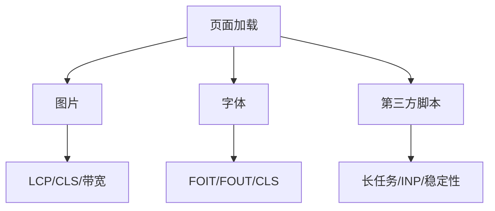

# 图片、字体和第三方脚本优化

## 场景

首屏 JS 已经拆分，接口也不慢，但页面仍然加载慢、布局抖动、交互卡顿。排查后发现：首屏 hero 图过大，字体阻塞文本显示，统计和客服脚本抢占主线程。

资源优化关注的是浏览器真正下载、解析和执行的内容，而不只是业务代码。

## 是什么

常见资源成本包括：

- 图片：体积、尺寸、格式、解码、布局占位。
- 字体：下载、阻塞文本显示、字体替换导致布局变化。
- 第三方脚本：网络请求、主线程执行、隐私和稳定性风险。



## 为什么需要

真实页面的瓶颈经常不在框架代码。图片可能决定 LCP，字体可能造成文本不可见，第三方脚本可能制造长任务。优化这些资源能直接改善用户感知和 Core Web Vitals。

## 推荐做法

### 1. 图片按用途选择策略

首屏 LCP 图片：优先级高，提供尺寸，避免 lazy。

```html
<link rel="preload" as="image" href="/hero.webp" />

```

非首屏图片：懒加载，使用合适尺寸。

```html

```

### 2. 使用响应式图片

```html

```

### 3. 字体减少阻塞和抖动

```css
@font-face {
  font-family: Inter;
  src: url('/fonts/inter.woff2') format('woff2');
  font-display: swap;
}
```

关键字体可以 preload，但不要预加载所有字重。

### 4. 第三方脚本延后和隔离

```ts
window.addEventListener('load', () => {
  const script = document.createElement('script');
  script.src = 'https://example.com/analytics.js';
  script.async = true;
  document.head.append(script);
}, { once: true });
```

非关键第三方脚本不应该阻塞首屏和关键交互。

## 代码示例

一个资源策略清单：

```html
<head>
  <link rel="preconnect" href="https://cdn.example.com" />
  <link rel="preload" as="image" href="https://cdn.example.com/hero.webp" />
  <link rel="preload" as="font" href="/fonts/inter.woff2" type="font/woff2" crossorigin />
</head>
```

注意：preload 只给关键资源使用。滥用会抢占带宽。

## 反例与后果

### 反例 1：首屏图片 lazy

后果：LCP 图片加载优先级降低，主要内容出现更晚。

### 反例 2：图片没有尺寸

后果：图片加载后挤开内容，造成 CLS。

### 反例 3：同步加载第三方脚本

后果：脚本阻塞解析或占用主线程，影响 LCP 和 INP。

## 常见坑

- WebP/AVIF 体积小，但要考虑兼容和回退。
- 字体 preload 必须匹配实际请求的 crossorigin 和 URL，否则可能重复下载。
- `font-display: swap` 可能带来字体替换，需要控制 fallback 字体尺寸。
- 第三方脚本也会造成线上错误和隐私风险，要纳入监控。

## 排查与验证

### 图片

Network 面板看图片体积、优先级和下载时机。Performance 看 LCP 元素是否是图片。

### 字体

检查字体是否阻塞文本显示，是否重复下载，是否造成布局偏移。

### 第三方脚本

Performance 面板查看 Long Task 来源，Coverage 面板看脚本使用率。

## 面试怎么讲

30 秒版本：

> 图片、字体和第三方脚本都会影响首屏和交互。首屏 LCP 图片要高优先级、合适尺寸和格式；非首屏图片 lazy；字体用 woff2、font-display 和必要 preload；第三方脚本延后加载并监控长任务。

1 分钟版本：

> 我会先用 Performance 和 Network 找资源瓶颈。图片看尺寸、格式、srcset、优先级和是否造成 CLS；字体看阻塞、重复下载和字体替换；第三方脚本看是否阻塞主线程和是否可延后。优化后用 LCP、CLS、INP 和真实用户数据验证。

追问版本：

> 如果问 preload，我会说它适合浏览器发现较晚但首屏关键的资源，比如 hero 图或关键字体。不能滥用，因为 preload 会提高优先级，可能抢占其它关键资源带宽。

## 延伸阅读

- [web.dev: Optimize images](https://web.dev/learn/images/)
- [web.dev: Optimize web fonts](https://web.dev/learn/performance/optimize-web-fonts)
- [web.dev: Efficiently load third-party JavaScript](https://web.dev/articles/efficiently-load-third-party-javascript)
- [MDN: Responsive images](https://developer.mozilla.org/en-US/docs/Learn/HTML/Multimedia_and_embedding/Responsive_images)
