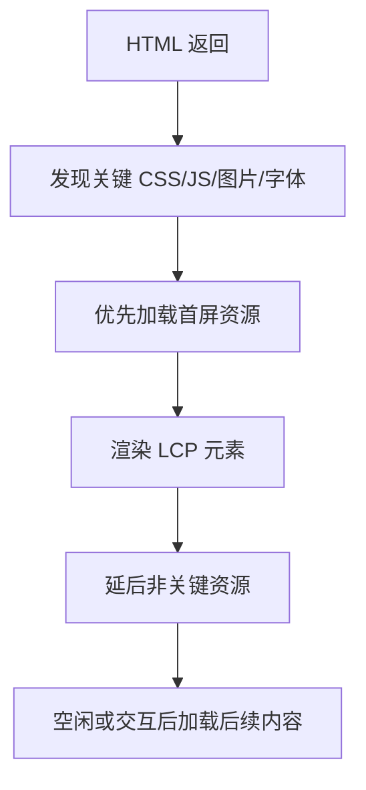

# 首屏优化：代码分割、预加载、懒加载和资源优先级

## 场景

一个落地页投放后转化率低，LCP p75 超过 4 秒。页面结构很常见：顶部 hero 图、标题、行动按钮、几段介绍、评论区和第三方统计脚本。

排查发现：首屏 JS 很大、hero 图片下载优先级不高、字体阻塞文本显示、非首屏组件也被打进首包。首屏优化要解决的不是“所有资源都快”，而是“用户最先需要看到和交互的内容优先完成”。

## 是什么

首屏优化是围绕关键渲染路径做资源调度和产物拆分，让首屏核心内容尽快可见、可用、稳定。



常用手段：

- 减少关键资源体积。
- 预加载 LCP 图片、关键字体和关键 CSS。
- 代码分割，非首屏组件懒加载。
- 图片按尺寸和格式优化。
- 延后第三方脚本。
- 服务端或边缘缓存降低 TTFB。

## 为什么需要

首屏体验直接影响用户是否继续等待。尤其是移动端和弱网环境，首包 JS、图片、字体和第三方脚本都会竞争带宽和主线程。

优化首屏不能只盯 bundle size。一个小 JS 包如果阻塞主线程，也会影响渲染；一张大 hero 图如果是 LCP 元素，却没有预加载，会拖慢 LCP；字体策略不当会造成文本不可见或布局抖动。

## 推荐做法

### 1. 找出真正的 LCP 元素

先用 Lighthouse 或 Performance 确认 LCP 元素是什么，再优化它的路径。不要猜。

如果 LCP 是 hero 图片：

```html
<link rel="preload" as="image" href="/hero-1200.webp" />

```

### 2. 非首屏组件懒加载

```tsx
import { lazy, Suspense } from 'react';

const Reviews = lazy(() => import('./Reviews'));

function LandingPage() {
  return (
    <>
      <Hero />
      <FeatureSummary />
      <Suspense fallback={<ReviewsSkeleton />}>
        <Reviews />
      </Suspense>
    </>
  );
}
```

懒加载适合非首屏、低优先级或条件展示内容。不要把首屏核心内容懒加载到用户看不见。

### 3. 控制第三方脚本

统计、客服、A/B 测试和广告脚本常常影响首屏。能延后的延后，能按需加载的按需加载。

```ts
function loadAnalytics() {
  const script = document.createElement('script');
  script.src = 'https://example.com/analytics.js';
  script.async = true;
  document.head.append(script);
}

window.addEventListener('load', loadAnalytics, { once: true });
```

### 4. 图片和字体按首屏优先级处理

首屏图片要给尺寸，非首屏图片懒加载。

```html

```

字体可以用 `font-display: swap`，避免文本长期不可见。

```css
@font-face {
  font-family: Inter;
  src: url('/fonts/inter.woff2') format('woff2');
  font-display: swap;
}
```

## 代码示例

下面是一个首屏资源优先级示例。

```html
<head>
  <link rel="preconnect" href="https://cdn.example.com" />
  <link rel="preload" as="image" href="https://cdn.example.com/hero.webp" />
  <link rel="stylesheet" href="/assets/app.css" />
  <script type="module" src="/assets/app.js" defer></script>
</head>
<body>
  <main id="root">
    <section class="hero">
      
      <h1>Analytics dashboard</h1>
    </section>
  </main>
</body>
```

这个例子明确告诉浏览器：CDN 连接、hero 图片、CSS 和入口 JS 是首屏关键资源。

## 反例与后果

### 反例 1：首屏依赖巨大 vendor 包

后果：用户必须下载和解析大量首屏不需要的代码，LCP 和 INP 都可能变差。

### 反例 2：LCP 图片懒加载

```html

```

后果：浏览器会降低它的加载优先级，LCP 可能变慢。首屏 LCP 图片通常不应该 lazy。

### 反例 3：第三方同步脚本放 head

后果：脚本下载和执行阻塞解析或占用主线程，首屏内容延迟出现。

## 常见坑

- 首屏优化不是只压缩 JS，还包括 TTFB、CSS、图片、字体和第三方脚本。
- preload 用错资源会抢占带宽，反而伤害首屏。
- 代码分割过细会增加请求开销，需要结合 HTTP/2/3 和缓存策略判断。
- SSR 不等于首屏一定快，hydration 成本也可能很高。
- 骨架屏不能替代真实内容，LCP 关注的是主要内容绘制。

## 排查与验证

### 定位 LCP 链路

用 Performance 找到 LCP 元素，检查它的资源发现时间、下载时间、渲染阻塞和尺寸。

### 分析包体积

用 bundle analyzer 找出首屏 bundle 中的大依赖，判断是否可以拆分、按需加载或替换。

### 检查资源优先级

Network 面板看 priority、waterfall、preload 是否命中。确认关键图片不是很晚才被发现。

### 线上验证

看真实用户 p75 LCP，按设备、网络、地区、版本切分。不要只用本地 Lighthouse 证明优化有效。

## 面试怎么讲

30 秒版本：

> 首屏优化的核心是缩短关键渲染路径，让首屏核心内容优先加载和绘制。常见手段包括降低 TTFB、压缩和拆分 JS、预加载 LCP 图片、优化字体和图片、延后非关键组件和第三方脚本。

1 分钟版本：

> 我会先用工具确认 LCP 元素和资源瀑布图，再针对瓶颈优化。如果 LCP 是图片，就保证尺寸、格式、CDN 和 preload；如果是 JS 阻塞，就做代码分割和延后非关键逻辑；如果是 TTFB 慢，就看缓存、SSR 或接口链路。优化后看线上 p75 LCP，而不是只看本地分数。

追问版本：

> 如果问懒加载，我会说非首屏内容适合 lazy，但首屏 LCP 图片不适合 lazy，因为会降低加载优先级。preload 也不能滥用，只应该给真正关键且浏览器发现较晚的资源，否则会抢占带宽。

## 延伸阅读

- [web.dev: Optimize LCP](https://web.dev/articles/optimize-lcp)
- [web.dev: Lazy loading images](https://web.dev/articles/browser-level-image-lazy-loading)
- [MDN: rel=preload](https://developer.mozilla.org/en-US/docs/Web/HTML/Attributes/rel/preload)
- [web.dev: Efficiently load third-party JavaScript](https://web.dev/articles/efficiently-load-third-party-javascript)
