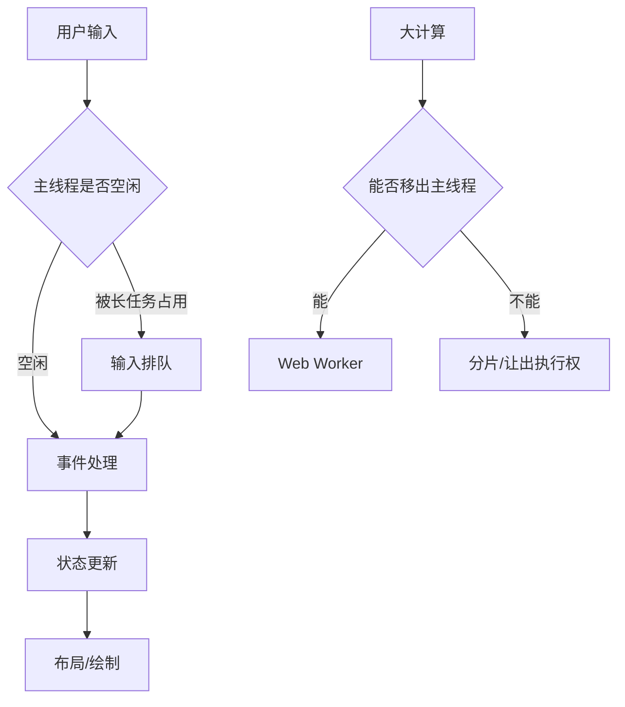

# 长任务拆分、Web Worker、虚拟列表和交互响应

## 场景

一个后台列表页一次展示几千条数据，支持本地筛选、排序、批量勾选和导出。用户输入搜索词时页面明显卡顿，滚动列表掉帧，点击按钮要等一会才有反馈。Performance 面板里可以看到主线程连续执行几百毫秒的 JavaScript，期间浏览器无法及时处理输入、布局和绘制。

性能优化不能只盯首屏。中后台和复杂 Web App 更常见的问题是交互期间卡顿，也就是用户已经看到页面，但操作没有及时响应。

## 是什么

长任务是主线程上持续时间超过 50ms 的任务。浏览器主线程负责执行 JavaScript、处理输入事件、计算样式、布局、绘制和合成调度。一个长任务占住主线程时，用户输入只能排队等待。

Web Worker 是浏览器提供的后台线程能力，适合把 CPU 密集型计算从主线程移走。

虚拟列表是只渲染视口附近数据项的技术，用较少 DOM 表示大量数据。

交互响应关注用户操作到下一次可见反馈之间的延迟，现代指标中常用 INP 衡量页面整体交互延迟。



## 为什么需要

用户感知的“卡”通常不是下载慢，而是主线程忙。常见来源包括：一次性渲染大量 DOM、同步解析大 JSON、本地搜索排序、复杂图表计算、富文本解析、递归遍历大对象、输入事件里做重计算。

如果不拆长任务，浏览器没有机会处理输入和绘制。即使算法总耗时不变，把一个 300ms 的任务拆成多个小片段，也能让用户在中间获得反馈。

## 推荐做法

### 1. 先定位主线程瓶颈

不要凭感觉加 `useMemo`。先用 Performance 面板或 React Profiler 找到长任务来自 JavaScript、布局、绘制还是 React commit。

### 2. 可见区域优先，避免一次性渲染全部

大量列表、树、表格优先考虑虚拟化。虚拟化能显著降低 DOM 节点数量、布局成本和 React 协调成本。

### 3. CPU 密集任务移到 Worker

适合 Worker 的任务：大数据聚合、搜索索引、图片处理、压缩、加密、复杂格式解析。Worker 不适合直接操作 DOM，也不适合频繁传输超大对象。

### 4. 无法移走的任务要分片执行

对必须在主线程执行的任务，可以用 `requestIdleCallback`、`setTimeout`、`scheduler.postTask` 或框架提供的并发能力分片。

### 5. 输入路径要轻

输入框、拖拽、滚动、鼠标移动这类高频交互中，不要同步做重计算。用防抖、节流、过渡状态、后台计算和增量渲染降低阻塞。

## 代码示例

### 分片处理大数组

```ts
type Processor<T> = (item: T) => void;

export function processInChunks<T>(items: T[], process: Processor<T>, chunkSize = 200) {
  let index = 0;

  function runChunk() {
    const end = Math.min(index + chunkSize, items.length);

    while (index < end) {
      process(items[index]);
      index += 1;
    }

    if (index < items.length) {
      window.setTimeout(runChunk, 0);
    }
  }

  runChunk();
}
```

这不会减少总计算量，但能让浏览器在任务之间处理输入和绘制。

### Web Worker 计算

```ts
// search.worker.ts
self.addEventListener('message', (event: MessageEvent<{ requestId: string; keyword: string; rows: Row[] }>) => {
  const { requestId, keyword, rows } = event.data;
  const result = rows.filter((row) => row.name.includes(keyword));
  self.postMessage({ requestId, result });
});
```

```ts
// main.ts
const worker = new Worker(new URL('./search.worker.ts', import.meta.url), { type: 'module' });
const pending = new Map<string, (rows: Row[]) => void>();

worker.addEventListener('message', (event: MessageEvent<{ requestId: string; result: Row[] }>) => {
  const resolve = pending.get(event.data.requestId);
  if (!resolve) return;

  pending.delete(event.data.requestId);
  resolve(event.data.result);
});

export function searchRows(keyword: string, rows: Row[]) {
  return new Promise<Row[]>((resolve) => {
    const requestId = crypto.randomUUID();
    pending.set(requestId, resolve);
    worker.postMessage({ requestId, keyword, rows });
  });
}
```

大数据传输要注意结构化克隆成本。非常大的二进制数据可以用 Transferable。

### 虚拟列表核心结构

```tsx
function VirtualList<T>({ items, height, rowHeight, renderItem }: {
  items: T[];
  height: number;
  rowHeight: number;
  renderItem: (item: T, index: number) => React.ReactNode;
}) {
  const [scrollTop, setScrollTop] = React.useState(0);
  const startIndex = Math.floor(scrollTop / rowHeight);
  const endIndex = Math.min(items.length, startIndex + Math.ceil(height / rowHeight) + 4);
  const visible = items.slice(startIndex, endIndex);

  return (
    <div style={{ height, overflow: 'auto' }} onScroll={(event) => setScrollTop(event.currentTarget.scrollTop)}>
      <div style={{ height: items.length * rowHeight, position: 'relative' }}>
        <div style={{ transform: `translateY(${startIndex * rowHeight}px)` }}>
          {visible.map((item, offset) => renderItem(item, startIndex + offset))}
        </div>
      </div>
    </div>
  );
}
```

生产项目建议优先使用成熟虚拟化库，并补齐动态高度、键盘导航、滚动恢复和可访问性。

### React 中降低输入阻塞

```tsx
import { useDeferredValue, useMemo, useState } from 'react';

function SearchPanel({ rows }: { rows: Row[] }) {
  const [keyword, setKeyword] = useState('');
  const deferredKeyword = useDeferredValue(keyword);

  const filteredRows = useMemo(() => {
    return rows.filter((row) => row.name.includes(deferredKeyword));
  }, [rows, deferredKeyword]);

  return (
    <>
      <input value={keyword} onChange={(event) => setKeyword(event.target.value)} />
      <VirtualList items={filteredRows} height={480} rowHeight={40} renderItem={(row) => <RowItem row={row} />} />
    </>
  );
}
```

`useDeferredValue` 不是替代算法优化的工具，它只是让高优先级输入更新更容易先完成。

## 反例与后果

### 反例 1：输入事件里同步筛选十万条数据

后果：每次按键都阻塞主线程，输入字符延迟显示，INP 变差。

### 反例 2：把所有计算都丢进 Worker

后果：线程通信和数据拷贝成本可能超过收益，代码复杂度也会上升。

### 反例 3：虚拟列表没有稳定高度和 key

后果：滚动跳动、复用错误、焦点丢失，用户体验比普通列表更差。

### 反例 4：只看 React render，不看浏览器布局

后果：即使 React 很快，复杂 CSS、表格布局和图片绘制仍可能造成卡顿。

## 常见坑

- `setTimeout(fn, 0)` 只是让出主线程，不保证立即执行。
- Worker 不能访问 DOM，UI 更新必须回到主线程。
- 大对象在主线程和 Worker 间传递会有克隆成本。
- 虚拟列表会影响浏览器原生查找、打印、可访问性和锚点定位。
- 动态高度虚拟列表要处理测量缓存失效。
- 滚动事件要避免频繁触发全量 state 更新。

## 排查与验证

### 定位长任务

打开 Performance 面板录制交互，查 Main 线程上超过 50ms 的 Task。展开调用栈确认是业务计算、React commit、Layout 还是第三方脚本。

### 验证 Worker 是否有效

对比移入 Worker 前后的主线程长任务数量、输入延迟和总耗时。还要观察数据传输时间，避免只把阻塞换成通信开销。

### 验证虚拟列表

观察 DOM 节点数量是否随数据量线性增长。快速滚动时检查空白、跳动、焦点和固定列同步问题。

### 验证交互响应

用 Lighthouse、Web Vitals 或真实用户监控看 INP 变化。实验室数据要配合线上分位数，尤其关注低端设备。

## 面试怎么讲

30 秒版本：

> 交互卡顿通常是主线程被长任务占住。我的处理顺序是先用 Performance 定位，再减少一次性渲染和计算；大列表用虚拟化，CPU 密集任务放到 Worker，必须在主线程做的任务就分片执行，让浏览器有机会处理输入和绘制。

1 分钟版本：

> 我会把问题拆成数据量、计算量和渲染量。数据量大时优先分页和字段裁剪，渲染量大时用虚拟列表或虚拟表格，计算量大时考虑 Worker 或分片。React 层可以用 memo、useDeferredValue、状态下沉减少阻塞，但不能替代浏览器层面的长任务分析。最后用 INP、Performance 录制和线上监控验证优化是否真的改善用户交互。

追问版本：

> 如果问 Worker 什么时候不适合，我会说任务很小、需要频繁访问 DOM、需要高频传输大对象时不适合。Worker 解决的是主线程 CPU 阻塞，不解决网络慢和 DOM 渲染慢。引入前要估算计算成本和通信成本。

## 延伸阅读

- [web.dev: Optimize long tasks](https://web.dev/articles/optimize-long-tasks)
- [MDN: Web Workers API](https://developer.mozilla.org/en-US/docs/Web/API/Web_Workers_API)
- [web.dev: Virtualize large lists with react-window](https://web.dev/articles/virtualize-long-lists-react-window)
- [React: useDeferredValue](https://react.dev/reference/react/useDeferredValue)
- [web.dev: Interaction to Next Paint](https://web.dev/articles/inp)
