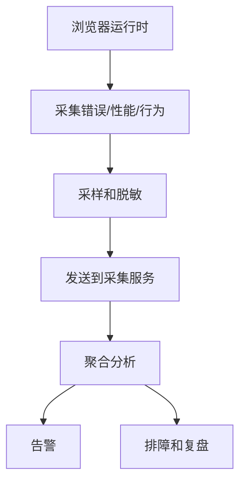

# 前端监控与埋点：错误、性能、行为和排障闭环

## 场景

上线后用户反馈“页面偶尔白屏”“按钮点了没反应”“某个地区打开很慢”。如果没有监控，只能靠用户截图、客服转述和本地猜测。

前端监控要解决的是：线上发生了什么、影响多少用户、从哪个版本开始、和哪些环境相关、能否定位到代码和链路。

## 是什么

前端监控通常包含几类数据：

- 错误监控：JS 异常、Promise rejection、资源加载失败、React Error Boundary。
- 性能监控：Web Vitals、资源耗时、接口耗时、长任务。
- 行为埋点：页面访问、点击、曝光、转化漏斗。
- 环境信息：版本、路由、浏览器、设备、网络、用户分组。



## 为什么需要

前端运行在用户设备上，环境不可控。浏览器版本、网络、插件、缓存、地区、灰度版本都会影响表现。

没有监控时，线上问题不可见；有了监控但没有维度和版本，也很难定位。一个可用的监控体系至少要能回答：谁受影响、什么时候开始、哪个版本、哪个页面、错误堆栈是什么、用户做了什么操作。

## 推荐做法

### 1. 错误采集覆盖同步和异步

```ts
window.addEventListener('error', (event) => {
  reportError({
    type: 'error',
    message: event.message,
    filename: event.filename,
    lineno: event.lineno,
    colno: event.colno
  });
});

window.addEventListener('unhandledrejection', (event) => {
  reportError({
    type: 'unhandledrejection',
    message: String(event.reason)
  });
});
```

React 组件渲染错误需要 Error Boundary 承接，并上报组件栈。

### 2. 性能指标要带上下文

Web Vitals 上报时要带页面、版本、设备和网络信息，否则只能看到一个孤立数字。

```ts
function reportMetric(metric: Metric) {
  send('/metrics', {
    name: metric.name,
    value: metric.value,
    rating: metric.rating,
    path: location.pathname,
    version: __APP_VERSION__,
    connection: navigator.connection?.effectiveType
  });
}
```

### 3. 行为埋点用事件模型管理

```ts
type AnalyticsEvent = {
  name: 'order_create_click' | 'order_submit_success' | 'order_submit_failed';
  properties?: Record<string, string | number | boolean>;
};

function track(event: AnalyticsEvent) {
  sendBeacon('/analytics', event);
}
```

事件名和属性要有规范，避免同一行为出现多个名字。

### 4. 采样、脱敏和降级

监控本身不能影响业务体验。要控制采样率，避免上传敏感信息，发送失败不能阻塞用户操作。

```ts
function sendBeacon(url: string, payload: unknown) {
  const body = JSON.stringify(payload);
  if (!navigator.sendBeacon(url, body)) {
    fetch(url, { method: 'POST', body, keepalive: true });
  }
}
```

## 代码示例

一个最小监控 SDK 结构：

```ts
type MonitorContext = {
  appVersion: string;
  userId?: string;
  releaseChannel?: string;
};

export function initMonitor(context: MonitorContext) {
  window.addEventListener('error', (event) => {
    report('error', {
      ...context,
      message: event.message,
      stack: event.error?.stack,
      path: location.pathname
    });
  });

  window.addEventListener('unhandledrejection', (event) => {
    report('promise_rejection', {
      ...context,
      reason: String(event.reason),
      path: location.pathname
    });
  });
}

function report(type: string, payload: Record<string, unknown>) {
  const body = JSON.stringify({ type, payload, time: Date.now() });
  navigator.sendBeacon('/monitor', body);
}
```

真实 SDK 还要处理 source map 映射、批量发送、缓存重试、采样、脱敏和插件化。

## 反例与后果

### 反例 1：只上报错误 message

后果：缺少版本、页面、用户环境和堆栈，无法定位问题。

### 反例 2：埋点命名随意

后果：数据分析口径混乱，转化漏斗无法稳定计算。

### 反例 3：上传敏感字段

后果：可能泄露手机号、邮箱、Token、订单信息等敏感数据。

## 常见坑

- 跨域脚本没有正确 CORS 时，错误可能只显示 Script error。
- Source Map 版本必须和线上 JS 版本匹配。
- 平均性能指标容易误导，通常要看 p75/p95。
- 埋点请求不能阻塞主流程。
- 监控数据要有采样和限流，否则故障时可能放大流量。

## 排查与验证

### 白屏问题

看 JS 错误、资源加载失败、接口失败、路由切换和首屏指标。结合版本判断是否从某次发布开始。

### 性能问题

按页面、设备、网络、地区、版本切分 LCP/INP/CLS。再用本地 Performance 复现具体链路。

### 埋点准确性

用测试环境和数据校验表确认事件触发时机、去重规则、属性完整性和漏斗口径。

## 面试怎么讲

30 秒版本：

> 前端监控通常覆盖错误、性能和行为。错误包括 JS 异常、Promise rejection、资源失败和 Error Boundary；性能包括 Web Vitals、资源和接口耗时；行为埋点用于转化和路径分析。上报要带版本、路由、设备、网络等上下文。

1 分钟版本：

> 我会把监控设计成采集、脱敏、采样、上报、聚合、告警和复盘的闭环。错误要能通过 Source Map 定位源码，性能要看真实用户 p75，行为埋点要有命名和属性规范。监控不能阻塞业务，也不能上传敏感数据。

追问版本：

> 如果问白屏怎么排查，我会先看某版本错误率是否突增，再看资源加载失败、JS 异常、接口失败和首屏指标。结合用户环境和路由定位范围。如果有 Source Map 和 release 版本绑定，就能把压缩后的堆栈还原到源码位置。

## 延伸阅读

- [MDN: Window error event](https://developer.mozilla.org/en-US/docs/Web/API/Window/error_event)
- [MDN: unhandledrejection](https://developer.mozilla.org/en-US/docs/Web/API/Window/unhandledrejection_event)
- [web-vitals](https://github.com/GoogleChrome/web-vitals)
- [Sentry: Source Maps](https://docs.sentry.io/platforms/javascript/sourcemaps/)
