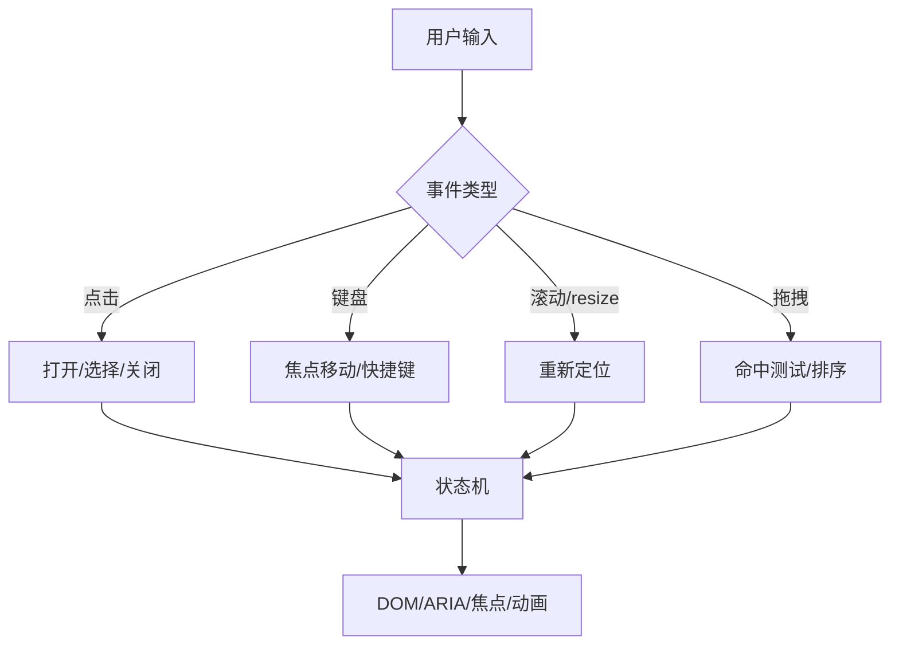
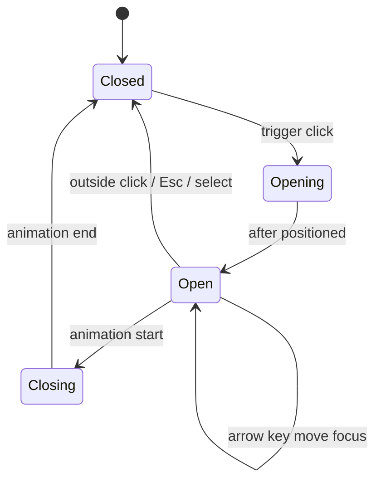

# 复杂交互组件：弹窗、下拉、拖拽、快捷键和可访问性

## 场景

业务里经常要做看似简单的交互组件：弹窗、抽屉、下拉菜单、Tooltip、级联选择、拖拽排序、快捷键面板。第一版通常很快写出来，但上线后问题不断：弹层被遮挡、滚动穿透、Esc 不关闭、焦点丢失、键盘无法操作、拖拽和滚动冲突、移动端点击穿透、多个弹层互相抢状态。

复杂交互组件的难点不是样式，而是状态、事件、焦点、层级、可访问性和边界条件。

## 是什么

复杂交互组件是带有多状态、多事件源、多 DOM 层级和可访问性语义的 UI 单元。它通常需要处理：打开关闭、定位、键盘导航、焦点管理、外部点击、滚动锁定、动画、嵌套、受控/非受控和错误恢复。



## 为什么需要

这些组件通常是产品工作流的入口。弹窗保存失败、下拉无法键盘选择、拖拽误触都会直接影响任务完成率。

如果没有系统设计，每个业务页面都会复制一套半成品组件，最终出现交互不一致、可访问性缺失和难以维护的问题。

## 推荐做法

### 1. 用状态机思维定义行为

先列出状态和事件，再写 UI。以下拉菜单为例：



状态机能避免多个布尔值组合出非法状态。

### 2. 弹层统一走 Portal 和层级管理

弹窗、下拉、Tooltip 通常要脱离局部 DOM 裁剪，用 Portal 渲染到统一容器。层级、滚动锁定、Esc 关闭顺序和点击外部要由弹层管理器统一处理。

### 3. 焦点管理是弹窗质量底线

弹窗打开后，焦点应进入弹窗；Tab 不应跑出模态弹窗；关闭后焦点应回到触发元素。下拉菜单要支持方向键移动、Enter 选择、Esc 关闭。

### 4. 拖拽优先使用成熟库

拖拽涉及指针事件、键盘拖拽、碰撞检测、滚动容器、虚拟列表和可访问性。真实项目优先选择 dnd-kit、React Aria、Floating UI 等成熟基础库，而不是从零实现全部行为。

### 5. Headless 组件更适合沉淀行为

把行为、状态和 ARIA 逻辑封装成 headless hook 或组件，把视觉样式留给业务主题。这样既能统一交互，又能适配不同设计。

## 代码示例

### 受控/非受控 open 状态

```tsx
function useControllableState<T>({ value, defaultValue, onChange }: {
  value?: T;
  defaultValue: T;
  onChange?: (value: T) => void;
}) {
  const [innerValue, setInnerValue] = React.useState(defaultValue);
  const isControlled = value !== undefined;
  const current = isControlled ? value : innerValue;

  const setValue = React.useCallback((next: T) => {
    if (!isControlled) {
      setInnerValue(next);
    }
    onChange?.(next);
  }, [isControlled, onChange]);

  return [current, setValue] as const;
}
```

### 弹窗焦点恢复

```tsx
function Modal({ open, onClose, children }: { open: boolean; onClose: () => void; children: React.ReactNode }) {
  const lastFocusedRef = React.useRef<HTMLElement | null>(null);
  const panelRef = React.useRef<HTMLDivElement | null>(null);

  React.useEffect(() => {
    if (!open) {
      return;
    }

    lastFocusedRef.current = document.activeElement as HTMLElement | null;
    panelRef.current?.focus();

    return () => {
      lastFocusedRef.current?.focus();
    };
  }, [open]);

  React.useEffect(() => {
    if (!open) {
      return;
    }

    function onKeyDown(event: KeyboardEvent) {
      if (event.key === 'Escape') {
        onClose();
      }
    }

    document.addEventListener('keydown', onKeyDown);
    return () => document.removeEventListener('keydown', onKeyDown);
  }, [open, onClose]);

  if (!open) {
    return null;
  }

  return createPortal(
    <div role="dialog" aria-modal="true" className="overlay">
      <div ref={panelRef} tabIndex={-1} className="panel">
        {children}
      </div>
    </div>,
    document.body
  );
}
```

生产级 Modal 还需要焦点陷阱、滚动锁定、嵌套弹层、动画退出和 aria-labelledby。

### 下拉菜单键盘导航

```tsx
function useMenuNavigation(count: number, onSelect: (index: number) => void) {
  const [activeIndex, setActiveIndex] = React.useState(0);

  function onKeyDown(event: React.KeyboardEvent) {
    if (event.key === 'ArrowDown') {
      event.preventDefault();
      setActiveIndex((index) => (index + 1) % count);
    }

    if (event.key === 'ArrowUp') {
      event.preventDefault();
      setActiveIndex((index) => (index - 1 + count) % count);
    }

    if (event.key === 'Enter') {
      onSelect(activeIndex);
    }
  }

  return { activeIndex, onKeyDown };
}
```

### 全局快捷键清理

```tsx
function useShortcut(key: string, handler: () => void) {
  const handlerRef = React.useRef(handler);
  handlerRef.current = handler;

  React.useEffect(() => {
    function onKeyDown(event: KeyboardEvent) {
      if (event.key === key && !event.defaultPrevented) {
        handlerRef.current();
      }
    }

    window.addEventListener('keydown', onKeyDown);
    return () => window.removeEventListener('keydown', onKeyDown);
  }, [key]);
}
```

## 反例与后果

### 反例 1：弹窗只用 `position: fixed` 和一个 `open` 状态

后果：滚动穿透、焦点丢失、Esc 不可用、嵌套弹窗关闭顺序混乱。

### 反例 2：下拉菜单只能鼠标点击

后果：键盘用户无法操作，自动化测试和无障碍体验都很差。

### 反例 3：拖拽直接监听 mousemove

后果：移动端、触控笔、滚动容器、iframe 和键盘拖拽都容易失效。

### 反例 4：全局快捷键不清理

后果：组件卸载后仍响应快捷键，多个页面互相干扰。

## 常见坑

- Portal 会改变 DOM 位置，但 React 事件仍按 React 树冒泡，要理解两套层级。
- 点击外部要处理 pointerdown/click 顺序，否则内部点击可能被误判。
- 滚动锁定要补偿滚动条宽度，避免页面横向跳动。
- 弹层定位要处理 viewport 边界、滚动容器和 resize。
- 快捷键在输入框、textarea、contenteditable 中通常要跳过。
- 可访问性不是最后加 `aria-label`，组件结构和键盘模型一开始就要设计。

## 排查与验证

### 弹层被遮挡

检查 stacking context、z-index、Portal 容器和父元素 transform。很多 z-index 问题来自新的层叠上下文。

### 焦点丢失

用 Tab 和 Shift+Tab 手动走一遍流程。确认打开后焦点进入组件，关闭后回到触发元素。

### 下拉定位错误

检查触发元素位置、滚动容器、viewport 边界和页面缩放。必要时使用 Floating UI 这类库。

### 拖拽卡顿

检查拖拽过程中是否触发大量 React state 更新、布局计算或 DOM 查询。优先用 transform 移动预览层。

## 面试怎么讲

30 秒版本：

> 复杂交互组件的重点不是样式，而是状态、事件、焦点、层级和可访问性。弹层要统一 Portal 和层级管理，弹窗要做焦点管理和滚动锁定，下拉要支持键盘导航，拖拽优先用成熟库处理指针事件和可访问性。

1 分钟版本：

> 我会先把组件行为建模成状态机，明确打开、关闭、选择、取消、动画和异常状态。再处理 DOM 层面的 Portal、z-index、滚动锁定和外部点击。可访问性上，模态弹窗要 focus trap，下拉菜单要方向键和 aria 语义，快捷键要清理并避开输入区域。对于拖拽这种复杂交互，我倾向基于 dnd-kit、React Aria、Floating UI 这类库做业务封装。

追问版本：

> 如果问为什么要 Headless 组件，我会说复杂交互的行为逻辑应该复用，但视觉主题经常变化。Headless 把状态、事件和 ARIA 封装起来，把 DOM 结构和样式暴露给业务组合，适合设计系统和多主题场景。

## 延伸阅读

- [React: createPortal](https://react.dev/reference/react-dom/createPortal)
- [WAI-ARIA Authoring Practices Guide](https://www.w3.org/WAI/ARIA/apg/)
- [Floating UI](https://floating-ui.com/)
- [dnd kit](https://dndkit.com/)
- [React Aria](https://react-spectrum.adobe.com/react-aria/)
