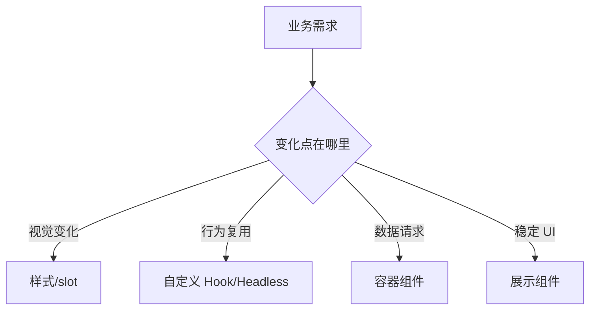

# 组件设计：组合、插槽、Headless 组件和抽象边界

## 场景

团队做了很多“通用组件”，但越用越难用：一个 Table 有几十个 props，一个 Modal 同时处理表单、请求和权限，一个 Select 被不同业务反复 fork。组件复用的难点不在于“抽出来”，而在于抽象边界是否稳定。

## 是什么

组件设计是把 UI、状态、行为和扩展点组织成稳定接口。

常见模式：

- 展示组件：只关心渲染。
- 容器组件：处理数据、权限、请求和状态。
- 组合组件：用 children 和子组件组合能力。
- Headless 组件：只提供状态和行为，不绑定样式。
- 受控/非受控组件：由外部或内部管理状态。



## 为什么需要

组件抽象过早会导致 props 爆炸，抽象过晚会导致重复和不一致。好的组件设计让复用发生在稳定边界上：视觉可替换、行为可复用、状态来源清晰、业务逻辑不过度混入基础组件。

## 推荐做法

### 1. 先分清业务组件和基础组件

基础组件不应该知道订单、用户、权限等业务概念。

```tsx
function Button({ variant, children, ...props }: ButtonProps) {
  return <button data-variant={variant} {...props}>{children}</button>;
}
```

业务按钮可以组合基础按钮：

```tsx
function DeleteOrderButton({ orderId }: { orderId: string }) {
  return <Button variant="danger" onClick={() => deleteOrder(orderId)}>Delete</Button>;
}
```

### 2. 用组合替代布尔 props 爆炸

```tsx
<Card>
  <Card.Header title="Orders" />
  <Card.Body>
    <OrderTable />
  </Card.Body>
  <Card.Footer>
    <Pagination />
  </Card.Footer>
</Card>
```

比 `showHeader`、`showFooter`、`footerType`、`headerExtra` 更可扩展。

### 3. Headless 组件复用行为

```tsx
function useDisclosure(defaultOpen = false) {
  const [open, setOpen] = useState(defaultOpen);
  return {
    open,
    close: () => setOpen(false),
    toggle: () => setOpen((value) => !value)
  };
}
```

不同视觉样式的弹窗、下拉、抽屉可以复用同一套状态行为。

### 4. 明确受控和非受控接口

```tsx
type TabsProps = {
  value?: string;
  defaultValue?: string;
  onValueChange?: (value: string) => void;
};
```

组件要明确是外部控制状态，还是内部管理状态，避免两种模式混乱。

## 代码示例

一个支持受控和非受控的 Tabs 简化实现：

```tsx
function Tabs({ value, defaultValue, onValueChange, children }: TabsProps) {
  const [innerValue, setInnerValue] = useState(defaultValue);
  const currentValue = value ?? innerValue;

  function setValue(nextValue: string) {
    if (value === undefined) {
      setInnerValue(nextValue);
    }
    onValueChange?.(nextValue);
  }

  return (
    <TabsContext.Provider value={{ value: currentValue, setValue }}>
      {children}
    </TabsContext.Provider>
  );
}
```

真实组件还要处理键盘导航、ARIA、禁用态和焦点管理。

## 反例与后果

### 反例 1：万能组件

后果：props 越来越多，任何改动都可能影响多个业务场景，最终没人敢改。

### 反例 2：基础组件发业务请求

后果：组件无法复用，也难以测试。数据请求应放在业务层或容器层。

### 反例 3：只抽视觉，不抽行为

后果：每个业务都重复写键盘导航、焦点管理、打开关闭逻辑。

## 常见坑

- 不要为了“通用”提前抽象，先观察重复是否稳定。
- props 过多通常说明组件承担了太多变化点。
- Headless 组件要补足可访问性行为，否则只是把样式拿掉。
- 组件库 API 一旦发布，破坏性修改成本很高。
- 业务组件可以强绑定业务，基础组件要保持语义稳定。

## 排查与验证

### 组件难用

看调用方是否需要传大量布尔 props，是否经常组合出非法状态。

### 组件难改

看组件内部是否混合了请求、权限、埋点、布局和展示。按职责拆分。

### 可访问性缺失

检查键盘操作、role、aria 属性、焦点管理和屏幕阅读器名称。

## 面试怎么讲

30 秒版本：

> 组件设计的核心是稳定边界。基础组件关注通用 UI 和可访问性，业务组件组合基础能力并接入业务数据。复杂变化优先用组合和 slot，行为复用可以用自定义 Hook 或 Headless 组件。

1 分钟版本：

> 我判断组件该不该抽象，会看重复是否稳定、变化点在哪里。如果只是视觉重复，可以抽展示组件；如果是行为重复，可以抽 Hook 或 Headless；如果涉及数据请求和权限，通常放在业务容器层。避免一个万能组件用几十个 props 控制所有场景。

追问版本：

> 如果问 Headless 组件，我会说它把状态和交互行为抽出来，不绑定具体样式，适合下拉、弹窗、Tabs 这类需要复用行为但视觉差异大的组件。但它仍然要负责键盘、焦点和 ARIA，否则复用价值不完整。

## 延伸阅读

- [React Docs: Passing JSX as children](https://react.dev/learn/passing-props-to-a-component#passing-jsx-as-children)
- [WAI-ARIA APG](https://www.w3.org/WAI/ARIA/apg/)
- [Radix UI](https://www.radix-ui.com/)
- [Headless UI](https://headlessui.com/)
