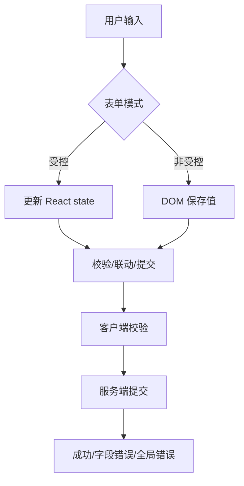

# React 表单设计：受控、非受控、校验和异步提交

## 场景

后台系统里最复杂的页面往往不是图表，而是表单：创建订单、编辑用户、配置权限、提交审批。表单会涉及默认值、联动、校验、异步提交、错误回填、草稿保存和防重复点击。

如果设计不清楚，很容易出现：输入卡顿、校验时机混乱、服务端错误无法定位到字段、弹窗关闭后旧值残留、重复提交造成脏数据。

## 是什么

React 表单主要有两类模式：

- 受控组件：表单值由 React state 管理，输入变化触发 state 更新。
- 非受控组件：表单值由 DOM 自己保存，提交或需要时通过 ref/FormData 读取。



## 为什么需要

表单是状态密度很高的 UI。每个字段都有值、错误、是否 touched、是否 dirty、是否 disabled，还可能依赖其它字段。

受控模式让联动和实时校验更直接，但大表单可能频繁渲染。非受控模式性能更好，适合字段多但联动少的场景。成熟表单库通常会混合两者：对外提供声明式 API，内部尽量减少重渲染。

## 推荐做法

### 1. 简单表单直接受控

```tsx
function LoginForm() {
  const [email, setEmail] = useState('');
  const [password, setPassword] = useState('');

  return (
    <form>
      <input value={email} onChange={(event) => setEmail(event.target.value)} />
      <input value={password} onChange={(event) => setPassword(event.target.value)} type="password" />
    </form>
  );
}
```

字段少、联动简单时，受控写法清晰直接。

### 2. 大表单使用表单库或局部状态

大表单不要把所有字段变化都提升到页面顶层。可以按 section 拆分，或使用 React Hook Form 这类减少重渲染的库。

### 3. 客户端校验和服务端校验都要有

客户端校验提升体验，服务端校验保证安全和一致性。

```ts
type FieldErrors<T> = Partial<Record<keyof T, string>>;

type SubmitResult<T> =
  | { ok: true }
  | { ok: false; fieldErrors?: FieldErrors<T>; formError?: string };
```

服务端字段错误要能回填到对应字段，全局错误显示在表单顶部。

### 4. 提交状态显式建模

```tsx
const [submitState, setSubmitState] = useState<'idle' | 'submitting' | 'success' | 'error'>('idle');
```

提交中禁用提交按钮，防止重复提交。失败后允许用户修正并重试。

## 代码示例

下面是一个简化编辑表单，包含字段错误、全局错误和防重复提交。

```tsx
type UserForm = {
  name: string;
  email: string;
};

function EditUserForm({ initialValue }: { initialValue: UserForm }) {
  const [value, setValue] = useState(initialValue);
  const [fieldErrors, setFieldErrors] = useState<FieldErrors<UserForm>>({});
  const [formError, setFormError] = useState<string | null>(null);
  const [submitting, setSubmitting] = useState(false);

  async function handleSubmit(event: React.FormEvent) {
    event.preventDefault();
    if (submitting) return;

    setSubmitting(true);
    setFieldErrors({});
    setFormError(null);

    const result = await submitUser(value);

    if (!result.ok) {
      setFieldErrors(result.fieldErrors ?? {});
      setFormError(result.formError ?? null);
      setSubmitting(false);
      return;
    }

    setSubmitting(false);
  }

  return (
    <form onSubmit={handleSubmit}>
      {formError && <p role="alert">{formError}</p>}
      <label htmlFor="name">Name</label>
      <input
        id="name"
        value={value.name}
        aria-invalid={Boolean(fieldErrors.name)}
        onChange={(event) => setValue({ ...value, name: event.target.value })}
      />
      {fieldErrors.name && <p>{fieldErrors.name}</p>}

      <label htmlFor="email">Email</label>
      <input
        id="email"
        value={value.email}
        aria-invalid={Boolean(fieldErrors.email)}
        onChange={(event) => setValue({ ...value, email: event.target.value })}
      />
      {fieldErrors.email && <p>{fieldErrors.email}</p>}

      <button type="submit" disabled={submitting}>
        {submitting ? 'Saving...' : 'Save'}
      </button>
    </form>
  );
}
```

## 反例与后果

### 反例 1：只做前端校验

后果：用户可以绕过前端直接请求接口，服务端仍可能收到非法数据。

### 反例 2：提交中不禁用按钮

后果：重复点击可能创建重复订单或重复审批。后端也应提供幂等保护。

### 反例 3：关闭弹窗不重置表单

后果：下次打开看到上次编辑残留。需要明确是保留草稿还是重置状态。

## 常见坑

- `defaultValue` 只在初始挂载时生效，后续 props 变化不会自动更新非受控输入。
- 受控 input 的 `value` 不要传 undefined，否则会在受控和非受控之间切换。
- 大表单频繁顶层 setState 可能导致输入卡顿。
- 服务端字段错误要能映射到字段名，否则用户不知道怎么修。
- 表单重置要区分“恢复初始值”和“清空”。

## 排查与验证

### 输入卡顿

用 React Profiler 看每次输入触发了哪些组件。必要时状态下沉、拆分字段或使用表单库。

### 错误提示不可访问

检查 label、aria-invalid、aria-describedby 和错误文案是否关联。

### 重复提交

连续点击提交按钮，确认前端 disabled 和后端幂等都生效。

## 面试怎么讲

30 秒版本：

> React 表单分受控和非受控。受控适合字段少、联动和实时校验明确的场景；非受控或表单库适合大表单，能减少重渲染。真实表单要处理客户端校验、服务端错误回填、提交状态和防重复提交。

1 分钟版本：

> 我会先按复杂度选方案。简单表单直接受控；复杂表单用表单库或局部状态，避免每个字段变化都让整页重渲染。校验上客户端负责体验，服务端负责最终约束。提交时要显式管理 submitting、field errors、form error，失败能恢复，成功后决定重置或保留。

追问版本：

> 如果问受控和非受控取舍，我会说受控更容易做联动和统一状态，但频繁更新可能影响大表单性能；非受控性能更好，但状态读取和联动要设计好。像 React Hook Form 这类库通常利用非受控和订阅机制减少重渲染。

## 延伸阅读

- [React Docs: Forms](https://react.dev/reference/react-dom/components/input)
- [React Hook Form](https://react-hook-form.com/)
- [MDN: Client-side form validation](https://developer.mozilla.org/en-US/docs/Learn/Forms/Form_validation)
