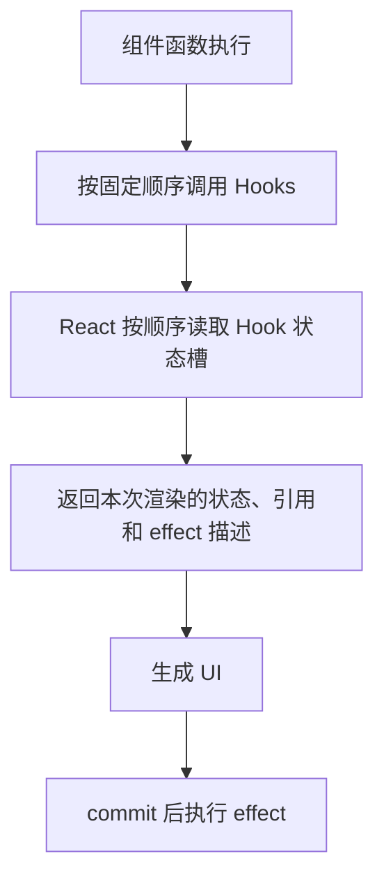
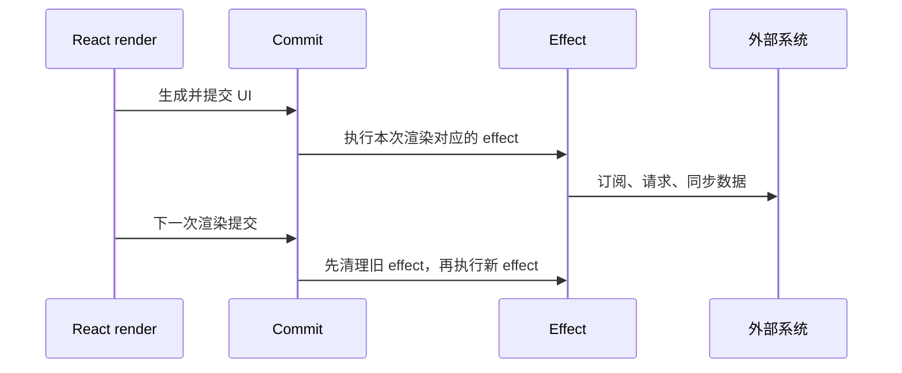

# Hooks 原理：调用顺序、闭包、依赖数组和副作用边界

## 场景

你维护一个用户详情页：进入页面后请求用户信息，切换用户 ID 后重新请求，页面里有定时刷新、窗口尺寸监听、保存按钮和埋点上报。

代码刚开始很简单，后来会逐渐出现这些问题：

- effect 依赖数组到底该不该写某个变量？
- 为什么定时器里读到的状态一直是旧值？
- 为什么请求会重复发送，或者旧请求覆盖新请求？
- 为什么 Hooks 不能放到 `if` 或循环里？
- 为什么加了 `useCallback` 之后性能没有变好，代码反而更难懂？

这些问题不是 API 记忆问题，而是 Hooks 的核心机制问题：React 如何在函数组件的多次执行之间保存状态和副作用信息。

## 是什么

Hooks 是 React 提供的一组函数，让函数组件能够保存状态、执行副作用、持有可变引用、复用有状态逻辑。

常见 Hooks 的职责可以这样分：

- `useState`：保存参与渲染的本地状态。
- `useReducer`：管理更复杂、事件驱动的本地状态转换。
- `useEffect`：把渲染结果同步到外部系统。
- `useLayoutEffect`：在浏览器绘制前同步读取或修改布局。
- `useRef`：保存跨渲染稳定但不触发渲染的可变值。
- `useMemo`：缓存计算结果。
- `useCallback`：缓存函数引用。
- 自定义 Hooks：复用有状态逻辑。

Hooks 的关键约束是：必须在组件或自定义 Hook 的顶层调用，不能放在条件、循环或嵌套函数里。



React 依赖调用顺序把每个 Hook 和内部状态槽对应起来。如果调用顺序变化，后续 Hook 读到的状态就会错位。

## 为什么需要

在 Hooks 之前，类组件通过实例字段、生命周期方法和 `this.setState` 管理状态与副作用。复杂组件里，相关逻辑经常被拆散到多个生命周期方法中，不相关逻辑又容易混在同一个生命周期方法里。

Hooks 解决的是逻辑组织问题：把同一件事的状态、订阅、清理和更新放在一起，并允许抽成自定义 Hook 复用。

例如“订阅窗口尺寸”这件事，类组件里通常要在 `componentDidMount` 订阅，在 `componentWillUnmount` 清理；Hooks 可以把它放在一个 effect 里，再抽成 `useWindowSize`。

但 Hooks 也带来了新的工程约束：函数组件每次渲染都会重新执行，事件处理函数和 effect 都会捕获当次渲染的变量快照。因此，理解闭包和依赖数组是写好 Hooks 的前提。

## 推荐做法

### 1. 把 Hooks 写在顶层

错误写法：

```tsx
function UserPanel({ enabled }: { enabled: boolean }) {
  if (enabled) {
    useEffect(() => {
      console.log('subscribe');
    }, []);
  }

  const [name, setName] = useState('');
  return <input value={name} onChange={(event) => setName(event.target.value)} />;
}
```

当 `enabled` 从 `true` 变成 `false`，第二个 Hook 的位置会变化，React 内部状态槽会错位。

正确做法是让 Hook 调用顺序稳定，把条件放进 Hook 内部：

```tsx
function UserPanel({ enabled }: { enabled: boolean }) {
  useEffect(() => {
    if (!enabled) {
      return;
    }

    console.log('subscribe');
  }, [enabled]);

  const [name, setName] = useState('');
  return <input value={name} onChange={(event) => setName(event.target.value)} />;
}
```

### 2. 把 effect 理解为同步外部系统

`useEffect` 不应该被当成“组件加载时执行一次”的工具。更准确的理解是：当某些渲染值变化后，把当前结果同步到外部系统。

外部系统包括：网络请求、浏览器 API、事件订阅、定时器、第三方 SDK、手动 DOM 操作和日志埋点。



### 3. 依赖数组写 effect 用到的渲染值

effect 内部使用了来自组件作用域的值，这些值就属于本次渲染快照。依赖数组应该描述 effect 依赖了哪些渲染值。

```tsx
function UserDetail({ userId }: { userId: string }) {
  const [user, setUser] = useState<User | null>(null);
  const [error, setError] = useState<string | null>(null);

  useEffect(() => {
    const controller = new AbortController();

    async function loadUser() {
      try {
        setError(null);
        const result = await fetchUser(userId, controller.signal);
        setUser(result);
      } catch (reason) {
        if (reason instanceof DOMException && reason.name === 'AbortError') {
          return;
        }
        setError(reason instanceof Error ? reason.message : 'Unknown error');
      }
    }

    loadUser();

    return () => {
      controller.abort();
    };
  }, [userId]);

  if (error) {
    return <p role="alert">{error}</p>;
  }

  return user ? <UserProfile user={user} /> : <UserSkeleton />;
}
```

这个 effect 使用了 `userId`，所以依赖数组包含 `userId`。`setUser` 和 `setError` 是 React 保证稳定的 setter，不需要加入依赖。

### 4. 用函数式更新处理旧状态依赖

当下一次状态依赖上一次状态时，使用函数式更新。

```tsx
function NotificationCounter() {
  const [count, setCount] = useState(0);

  function receiveMessage() {
    setCount((current) => current + 1);
  }

  return <button onClick={receiveMessage}>{count}</button>;
}
```

这样可以避免事件处理函数捕获旧 `count` 导致丢更新。

### 5. 用 ref 保存不参与渲染的可变值

`useRef` 适合保存定时器 ID、DOM 节点、第三方实例、最新回调等不直接参与 UI 展示的值。

```tsx
function AutoSave({ draft }: { draft: Draft }) {
  const latestDraftRef = useRef(draft);

  useEffect(() => {
    latestDraftRef.current = draft;
  }, [draft]);

  useEffect(() => {
    const timer = window.setInterval(() => {
      saveDraft(latestDraftRef.current);
    }, 5000);

    return () => {
      window.clearInterval(timer);
    };
  }, []);

  return null;
}
```

定时器只创建一次，但每次保存时都读取最新草稿。

## 代码示例

下面是一个可复用的 `useRequest`，处理 loading、error、取消请求和竞态问题。

```tsx
import { useEffect, useReducer } from 'react';

type RequestState<T> =
  | { status: 'idle' }
  | { status: 'loading' }
  | { status: 'success'; data: T }
  | { status: 'error'; error: string };

type Action<T> =
  | { type: 'loading' }
  | { type: 'success'; data: T }
  | { type: 'error'; error: string };

function reducer<T>(state: RequestState<T>, action: Action<T>): RequestState<T> {
  switch (action.type) {
    case 'loading':
      return { status: 'loading' };
    case 'success':
      return { status: 'success', data: action.data };
    case 'error':
      return { status: 'error', error: action.error };
    default:
      return state;
  }
}

export function useRequest<T>(
  request: (signal: AbortSignal) => Promise<T>,
  deps: React.DependencyList
) {
  const [state, dispatch] = useReducer(reducer<T>, { status: 'idle' });

  useEffect(() => {
    const controller = new AbortController();
    dispatch({ type: 'loading' });

    request(controller.signal)
      .then((data) => {
        dispatch({ type: 'success', data });
      })
      .catch((error: unknown) => {
        if (error instanceof DOMException && error.name === 'AbortError') {
          return;
        }

        dispatch({
          type: 'error',
          error: error instanceof Error ? error.message : 'Unknown error'
        });
      });

    return () => {
      controller.abort();
    };
  }, deps);

  return state;
}
```

使用时：

```tsx
function UserDetail({ userId }: { userId: string }) {
  const state = useRequest(
    (signal) => fetchUser(userId, signal),
    [userId]
  );

  if (state.status === 'loading') {
    return <UserSkeleton />;
  }

  if (state.status === 'error') {
    return <p role="alert">{state.error}</p>;
  }

  if (state.status === 'success') {
    return <UserProfile user={state.data} />;
  }

  return null;
}
```

真实项目里还会继续补充缓存、重试、去重和刷新策略。复杂到这个程度时，通常可以考虑 React Query 或 SWR，而不是继续扩一个自研 Hook。

## 反例与后果

### 反例 1：为了只执行一次而删除依赖

```tsx
function UserDetail({ userId }: { userId: string }) {
  useEffect(() => {
    fetchUser(userId);
  }, []);

  return null;
}
```

后果：`userId` 变化后不会重新请求，页面显示旧用户。这个 bug 在详情页切换、路由复用和弹窗复用中很常见。

### 反例 2：定时器捕获旧状态

```tsx
function BadTimer() {
  const [count, setCount] = useState(0);

  useEffect(() => {
    const timer = window.setInterval(() => {
      setCount(count + 1);
    }, 1000);

    return () => window.clearInterval(timer);
  }, []);

  return <span>{count}</span>;
}
```

后果：定时器闭包里的 `count` 永远是第一次渲染的 `0`，计数会卡住。应改成 `setCount((value) => value + 1)`。

### 反例 3：滥用 `useCallback`

```tsx
function Toolbar({ user }: { user: User }) {
  const handleClick = useCallback(() => {
    console.log(user.name);
  }, [user]);

  return <button onClick={handleClick}>Save</button>;
}
```

后果：如果子组件没有依赖引用相等优化，或者 `user` 每次都是新对象，这个 `useCallback` 没有收益，只增加理解成本。

## 常见坑

- effect 依赖数组不是“想什么时候执行”的开关，而是 effect 使用的渲染值清单。
- 不要用禁用 lint 规则掩盖依赖问题。多数情况下应该调整状态建模或拆分 effect。
- `useMemo` 和 `useCallback` 只提供缓存，不保证一定提升性能。
- `useRef` 修改后不会触发渲染，不适合保存需要展示在 UI 上的状态。
- 自定义 Hook 应该复用逻辑，不应该隐藏过多业务分支。
- `useLayoutEffect` 会阻塞浏览器绘制，只有需要同步测量布局时才使用。

## 排查与验证

### 依赖数组问题

开启 `eslint-plugin-react-hooks`。如果提示缺依赖，不要第一反应禁用规则。先问三个问题：

- effect 是否真的需要这个值？
- 这个 effect 是否做了太多事情，应该拆分？
- 这个值是否可以通过函数式更新或 reducer 消除依赖？

### 旧闭包问题

如果定时器、事件监听、Promise 回调里读到旧值，检查它捕获的是哪一次渲染的变量。解决方式通常是函数式更新、补依赖、或用 ref 保存最新值。

### 重复请求问题

看 Network 面板和 React Strict Mode。开发环境重复请求不一定代表生产也重复，但如果没有 cleanup 或请求取消，快速切换参数时生产也可能出现旧请求覆盖新结果。

### 性能问题

不要先加 `useMemo`。先用 React DevTools Profiler 看组件是否真的耗时，再确认 props 引用和状态边界是否合理。

## 面试怎么讲

30 秒版本：

> Hooks 让函数组件能保存状态和执行副作用。React 依赖 Hooks 的调用顺序关联内部状态，所以 Hooks 必须写在顶层。effect 的依赖数组应该包含它用到的渲染值，否则会出现旧闭包或状态不同步。

1 分钟版本：

> 函数组件每次渲染都会重新执行，事件处理函数和 effect 都会捕获本次渲染的变量快照。`useState` 保存参与渲染的状态，`useEffect` 用来同步外部系统，`useRef` 保存不触发渲染的可变值。写 effect 时我会关注依赖是否完整、是否需要 cleanup、是否存在请求竞态。依赖旧状态的更新用函数式写法，避免闭包旧值。

追问版本：

> Hooks 的调用顺序不能变化，因为 React 内部按顺序存储每个 Hook 的状态。如果把 Hook 放到条件里，下一次渲染的状态槽会错位。遇到 exhaustive-deps 警告时，我不会简单删依赖，而是检查 effect 是否该拆分、状态是否可以派生、回调是否需要稳定引用。对于服务端状态，如果涉及缓存、重试、去重、乐观更新，我会优先考虑 React Query 这类成熟方案。

## 延伸阅读

- [React Docs: Rules of Hooks](https://react.dev/reference/rules/rules-of-hooks)
- [React Docs: Synchronizing with Effects](https://react.dev/learn/synchronizing-with-effects)
- [React Docs: You Might Not Need an Effect](https://react.dev/learn/you-might-not-need-an-effect)
- [React Docs: Removing Effect Dependencies](https://react.dev/learn/removing-effect-dependencies)
- [React Docs: Reusing Logic with Custom Hooks](https://react.dev/learn/reusing-logic-with-custom-hooks)
