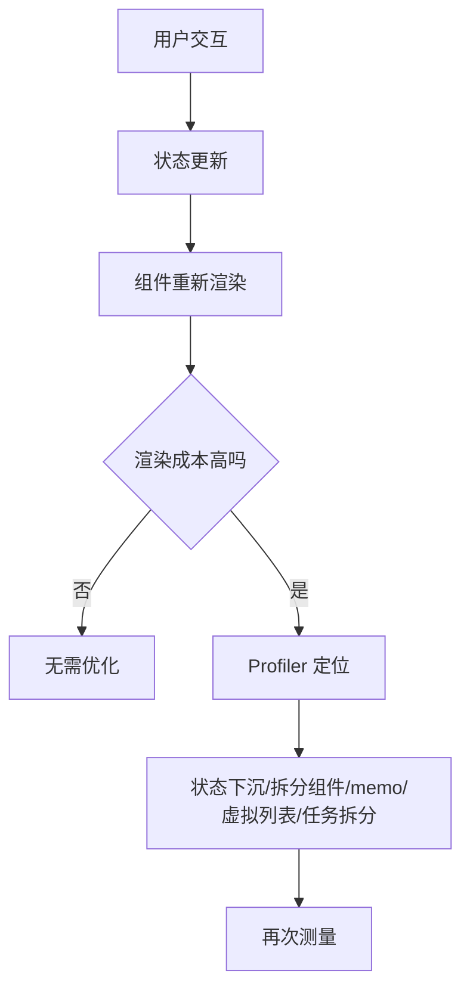

# React 性能优化：重渲染、memo、长列表和 Profiler

## 场景

你维护一个复杂表格页面：顶部有筛选表单，中间有几千行数据，右侧有详情面板。用户反馈输入筛选条件卡顿、勾选行时整页闪动、展开详情慢。

团队第一反应是到处加 `useMemo`、`useCallback` 和 `memo`，但效果不稳定，有时还让代码更难读。

React 性能优化的第一原则是：先定位瓶颈，再选择手段。重渲染不一定是问题，高成本且影响交互的渲染才是问题。

## 是什么

React 性能问题常见来源：

- 状态放得太高，导致大范围组件重新渲染。
- props 每次都是新引用，`memo` 无法生效。
- Context value 高频变化，所有消费者都被通知。
- 列表规模过大，一次渲染太多 DOM。
- 渲染期间做了昂贵计算。
- 事件处理里执行长任务，阻塞输入和绘制。



## 为什么需要

React 的声明式模型让 UI 更容易维护，但状态变化会触发组件重新执行。如果组件树很大、计算很重或 DOM 很多，更新就可能阻塞主线程。

优化不是为了消灭所有重渲染，而是为了保障用户体验：输入要及时、滚动要流畅、点击要有反馈、首屏要尽快可用。

盲目优化也有成本。`useMemo` 和 `useCallback` 会增加依赖管理复杂度，`memo` 会增加 props 比较成本，过度拆分组件会降低可读性。

## 推荐做法

### 1. 状态下沉，缩小影响范围

如果一个输入框状态只影响输入框，不要放到页面顶层。

```tsx
function SearchInput({ onSearch }: { onSearch: (value: string) => void }) {
  const [value, setValue] = useState('');

  return (
    <input
      value={value}
      onChange={(event) => setValue(event.target.value)}
      onKeyDown={(event) => {
        if (event.key === 'Enter') {
          onSearch(value);
        }
      }}
    />
  );
}
```

页面顶层只接收最终搜索动作，减少每次输入引起的大范围更新。

### 2. `memo` 用在高成本且 props 稳定的组件

```tsx
const OrderRow = memo(function OrderRow({ order, selected, onToggle }: Props) {
  return (
    <tr>
      <td>
        <input checked={selected} onChange={() => onToggle(order.id)} type="checkbox" />
      </td>
      <td>{order.title}</td>
    </tr>
  );
});
```

如果 `onToggle` 每次都是新函数，`memo` 收益会下降。必要时稳定回调：

```tsx
const handleToggle = useCallback((id: string) => {
  setSelectedIds((ids) => toggleId(ids, id));
}, []);
```

### 3. 长列表优先虚拟化

几千行数据不应该一次性渲染全部 DOM。虚拟列表只渲染视口附近的行。

```tsx
import { FixedSizeList } from 'react-window';

function OrderVirtualList({ orders }: { orders: Order[] }) {
  return (
    <FixedSizeList height={600} itemCount={orders.length} itemSize={44} width="100%">
      {({ index, style }) => <OrderRow style={style} order={orders[index]} />}
    </FixedSizeList>
  );
}
```

### 4. Context 拆分或使用 selector

不要把高频变化和低频配置塞进同一个 Context。

```tsx
<ThemeContext.Provider value={theme}>
  <CurrentUserContext.Provider value={currentUser}>
    {children}
  </CurrentUserContext.Provider>
</ThemeContext.Provider>
```

拆分后，用户信息变化不会通知只消费主题的组件。

## 代码示例

下面是一个表格选中状态优化示例：选中状态用 `Set`，回调稳定，行组件 memo。

```tsx
const MemoOrderRow = memo(function MemoOrderRow({
  order,
  selected,
  onToggle
}: {
  order: Order;
  selected: boolean;
  onToggle: (id: string) => void;
}) {
  return (
    <tr>
      <td>
        <input type="checkbox" checked={selected} onChange={() => onToggle(order.id)} />
      </td>
      <td>{order.name}</td>
    </tr>
  );
});

function OrderTable({ orders }: { orders: Order[] }) {
  const [selectedIds, setSelectedIds] = useState(() => new Set<string>());

  const handleToggle = useCallback((id: string) => {
    setSelectedIds((current) => {
      const next = new Set(current);
      next.has(id) ? next.delete(id) : next.add(id);
      return next;
    });
  }, []);

  return (
    <table>
      <tbody>
        {orders.map((order) => (
          <MemoOrderRow
            key={order.id}
            order={order}
            selected={selectedIds.has(order.id)}
            onToggle={handleToggle}
          />
        ))}
      </tbody>
    </table>
  );
}
```

这个优化是否值得做，要用 Profiler 验证。如果行数很少，可能没有必要。

## 反例与后果

### 反例 1：到处加 `useMemo`

后果：依赖数组变复杂，缓存本身也有成本。没有昂贵计算或引用稳定需求时，收益很低。

### 反例 2：`memo` 搭配不稳定 props

```tsx
<MemoChild options={{ size: 'large' }} onClick={() => save()} />
```

后果：每次 render 都创建新对象和新函数，`memo` 仍然会重新渲染。

### 反例 3：一次渲染上万行 DOM

后果：渲染、布局、绘制都会变慢。即使 React 层优化了，浏览器 DOM 成本仍然很高。

## 常见坑

- 重渲染不等于性能问题，低成本重渲染可以接受。
- `useCallback` 不会让函数执行更快，只是稳定函数引用。
- `useMemo` 不能保证永远缓存，语义上不要依赖它保存业务状态。
- 虚拟列表要处理动态高度、键盘导航、可访问性和滚动恢复。
- React 性能问题可能来自浏览器布局、绘制和第三方脚本，不一定只在组件层。

## 排查与验证

### React DevTools Profiler

录制卡顿交互，看哪些组件 commit 耗时高、为什么渲染。优先优化热点组件，而不是全局加缓存。

### Chrome Performance

如果 Profiler 看不出问题，用 Performance 查看主线程是否有长任务、布局、绘制或脚本阻塞。

### 验证优化是否有效

优化前后用同一数据规模和同一操作录制。比较 commit 时间、长任务数量、INP 或交互耗时。

## 面试怎么讲

30 秒版本：

> React 性能优化我会先用 Profiler 定位，而不是直接加 memo。常见手段包括状态下沉、拆分组件、稳定 props、memo、虚拟列表和任务拆分。重渲染不一定是问题，关键看渲染成本和用户体验。

1 分钟版本：

> 我会先看卡顿来自哪里。如果是状态影响范围太大，就状态下沉或拆组件；如果子组件成本高且 props 稳定，可以用 memo；如果 props 引用不稳定，再考虑 useMemo/useCallback；如果列表太大，优先虚拟化；如果是长任务，就拆分任务或用 Worker。优化后必须重新测量。

追问版本：

> 如果问 useCallback 是否一定提升性能，我会说不一定。它只是稳定函数引用，本身也有成本，通常在传给 memo 子组件或作为 effect 依赖时才有明确价值。性能优化要从 Profiler 和用户指标出发，而不是把 Hook 当模板。

## 延伸阅读

- [React Docs: memo](https://react.dev/reference/react/memo)
- [React Docs: useMemo](https://react.dev/reference/react/useMemo)
- [React Docs: useCallback](https://react.dev/reference/react/useCallback)
- [React DevTools](https://react.dev/learn/react-developer-tools)
- [web.dev: Virtualize large lists](https://web.dev/articles/virtualize-long-lists-react-window)
