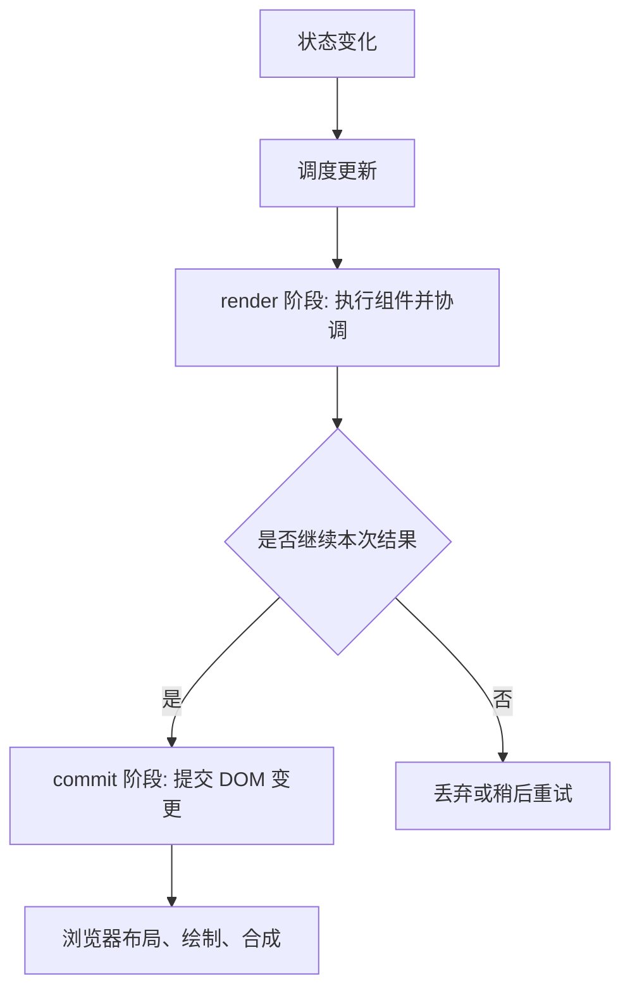

# React 渲染模型：render、commit、Fiber 和并发渲染基础

## 场景

你在做一个订单管理页面：左侧是筛选条件，中间是订单列表，右侧是订单详情。用户输入搜索词时，列表会刷新；用户切换订单时，详情面板会更新；页面里还有统计卡片、权限按钮和埋点逻辑。

常见问题很快会出现：

- 为什么输入一个字符，很多组件都重新执行了？
- 为什么 `setState` 后立刻读到的还是旧值？
- 为什么列表用数组下标做 `key` 后，勾选状态会串行？
- 为什么开发环境下 effect 好像执行了两次？
- 为什么加了 `memo` 之后，页面还是会更新？

这些问题背后都指向同一个核心：React 如何把状态变化变成真实页面更新。

## 是什么

React 渲染模型可以拆成三个层次理解。

第一层是组件模型。React 组件根据 `props`、`state` 和 `context` 返回 React Element。React Element 是 UI 的描述，不是真实 DOM。

第二层是更新流程。状态变化后，React 会重新执行相关组件，得到新的 UI 描述，并和上一次的结果做协调。这个过程会计算哪些节点需要新增、删除、移动或更新。

第三层是提交。React 把协调出来的变更应用到宿主环境。Web 项目里宿主环境通常是 DOM，React Native 里则是原生视图。



这里最重要的边界是：render 阶段负责计算，commit 阶段负责产生真实副作用。

## 为什么需要

如果没有这套模型，应用会退回到手动 DOM 操作：每个事件处理函数都要查找节点、判断旧值、修改 DOM、绑定和解绑事件。页面小的时候还能维护，业务复杂后很容易出现状态和 UI 不一致。

React 用声明式方式解决这个问题：开发者只描述“当前状态下 UI 应该是什么样”，React 负责计算如何把旧 UI 变成新 UI。

这带来几个工程价值：

- 状态是 UI 的来源，问题更容易回溯。
- 组件可以组合，复杂页面能拆成局部问题。
- React 可以集中做调度、批处理和渲染优化。
- 同一套组件模型可以适配不同宿主环境。

代价是你必须理解 React 的更新边界。否则会把“组件重新执行”误认为“DOM 全量重建”，或者在 render 阶段写副作用，导致并发渲染、Strict Mode 和性能优化都变得不可预测。

## 推荐做法

### 1. 把 render 阶段当成纯计算

组件函数应该根据输入返回 UI，不应该在函数体里发请求、订阅事件、修改全局变量或直接操作 DOM。

```tsx
function OrderDetail({ orderId }: { orderId: string }) {
  const [order, setOrder] = useState<Order | null>(null);

  useEffect(() => {
    let ignore = false;

    async function loadOrder() {
      const result = await fetchOrder(orderId);
      if (!ignore) {
        setOrder(result);
      }
    }

    loadOrder();

    return () => {
      ignore = true;
    };
  }, [orderId]);

  if (!order) {
    return <OrderDetailSkeleton />;
  }

  return <OrderDetailView order={order} />;
}
```

请求放在 effect 里，并提供清理逻辑。组件函数本身只负责根据当前状态返回 UI。

### 2. 用稳定 key 描述业务实体

React 在列表协调时依赖 `key` 判断元素是否代表同一个实体。动态列表里优先使用后端 ID 或稳定业务 ID。

```tsx
function OrderList({ orders }: { orders: Order[] }) {
  return (
    <ul>
      {orders.map((order) => (
        <OrderListItem key={order.id} order={order} />
      ))}
    </ul>
  );
}
```

`key` 不是给业务代码读取的 props，而是给 React 协调用的身份标识。

### 3. 区分 state 快照和下一次渲染

一次渲染里的 `state` 是快照。调用 `setState` 不会修改当前闭包中的变量，而是安排下一次渲染。

```tsx
function Counter() {
  const [count, setCount] = useState(0);

  function handleClick() {
    setCount((value) => value + 1);
    setCount((value) => value + 1);
  }

  return <button onClick={handleClick}>{count}</button>;
}
```

如果下一次状态依赖上一次状态，使用函数式更新，避免闭包里的旧值。

### 4. 让副作用有完整生命周期

订阅、定时器、DOM 监听、请求取消和第三方实例都要考虑清理。

```tsx
useEffect(() => {
  const controller = new AbortController();

  fetch(`/api/orders/${orderId}`, { signal: controller.signal })
    .then((response) => response.json())
    .then(setOrder)
    .catch((error) => {
      if (error.name !== 'AbortError') {
        setError(error);
      }
    });

  return () => {
    controller.abort();
  };
}, [orderId]);
```

这能避免组件卸载后继续更新状态，也能避免快速切换参数时旧请求覆盖新结果。

## 代码示例

下面是一个接近真实业务的订单搜索组件，包含输入、并发请求取消、加载态、错误态和列表 key。

```tsx
import { useEffect, useMemo, useState } from 'react';

type Order = {
  id: string;
  title: string;
  status: 'pending' | 'paid' | 'failed';
};

type QueryState =
  | { type: 'idle' }
  | { type: 'loading' }
  | { type: 'success'; orders: Order[] }
  | { type: 'error'; message: string };

export function OrderSearch() {
  const [keyword, setKeyword] = useState('');
  const [state, setState] = useState<QueryState>({ type: 'idle' });

  const trimmedKeyword = useMemo(() => keyword.trim(), [keyword]);

  useEffect(() => {
    if (!trimmedKeyword) {
      setState({ type: 'idle' });
      return;
    }

    const controller = new AbortController();
    setState({ type: 'loading' });

    fetch(`/api/orders?keyword=${encodeURIComponent(trimmedKeyword)}`, {
      signal: controller.signal
    })
      .then((response) => {
        if (!response.ok) {
          throw new Error(`Request failed: ${response.status}`);
        }
        return response.json() as Promise<Order[]>;
      })
      .then((orders) => {
        setState({ type: 'success', orders });
      })
      .catch((error: unknown) => {
        if (error instanceof DOMException && error.name === 'AbortError') {
          return;
        }

        setState({
          type: 'error',
          message: error instanceof Error ? error.message : 'Unknown error'
        });
      });

    return () => {
      controller.abort();
    };
  }, [trimmedKeyword]);

  return (
    <section>
      <input
        value={keyword}
        onChange={(event) => setKeyword(event.target.value)}
        placeholder="Search orders"
      />

      {state.type === 'idle' && <p>Input keyword to search.</p>}
      {state.type === 'loading' && <p>Loading...</p>}
      {state.type === 'error' && <p role="alert">{state.message}</p>}
      {state.type === 'success' && (
        <ul>
          {state.orders.map((order) => (
            <li key={order.id}>
              {order.title} - {order.status}
            </li>
          ))}
        </ul>
      )}
    </section>
  );
}
```

这个例子的重点不是搜索功能，而是更新模型：输入变化触发 state 更新，组件重新执行，effect 根据新的 `trimmedKeyword` 同步外部请求，commit 后用户看到新的 UI 状态。

## 反例与后果

### 反例 1：在 render 阶段发请求

```tsx
function BadOrderDetail({ orderId }: { orderId: string }) {
  fetch(`/api/orders/${orderId}`);
  return <div>Order detail</div>;
}
```

后果：组件每次重新执行都会发请求。开发环境 Strict Mode、父组件更新或并发渲染重试都可能放大这个问题，导致重复请求、状态错乱和难以排查的线上流量异常。

### 反例 2：动态列表使用数组下标 key

```tsx
function BadList({ orders }: { orders: Order[] }) {
  return orders.map((order, index) => (
    <OrderListItem key={index} order={order} />
  ));
}
```

后果：当列表插入、删除、排序时，同一个 key 可能对应不同订单。React 会复用错误的组件实例，导致输入框内容、勾选状态或动画状态串到别的行上。

### 反例 3：以为 `setState` 会同步修改当前变量

```tsx
function BadCounter() {
  const [count, setCount] = useState(0);

  function addTwice() {
    setCount(count + 1);
    setCount(count + 1);
  }

  return <button onClick={addTwice}>{count}</button>;
}
```

后果：两次更新都基于同一个 `count` 快照，最终通常只加 1。依赖旧状态时应该使用函数式更新。

## 常见坑

- 重新渲染不等于真实 DOM 全量重建。React 会先计算差异，再提交必要变更。
- `memo` 只影响 props 相等时的子组件渲染，不能阻止组件自身 state 或 context 变化导致的更新。
- render 阶段必须保持纯净，因为它可能被重复执行、被中断或被丢弃。
- effect 不是生命周期方法的简单替代。它表达的是“把当前渲染结果同步到外部系统”。
- Strict Mode 的重复执行是开发环境检查手段，不是生产行为，但它暴露的问题通常是真问题。
- key 应该来自稳定业务身份，不应该来自随机数。随机 key 会让 React 每次都认为是新节点。

## 排查与验证

### 判断是否真的有性能问题

先用 React DevTools Profiler 录制一次交互，看哪些组件渲染耗时高、为什么渲染。不要只凭 console 次数判断。

### 定位重复请求

检查请求是否在组件函数体里发起，或者 effect 是否缺少依赖和清理逻辑。Network 面板中如果同一个参数短时间重复请求，优先看 Strict Mode、依赖数组和父组件重渲染链路。

### 定位列表状态错乱

检查列表 `key` 是否来自稳定 ID。复现方式是对列表执行插入、删除、排序，再观察输入框、勾选框、展开行等局部状态是否错位。

### 定位无效 memo

在 React DevTools 中查看 props 是否每次都是新引用。常见原因包括父组件内联创建对象、数组、函数，或者 Context value 每次 render 都重新创建。

## 面试怎么讲

30 秒版本：

> React 更新大致分为 render 和 commit 两个阶段。render 阶段会重新执行组件并协调新旧 UI 描述，计算需要变更的内容；commit 阶段把这些变更应用到 DOM，并执行相关副作用。render 阶段应该保持纯净，因为它可能被重复执行或丢弃。

1 分钟版本：

> React 组件返回的是 UI 描述，不是真实 DOM。状态变化后，React 会调度更新，进入 render 阶段重新执行组件并通过类型和 key 判断节点是否复用。计算完成后进入 commit 阶段，把变更提交到宿主环境。列表里的 key 用来标识稳定业务实体，错误 key 会造成状态错位。Hooks 里的 effect 则应该用来同步外部系统，并处理清理逻辑。

追问版本：

> 在并发渲染能力下，render 阶段更需要保持纯净，因为 React 可以暂停、重试或丢弃一次 render 结果。真实副作用应该放在 commit 之后的 effect 或事件处理里。性能优化时，我不会看到重渲染就直接加 memo，而是先用 Profiler 找到高成本组件，再判断是状态边界、props 引用、Context value 还是列表规模造成的问题。

## 延伸阅读

- [React Docs: Render and Commit](https://react.dev/learn/render-and-commit)
- [React Docs: State as a Snapshot](https://react.dev/learn/state-as-a-snapshot)
- [React Docs: Preserving and Resetting State](https://react.dev/learn/preserving-and-resetting-state)
- [React Docs: Synchronizing with Effects](https://react.dev/learn/synchronizing-with-effects)
- [React Docs: Strict Mode](https://react.dev/reference/react/StrictMode)
