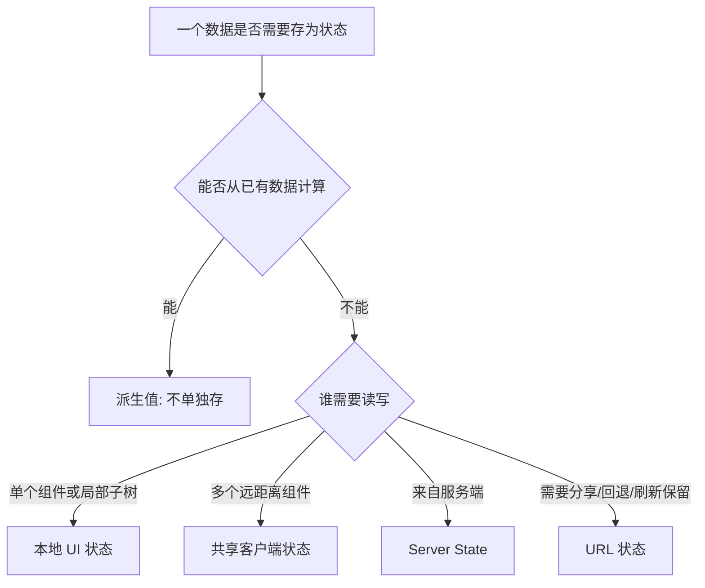

# React 状态管理：本地状态、Context、外部 Store 和 Server State

## 场景

你在做一个后台管理系统：页面有筛选条件、表格分页、弹窗表单、用户权限、主题语言、消息通知和接口数据缓存。刚开始所有状态都用 `useState`，后来发现：

- 表格筛选条件在多个组件之间传来传去。
- Context 放了一个大对象，任何字段变化都会导致很多组件重渲染。
- 接口数据复制到本地 state 后，经常和服务端不一致。
- 弹窗关闭后状态没有重置，下一次打开还保留旧值。
- Redux、Zustand、React Query 都有人建议用，但没人说清楚各自解决什么问题。

状态管理的核心不是“选哪个库”，而是先判断状态的类型、生命周期、共享范围和一致性要求。

## 是什么

React 状态可以按来源和生命周期分成几类：



常见类别：

- 本地 UI 状态：弹窗开关、输入框内容、当前 tab。
- 派生状态：可以由 props、state 或接口数据计算出来的值。
- 共享客户端状态：主题、语言、当前用户、全局通知、跨页面草稿。
- Server State：接口返回的数据、缓存、刷新、重试、过期、乐观更新。
- URL 状态：搜索词、筛选条件、分页、排序。

## 为什么需要

状态放错位置，会直接制造复杂度。

把局部状态放全局，会让简单交互变得难以追踪。把服务端数据复制成本地状态，会产生同步问题。把能计算的值再存一份，会出现两个来源互相打架。把高频变化的大对象塞进 Context，会让大量消费者重渲染。

好的状态管理应该让你回答几个问题：

- 这个状态的唯一来源在哪里？
- 谁能修改它？
- 它什么时候创建，什么时候销毁？
- 它能否从其它状态计算出来？
- 它是否需要缓存、重试、失效和同步服务端？

## 推荐做法

### 1. 本地状态尽量靠近使用点

```tsx
function DeleteButton({ onConfirm }: { onConfirm: () => void }) {
  const [open, setOpen] = useState(false);

  return (
    <>
      <button onClick={() => setOpen(true)}>Delete</button>
      {open && (
        <ConfirmDialog
          onCancel={() => setOpen(false)}
          onConfirm={() => {
            onConfirm();
            setOpen(false);
          }}
        />
      )}
    </>
  );
}
```

弹窗开关只影响按钮和弹窗，就不需要放到全局 store。

### 2. 能计算的值不要重复存

```tsx
function CartSummary({ items }: { items: CartItem[] }) {
  const totalPrice = items.reduce((sum, item) => sum + item.price * item.count, 0);
  return <p>Total: {totalPrice}</p>;
}
```

如果把 `totalPrice` 单独存 state，就要保证每次 `items` 变化都同步更新，很容易漏。

### 3. URL 状态用于可分享和可恢复的页面条件

```tsx
function useProductQuery() {
  const [params, setParams] = useSearchParams();

  return {
    keyword: params.get('keyword') ?? '',
    page: Number(params.get('page') ?? '1'),
    setKeyword(keyword: string) {
      setParams((current) => {
        current.set('keyword', keyword);
        current.set('page', '1');
        return current;
      });
    }
  };
}
```

搜索条件放 URL 后，刷新、分享链接、浏览器前进后退都更自然。

### 4. Context 适合低频全局信息

Context 适合主题、语言、当前用户、权限配置这类低频变化数据。

```tsx
const CurrentUserContext = createContext<CurrentUser | null>(null);

function CurrentUserProvider({ children }: { children: React.ReactNode }) {
  const user = useCurrentUserQuery();

  return (
    <CurrentUserContext.Provider value={user.data ?? null}>
      {children}
    </CurrentUserContext.Provider>
  );
}
```

如果 value 是高频变化的大对象，需要拆分 Context、稳定引用，或改用支持 selector 的外部 store。

### 5. Server State 交给专门的数据层

接口数据不只是一个 value，它还包含 loading、error、stale、refetch、retry、cache、mutation 等状态。

```tsx
function ProductList() {
  const query = useQuery({
    queryKey: ['products'],
    queryFn: fetchProducts,
    staleTime: 60_000
  });

  if (query.isLoading) {
    return <ProductSkeleton />;
  }

  if (query.isError) {
    return <RetryPanel onRetry={() => query.refetch()} />;
  }

  return <ProductTable products={query.data} />;
}
```

这里用 React Query 只是示例。重点是 Server State 需要缓存和失效模型，不适合全部手写在组件 state 里。

## 代码示例

下面是一个筛选表格的状态拆分：URL 管筛选和分页，数据请求层管服务端状态，本地 state 管弹窗。

```tsx
function OrdersPage() {
  const [params, setParams] = useSearchParams();
  const [editingOrderId, setEditingOrderId] = useState<string | null>(null);

  const keyword = params.get('keyword') ?? '';
  const page = Number(params.get('page') ?? '1');

  const ordersQuery = useQuery({
    queryKey: ['orders', { keyword, page }],
    queryFn: () => fetchOrders({ keyword, page }),
    staleTime: 30_000
  });

  function updateKeyword(nextKeyword: string) {
    setParams({ keyword: nextKeyword, page: '1' });
  }

  return (
    <section>
      <OrderFilters keyword={keyword} onKeywordChange={updateKeyword} />

      {ordersQuery.isLoading && <OrderTableSkeleton />}
      {ordersQuery.isError && <RetryPanel onRetry={() => ordersQuery.refetch()} />}
      {ordersQuery.isSuccess && (
        <OrderTable
          orders={ordersQuery.data.items}
          onEdit={(order) => setEditingOrderId(order.id)}
        />
      )}

      {editingOrderId && (
        <OrderEditorDialog
          orderId={editingOrderId}
          onClose={() => setEditingOrderId(null)}
        />
      )}
    </section>
  );
}
```

这个结构让每类状态有清晰归属：筛选条件可分享，接口数据可缓存，弹窗状态局部维护。

## 反例与后果

### 反例 1：把派生值存成 state

```tsx
const [items, setItems] = useState<CartItem[]>([]);
const [total, setTotal] = useState(0);
```

后果：每次 items 变化都要同步 total，漏一次就出现错误金额。能计算的值应该直接计算或用 `useMemo` 缓存。

### 反例 2：接口数据复制多份

```tsx
const query = useQuery({ queryKey: ['user'], queryFn: fetchUser });
const [user, setUser] = useState(query.data);
```

后果：query 更新后本地 user 不一定同步，保存、刷新、回滚都会变复杂。除非要编辑草稿，否则不要复制服务端数据。

### 反例 3：Context 放高频大对象

```tsx
<AppContext.Provider value={{ mousePosition, theme, user, permissions }}>
  {children}
</AppContext.Provider>
```

后果：鼠标位置变化会导致所有消费这个 Context 的组件都可能重渲染，即使它们只关心 theme。

## 常见坑

- 状态上提不是越高越好，越高影响范围越大。
- 全局 store 不能自动解决状态设计问题，只是改变存放位置。
- Context 不是状态管理库，它主要解决跨层传值。
- Server State 有过期和重新验证问题，和客户端 UI 状态不是一类问题。
- 表单编辑时可以从服务端数据初始化草稿，但草稿和原数据要有明确同步策略。
- 乐观更新必须设计失败回滚，否则数据会和服务端不一致。

## 排查与验证

### 状态来源混乱

搜索同一个业务字段在哪里被 `useState`、store、query cache、URL 同时保存。多来源通常意味着同步风险。

### Context 导致重渲染

用 React DevTools Profiler 查看 Provider value 变化时哪些消费者重渲染。再检查 value 是否每次 render 都创建新对象。

### 接口数据过期

检查数据请求库的 `staleTime`、缓存 key、失效时机和 mutation 后是否 invalidate。不要只看组件 state。

### 弹窗状态残留

确认弹窗关闭时是卸载组件、重置 key，还是保留内部状态。复杂表单通常需要显式 reset。

## 面试怎么讲

30 秒版本：

> 我会先给状态分类。本地 UI 状态尽量靠近使用点；能从已有数据计算的不要单独存；跨层低频数据可以用 Context；复杂共享客户端状态可以用外部 store；接口数据属于 Server State，优先交给 React Query 或 SWR 这类数据层处理。

1 分钟版本：

> 状态管理的关键是来源、生命周期和共享范围。比如筛选条件适合放 URL，因为要支持分享和回退；弹窗开关适合本地 state；主题和当前用户适合 Context；接口数据涉及缓存、重试、失效和乐观更新，最好由数据请求库管理。选库之前，我会先判断这个状态能不能派生、谁读写、什么时候销毁。

追问版本：

> 如果问 Context 性能，我会说 Context value 变化会通知消费者，高频大对象会放大重渲染。优化可以拆分 Context、稳定 value 引用、用 selector store，或者把高频状态下沉。对于 Server State，我不会把接口数据复制到多个本地 state，而是通过 query key 和失效策略保持一致性。

## 延伸阅读

- [React Docs: Choosing the State Structure](https://react.dev/learn/choosing-the-state-structure)
- [React Docs: Sharing State Between Components](https://react.dev/learn/sharing-state-between-components)
- [React Docs: You Might Not Need an Effect](https://react.dev/learn/you-might-not-need-an-effect)
- [React Docs: Passing Data Deeply with Context](https://react.dev/learn/passing-data-deeply-with-context)
- [TanStack Query Docs](https://tanstack.com/query/latest/docs/framework/react/overview)
