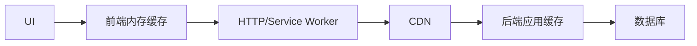

# 前端缓存与后端缓存如何配合

## 场景

用户修改资料后页面仍显示旧头像；列表页返回后希望保留之前数据；接口明明更新了，CDN 还返回旧内容；React Query 里数据没刷新，后端 Redis 也有缓存。缓存层多了以后，问题不再是“要不要缓存”，而是“哪一层缓存什么、什么时候失效”。

## 是什么

前后端缓存可能存在多个层次：

- 浏览器 HTTP 缓存。
- Service Worker Cache。
- 前端内存缓存，如 React Query/SWR。
- 本地持久化缓存，如 localStorage/IndexedDB。
- CDN 缓存。
- 后端应用缓存和 Redis。
- 数据库查询缓存。



## 为什么需要

缓存能提升性能和稳定性，但缓存层越多，一致性越难。一次写操作后，如果没有明确失效策略，用户可能在不同页面看到不同版本数据。

可靠的缓存设计要回答：缓存多久、谁负责失效、写操作后如何同步、失败时如何回滚、是否允许短暂旧数据。

## 推荐做法

### 1. 按数据实时性分类

- 强实时：余额、库存、权限，谨慎缓存或短缓存。
- 中等实时：用户资料、配置，允许短暂 stale。
- 弱实时：公开字典、静态配置，适合长缓存和版本化。

### 2. 前端缓存使用明确 key

```ts
const query = useQuery({
  queryKey: ['orders', { keyword, page }],
  queryFn: () => fetchOrders({ keyword, page }),
  staleTime: 30_000
});
```

缓存 key 必须包含影响数据结果的参数。

### 3. 写操作后失效相关缓存

```ts
const mutation = useMutation({
  mutationFn: updateOrder,
  onSuccess: () => {
    queryClient.invalidateQueries({ queryKey: ['orders'] });
  }
});
```

写操作后要明确哪些列表、详情、统计缓存需要失效。

### 4. 后端返回缓存语义

```http
Cache-Control: private, max-age=60, stale-while-revalidate=30
ETag: "user-profile-v12"
```

前端不要猜接口可缓存性，最好由后端用 Header 或接口契约表达。

## 代码示例

一个用户资料更新后的缓存处理：

```ts
const updateProfileMutation = useMutation({
  mutationFn: updateProfile,
  onSuccess: (profile) => {
    queryClient.setQueryData(['profile', profile.id], profile);
    queryClient.invalidateQueries({ queryKey: ['current-user'] });
  }
});
```

详情缓存可以直接写入新值，当前用户摘要缓存则重新拉取。

## 反例与后果

### 反例 1：缓存 key 缺少参数

```ts
useQuery({ queryKey: ['orders'], queryFn: () => fetchOrders({ page }) });
```

后果：不同分页共用同一个缓存，页面显示错乱。

### 反例 2：写操作后不失效

后果：用户保存成功但列表仍显示旧数据。

### 反例 3：所有接口都 no-store

后果：简单但性能差，后端压力高，用户返回页面体验差。

## 常见坑

- 前端缓存旧不一定是 HTTP 缓存，也可能是 React Query、SWR 或本地 store。
- 后端 Redis 更新了，不代表 CDN 或浏览器缓存也失效。
- 乐观更新要和缓存回滚配合。
- 权限和用户私有数据要注意 private/no-store 和数据泄露风险。
- 缓存时间不是越长越好，要和业务可接受旧数据窗口一致。

## 排查与验证

### 数据旧

按层排查：前端内存缓存、Service Worker、HTTP 缓存、CDN、后端缓存、数据库。

### 写后不更新

检查 mutation 后是否 setQueryData 或 invalidateQueries，后端是否返回最新版本。

### 缓存命中率低

看请求参数是否过度离散，Cache-Control 是否正确，CDN 是否因 Cookie 或 Header 不能缓存。

## 面试怎么讲

30 秒版本：

> 前后端缓存要按数据实时性设计。静态资源和弱实时配置可以长缓存，用户私有和强实时数据要短缓存或不缓存。前端数据缓存要用正确 query key，写操作后失效或更新相关缓存。

1 分钟版本：

> 我会把缓存分层看：浏览器 HTTP、Service Worker、前端内存缓存、CDN、后端 Redis。缓存问题要明确哪一层命中，写操作后要设计失效策略。前端用 React Query/SWR 时，query key 必须包含参数，mutation 后 invalidate 或 setQueryData，最终以服务端数据为准。

追问版本：

> 如果用户说保存成功但页面还是旧数据，我会先看前端 query cache 是否更新，再看 HTTP/CDN 是否返回 304 或旧 200，最后看后端缓存是否失效。不能只清一个缓存层就认为问题解决。

## 延伸阅读

- [MDN: HTTP caching](https://developer.mozilla.org/en-US/docs/Web/HTTP/Caching)
- [TanStack Query: Query Invalidation](https://tanstack.com/query/latest/docs/framework/react/guides/query-invalidation)
- [web.dev: Service worker caching and HTTP caching](https://web.dev/articles/service-worker-caching-and-http-caching)
