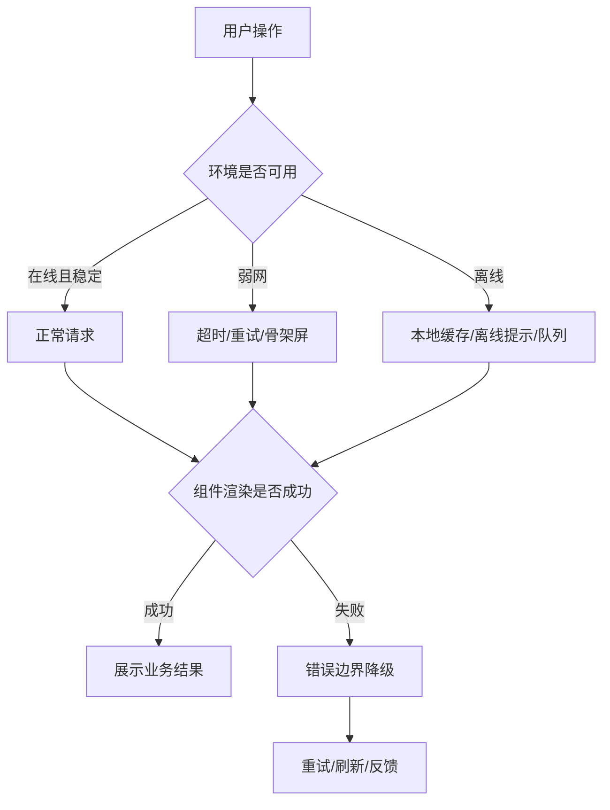
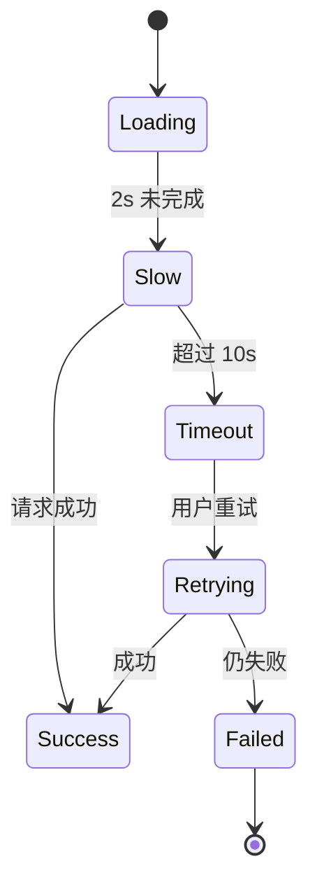

# 离线、弱网、错误边界和降级体验

## 场景

用户在地铁里打开订单页，页面首屏加载很慢；进入编辑页后网络断开，保存按钮一直转圈；一个新上线的图表组件因为空数据崩溃，导致整个后台白屏。真实业务里，前端不能假设网络稳定、接口永远成功、组件永远不会抛错。

可靠的前端体验不是“没有错误”，而是错误发生时能被隔离、被解释、可重试、可恢复。

## 是什么

离线和弱网处理关注运行环境不可用或质量很差时的体验。错误边界关注 React 组件渲染过程中的异常隔离。降级体验是当核心能力不可用时，提供一个业务可接受的替代路径。



核心术语：

- 离线：浏览器无法访问网络，或业务接口不可达。
- 弱网：网络可用但延迟高、丢包、吞吐低、请求经常超时。
- Error Boundary：React 中捕获子组件渲染、生命周期和构造函数错误的边界组件。
- 降级：放弃部分非核心能力，保留核心路径可用。
- 离线队列：离线时先记录用户操作，恢复联网后再同步。

## 为什么需要

移动端、跨国访问、企业内网、公共 Wi-Fi 都可能出现不稳定网络。一个请求失败不应该让用户丢失输入，一个组件异常不应该拖垮整页，一个非核心接口慢不应该阻塞主流程。

如果没有离线和弱网策略，用户会看到长时间 loading、重复提交、数据丢失和不可解释的白屏。如果没有错误边界，React 渲染树中的一个错误可能卸载整个应用根节点。

## 推荐做法

### 1. 把失败按层次处理

不要把所有失败都展示成同一个 toast。更合理的分层是：

- 网络层：超时、断网、DNS、TLS、网关错误。
- 协议层：HTTP 401、403、404、409、429、5xx。
- 业务层：库存不足、表单校验失败、状态已变更。
- 渲染层：组件异常、数据结构不兼容。

不同层次决定不同恢复动作：重试、重新登录、刷新数据、回滚本地状态、展示错误边界。

### 2. 弱网下给出明确状态和边界



2 秒左右可以展示“仍在加载”的弱反馈，较长超时后给重试入口。不要无限等待，也不要过早打断用户。

### 3. 离线时保护用户输入

表单、草稿、编辑器和提交类页面要优先保护用户输入。可以用 localStorage、IndexedDB 或状态管理持久化草稿，并在恢复联网后提示用户继续提交。

### 4. 错误边界按业务区域设置

错误边界不要只放在应用根节点。更实用的做法是在路由级、模块级、复杂组件级设置边界，避免一个区域崩溃影响其他区域。

### 5. 降级要保核心路径

后台系统的核心路径通常是查询、编辑、提交、审批。图表、推荐、头像、埋点、非关键筛选项都可以降级。降级策略应该在设计阶段明确，而不是线上故障时临时判断。

## 代码示例

### React 错误边界

```tsx
import React from 'react';

type Props = {
  children: React.ReactNode;
  fallback: React.ReactNode;
  onError?: (error: Error, info: React.ErrorInfo) => void;
};

type State = {
  hasError: boolean;
};

export class ErrorBoundary extends React.Component<Props, State> {
  state: State = { hasError: false };

  static getDerivedStateFromError(): State {
    return { hasError: true };
  }

  componentDidCatch(error: Error, info: React.ErrorInfo) {
    this.props.onError?.(error, info);
  }

  render() {
    if (this.state.hasError) {
      return this.props.fallback;
    }

    return this.props.children;
  }
}
```

路由或模块级使用：

```tsx
<ErrorBoundary fallback={<PanelError onRetry={() => window.location.reload()} />}>
  <RevenueChart />
</ErrorBoundary>
```

### 弱网超时与重试

```ts
export async function fetchWithTimeout(input: RequestInfo, init: RequestInit = {}, timeoutMs = 10000) {
  const controller = new AbortController();
  const timer = window.setTimeout(() => controller.abort(), timeoutMs);

  try {
    return await fetch(input, {
      ...init,
      signal: controller.signal
    });
  } finally {
    window.clearTimeout(timer);
  }
}
```

### 离线队列

```ts
type PendingAction = {
  id: string;
  type: 'update-profile';
  payload: unknown;
  createdAt: number;
};

const queueKey = 'pending-actions';

export function enqueue(action: PendingAction) {
  const current = JSON.parse(localStorage.getItem(queueKey) ?? '[]') as PendingAction[];
  localStorage.setItem(queueKey, JSON.stringify([...current, action]));
}

export async function flushQueue(sync: (action: PendingAction) => Promise<void>) {
  const current = JSON.parse(localStorage.getItem(queueKey) ?? '[]') as PendingAction[];
  const syncedIds = new Set<string>();

  for (const action of current) {
    try {
      await sync(action);
      syncedIds.add(action.id);
    } catch {
      // 保留失败动作，等下一次联网后继续重试。
    }
  }

  if (syncedIds.size > 0) {
    const latest = JSON.parse(localStorage.getItem(queueKey) ?? '[]') as PendingAction[];
    localStorage.setItem(
      queueKey,
      JSON.stringify(latest.filter((action) => !syncedIds.has(action.id)))
    );
  }
}

window.addEventListener('online', () => {
  void flushQueue(syncPendingAction);
});
```

真实项目里，离线队列更适合用 IndexedDB，并且每个操作都要有幂等键，避免恢复网络后重复提交。

## 反例与后果

### 反例 1：只有全局错误 toast

后果：用户不知道哪个区域失败，也不知道能否继续操作。复杂页面里 toast 还可能被连续错误淹没。

### 反例 2：错误边界只放在 App 根节点

后果：能避免白屏，但整个应用都会进入兜底页，局部错误无法局部恢复。

### 反例 3：离线时允许继续提交但不保存输入

后果：请求失败后用户输入丢失，尤其在长表单和移动端场景非常伤害体验。

### 反例 4：弱网下无限重试

后果：用户流量和电量被消耗，后端压力被放大，还可能制造重复业务操作。

## 常见坑

- `navigator.onLine` 只能表示浏览器判断的网络状态，不代表业务接口可用。
- Error Boundary 不能捕获事件处理器、异步回调和 Promise rejection，需要单独处理。
- Service Worker 缓存可能返回旧资源，错误修复后用户仍访问旧版本。
- 离线队列必须考虑幂等和冲突，否则恢复联网后可能覆盖新数据。
- 降级页不能只写“出错了”，要给用户下一步动作。
- 弱网重试要有退避和上限，提交类操作要特别谨慎。

## 排查与验证

### 验证弱网体验

用 Chrome DevTools Network throttling 模拟 Slow 3G，观察页面是否有骨架屏、慢加载提示、超时提示和重试入口。重点检查用户是否能离开页面或取消操作。

### 验证离线行为

切到 Offline 后执行核心操作，确认输入是否保留、提交是否进入队列、恢复 online 后是否同步成功。再验证重复刷新和多标签页场景。

### 验证错误边界

在复杂组件里临时抛错，确认只有该区域进入 fallback，导航、其他模块和全局状态不受影响。监控平台应收到错误和组件栈。

### 验证降级策略

人为让非核心接口返回 500 或超时，确认核心页面仍可使用。例如图表加载失败时，列表和提交按钮仍然可用。

## 面试怎么讲

30 秒版本：

> 离线、弱网和错误边界解决的是前端在不可靠环境里的恢复能力。我的思路是请求层做超时、重试和取消，业务层保护用户输入，渲染层用错误边界隔离局部崩溃，非核心能力可以降级但核心路径要保留。

1 分钟版本：

> 我会先把失败分层：网络失败、协议失败、业务失败和渲染失败。弱网下不能无限 loading，要有慢加载提示、超时和重试；离线下要保存草稿或进入离线队列，恢复网络后再同步；React 里错误边界要按路由或模块设置，避免一个组件导致整页白屏。降级的重点是明确核心路径，比如查询、编辑和提交不能被图表、推荐、埋点这类非核心能力阻塞。

追问版本：

> 如果问 Error Boundary 能捕获什么，我会说它能捕获子组件渲染、生命周期和构造函数里的错误，但不能捕获事件处理器和异步 Promise 错误。事件和异步错误要在调用点处理，并上报监控。错误边界更像 UI 渲染层的隔离机制，不是通用异常处理器。

## 延伸阅读

- [React: Catching rendering errors with an error boundary](https://react.dev/reference/react/Component#catching-rendering-errors-with-an-error-boundary)
- [MDN: Navigator.onLine](https://developer.mozilla.org/en-US/docs/Web/API/Navigator/onLine)
- [MDN: Network Information API](https://developer.mozilla.org/en-US/docs/Web/API/Network_Information_API)
- [MDN: IndexedDB API](https://developer.mozilla.org/en-US/docs/Web/API/IndexedDB_API)
- [web.dev: Service Worker lifecycle](https://web.dev/articles/service-worker-lifecycle)
