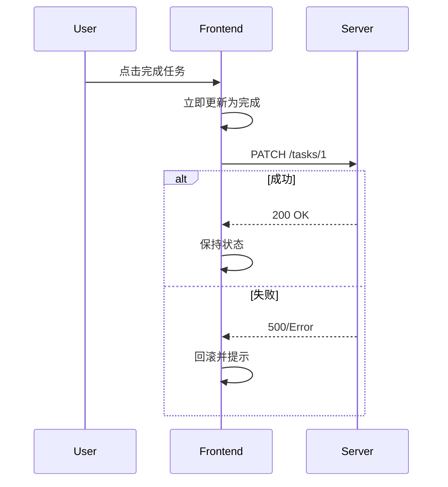

# 乐观更新、回滚、幂等提交和防重复点击

## 场景

用户在任务列表里点击“完成”，你希望界面立刻变成完成状态，而不是等接口返回。用户提交订单时，又必须避免重复点击造成多条订单。网络失败时，还要恢复界面并给出可理解的错误。

这就是乐观更新和幂等提交要解决的问题：在体验和一致性之间做权衡。

## 是什么

乐观更新是在服务端确认前，前端先假设操作成功并更新 UI。失败时再回滚或补偿。

幂等提交是保证同一个操作重复发送多次，服务端只产生一次业务结果。常见做法是幂等键、请求去重、按钮禁用和服务端唯一约束。



## 为什么需要

很多交互如果等接口返回再更新，会显得迟钝，比如点赞、勾选、收藏、排序。乐观更新能显著提升体验。

但不是所有操作都适合乐观更新。支付、下单、审批这类有强一致性和副作用的操作，更关注防重复提交、结果确认和错误恢复。

## 推荐做法

### 1. 低风险操作适合乐观更新

```tsx
async function toggleDone(taskId: string) {
  const previousTasks = tasks;
  setTasks((current) => markDone(current, taskId));

  const result = await updateTask(taskId, { done: true });
  if (!result.ok) {
    setTasks(previousTasks);
    showToast('Update failed. Reverted.');
  }
}
```

需要保存更新前状态，失败时能回滚。

### 2. 高风险操作用幂等键

```ts
async function submitOrder(input: OrderInput) {
  const idempotencyKey = crypto.randomUUID();

  return fetch('/api/orders', {
    method: 'POST',
    headers: {
      'Content-Type': 'application/json',
      'Idempotency-Key': idempotencyKey
    },
    body: JSON.stringify(input)
  });
}
```

服务端必须识别同一个幂等键，并返回同一业务结果。

### 3. 提交中禁用或去重

```tsx
<button type="submit" disabled={submitting}>
  {submitting ? 'Submitting...' : 'Submit'}
</button>
```

前端禁用只是体验层保护，不能替代服务端幂等。

### 4. 失败要可恢复

乐观更新失败后有几种策略：

- 回滚到旧状态。
- 标记为失败并允许重试。
- 重新拉取服务端数据。
- 对复杂操作走补偿流程。

## 代码示例

一个带乐观更新和回滚的收藏按钮：

```tsx
function FavoriteButton({ item }: { item: Item }) {
  const [favorite, setFavorite] = useState(item.favorite);
  const [pending, setPending] = useState(false);

  async function toggleFavorite() {
    if (pending) return;

    const previous = favorite;
    const next = !favorite;
    setFavorite(next);
    setPending(true);

    const result = await updateFavorite(item.id, next);
    if (!result.ok) {
      setFavorite(previous);
      showToast('Favorite update failed.');
    }

    setPending(false);
  }

  return (
    <button type="button" aria-pressed={favorite} onClick={toggleFavorite}>
      {favorite ? 'Favorited' : 'Favorite'}
    </button>
  );
}
```

## 反例与后果

### 反例 1：订单提交只靠按钮禁用

后果：刷新、重试、网络代理或多端操作仍可能重复提交。服务端必须做幂等。

### 反例 2：乐观更新失败不回滚

后果：前端显示成功，服务端实际失败，用户数据不一致。

### 反例 3：所有操作都乐观更新

后果：强一致性操作出错时很难补偿，用户信任受损。

## 常见坑

- 乐观更新要保存可回滚状态。
- 幂等键要由服务端持久化或在合理时间窗口内记录。
- 重试和幂等要配套，否则重试可能制造重复副作用。
- 列表排序和分页中的乐观更新要考虑数据位置变化。
- 多端同时修改时，乐观结果可能被服务端最新状态覆盖。

## 排查与验证

### 重复提交

连续点击、刷新重试、弱网重发，检查服务端是否只创建一条业务记录。

### 回滚正确性

模拟接口失败，确认 UI 回到旧状态，错误提示明确，用户可以重试。

### 缓存一致性

如果使用 React Query/SWR，检查 mutation 后是否正确更新 cache 或 invalidate query。

## 面试怎么讲

30 秒版本：

> 乐观更新是在接口确认前先更新 UI，失败时回滚，适合低风险高频交互。幂等提交是保证重复请求只产生一次业务结果，适合下单、支付、审批等强副作用操作。前端禁用按钮只是体验保护，服务端仍要做幂等。

1 分钟版本：

> 我会按风险选择策略。点赞、收藏可以乐观更新，保存旧状态，失败回滚或重拉数据；订单提交要生成幂等键，服务端按键去重并返回同一结果。重试策略要和幂等配合，避免网络失败时重复创建数据。

追问版本：

> 如果问乐观更新和缓存，我会说要同时更新本地 UI 和数据缓存。使用 React Query 时可以在 onMutate 保存 snapshot，失败 onError 回滚，成功或 settled 后 invalidate，确保最终和服务端一致。

## 延伸阅读

- [TanStack Query: Optimistic Updates](https://tanstack.com/query/latest/docs/framework/react/guides/optimistic-updates)
- [Stripe: Idempotent requests](https://docs.stripe.com/api/idempotent_requests)
- [MDN: HTTP request methods](https://developer.mozilla.org/en-US/docs/Web/HTTP/Methods)
