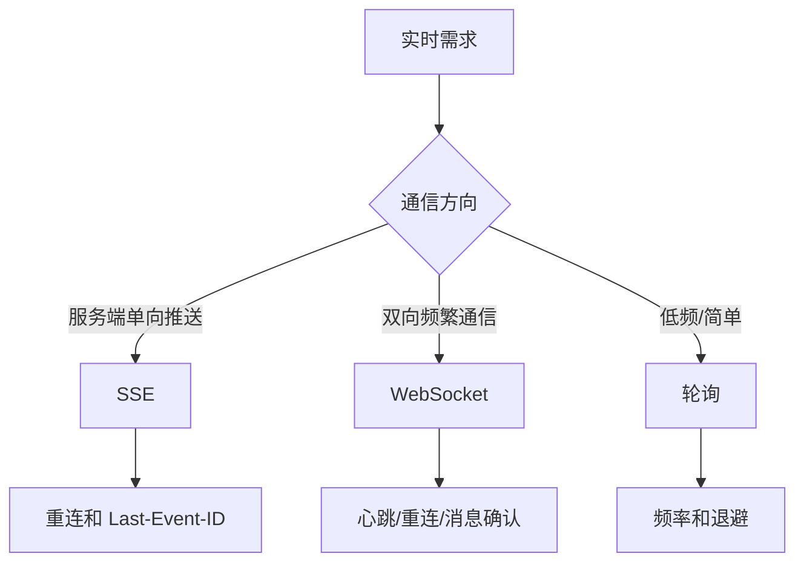

# 实时通信：WebSocket、SSE 和轮询

## 场景

你在做消息通知、任务进度、订单状态或在线协作。用户希望页面能及时更新，而不是手动刷新。可选方案很多：短轮询、长轮询、SSE、WebSocket。选错方案会带来服务器压力、断线恢复复杂、消息重复或状态不一致。

## 是什么

常见实时通信方案：

- 短轮询：定时请求接口，简单但延迟和浪费都较高。
- 长轮询：请求保持一段时间，服务端有数据再返回。
- SSE：基于 HTTP 的服务端单向推送。
- WebSocket：浏览器和服务端之间的全双工长连接。



## 为什么需要

实时通信不是只建立连接。真实项目还要处理鉴权、断线重连、心跳、消息顺序、重复消息、离线补偿、页面隐藏时降频和服务端扩展。

如果只是把 WebSocket 当成“更高级的 HTTP”，很容易在网络抖动、移动端切后台、服务端重启时出现数据丢失或重复。

## 推荐做法

### 1. 低频状态优先轮询

任务每 10 秒更新一次，用轮询可能比维护长连接更简单。

```ts
useEffect(() => {
  const timer = window.setInterval(() => {
    refetchStatus();
  }, 10000);

  return () => window.clearInterval(timer);
}, []);
```

页面隐藏时可以降频或暂停。

### 2. 服务端单向推送用 SSE

```ts
const source = new EventSource('/api/events');

source.addEventListener('message', (event) => {
  const payload = JSON.parse(event.data);
  applyServerEvent(payload);
});

source.addEventListener('error', () => {
  console.warn('SSE disconnected');
});
```

SSE 自动重连，适合通知、进度、只读事件流。

### 3. 双向通信用 WebSocket

```ts
const socket = new WebSocket('wss://example.com/realtime');

socket.addEventListener('open', () => {
  socket.send(JSON.stringify({ type: 'subscribe', roomId }));
});

socket.addEventListener('message', (event) => {
  applyMessage(JSON.parse(event.data));
});
```

WebSocket 适合聊天、协作编辑、实时游戏、双向控制等场景。

### 4. 所有实时方案都要设计恢复

关键字段：

- messageId：去重和排序。
- sequence：检测缺失消息。
- lastEventId：断线后续传。
- timestamp：辅助排序和排查。

## 代码示例

一个简单 WebSocket 重连骨架：

```ts
function connect(url: string) {
  let retry = 0;
  let socket: WebSocket | null = null;

  function open() {
    socket = new WebSocket(url);

    socket.addEventListener('open', () => {
      retry = 0;
    });

    socket.addEventListener('close', () => {
      const delay = Math.min(30000, 1000 * 2 ** retry);
      retry += 1;
      window.setTimeout(open, delay);
    });
  }

  open();

  return () => {
    socket?.close();
  };
}
```

真实项目还要区分主动关闭和异常断开，并加入心跳、鉴权刷新和订阅恢复。

## 反例与后果

### 反例 1：所有实时需求都用 WebSocket

后果：连接管理、扩容、鉴权和恢复复杂度上升。低频状态可能轮询更合适。

### 反例 2：没有消息 ID

后果：重连后无法去重，也无法判断消息是否丢失。

### 反例 3：断线后只重连不补数据

后果：断线期间的消息丢失，页面状态和服务端不一致。

## 常见坑

- WebSocket 不走普通 HTTP 请求响应模型，代理、负载均衡和鉴权要单独设计。
- SSE 是单向推送，不适合高频双向交互。
- 轮询要做退避和页面隐藏降频，避免无效流量。
- 实时消息通常要和全量拉取配合，用于修正丢失和乱序。
- 移动端网络切换和页面后台会导致连接不稳定。

## 排查与验证

### 重连是否可靠

断网、切后台、服务端重启，检查能否重连并恢复订阅。

### 消息是否丢失

使用 sequence 检测缺口。发现缺口时触发全量拉取或增量补偿。

### 服务端压力

观察连接数、消息 fanout、心跳频率、轮询 QPS 和峰值重连风暴。

## 面试怎么讲

30 秒版本：

> 实时通信方案要按场景选。低频简单状态可以轮询，服务端单向推送适合 SSE，双向高频交互适合 WebSocket。无论哪种，都要处理重连、去重、顺序和断线补偿。

1 分钟版本：

> 我会先看通信方向和实时性要求。任务进度可以轮询或 SSE，聊天和协作更适合 WebSocket。WebSocket 要设计心跳、指数退避重连、订阅恢复、消息 ID 和 sequence。断线恢复后通常要拉取一次服务端最新状态，保证最终一致。

追问版本：

> 如果问 SSE 和 WebSocket 区别，我会说 SSE 基于 HTTP，服务端到客户端单向推送，自动重连，适合通知和事件流；WebSocket 是全双工长连接，适合双向实时交互，但连接管理和扩容更复杂。

## 延伸阅读

- [MDN: WebSocket](https://developer.mozilla.org/en-US/docs/Web/API/WebSocket)
- [MDN: Server-sent events](https://developer.mozilla.org/en-US/docs/Web/API/Server-sent_events)
- [MDN: EventSource](https://developer.mozilla.org/en-US/docs/Web/API/EventSource)
