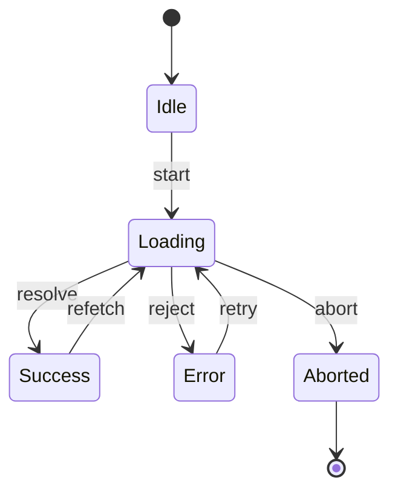

# 请求状态管理：重试、超时、取消和竞态控制

## 场景

一个列表页支持搜索、筛选、分页和详情弹窗。用户快速输入关键字、切换分页、打开详情再关闭。接口偶尔慢，网络偶尔断，后端偶尔返回 500。

如果只写一个 `loading` 和一个 `data`，很容易出现：

- 旧请求晚返回，覆盖新筛选结果。
- 请求失败后页面一直 loading。
- 用户关闭弹窗后，请求仍然更新已卸载组件。
- 重试按钮重复点击，发出多次相同请求。
- 空数据、错误、加载和成功状态互相覆盖。

请求可靠性不是后端才需要关注。前端要保证用户看到的状态可信、可恢复、可解释。

## 是什么

请求状态管理是把一次数据请求从“发起到结束”的生命周期显式建模。



真实请求还要处理：

- 超时：超过业务可接受时间后给出反馈。
- 取消：参数变化、组件卸载、用户关闭时停止旧请求。
- 竞态：多个请求同时存在时，只接受仍然有效的结果。
- 重试：对可恢复错误按策略重试。
- 幂等：避免重复提交造成重复数据。

## 为什么需要

请求链路是用户最容易感知不稳定的地方。接口慢、弱网、切换快、重复点击，都可能让 UI 和真实数据不一致。

如果没有清晰状态机，代码通常会散落多个布尔值：`loading`、`error`、`empty`、`submitting`。这些布尔值会组合出非法状态，比如 loading 同时 error，同时 data 还是旧的。

显式状态建模可以让 UI 分支更稳定，也让错误恢复路径更清楚。

## 推荐做法

### 1. 用联合类型表达请求状态

```ts
type RequestState<T> =
  | { type: 'idle' }
  | { type: 'loading'; requestId: number }
  | { type: 'success'; data: T }
  | { type: 'empty' }
  | { type: 'error'; message: string; retriable: boolean };
```

这种结构能避免非法组合，并强迫 UI 覆盖所有状态。

### 2. 参数变化时取消旧请求

```tsx
useEffect(() => {
  const controller = new AbortController();

  loadOrders(query, controller.signal)
    .then(setOrders)
    .catch((error) => {
      if (error.name !== 'AbortError') {
        setError(error);
      }
    });

  return () => {
    controller.abort();
  };
}, [query]);
```

取消旧请求能减少无效工作，也能避免组件卸载后继续更新。

### 3. 用请求序号抵御无法取消的竞态

有些异步任务不能真正取消，可以用递增序号只接受最新结果。

```tsx
const latestRequestId = useRef(0);

async function search(keyword: string) {
  const requestId = latestRequestId.current + 1;
  latestRequestId.current = requestId;

  const result = await searchApi(keyword);

  if (latestRequestId.current !== requestId) {
    return;
  }

  setResult(result);
}
```

### 4. 重试要有边界

```ts
async function retry<T>(task: () => Promise<T>, maxAttempts = 3) {
  let lastError: unknown;

  for (let attempt = 1; attempt <= maxAttempts; attempt += 1) {
    try {
      return await task();
    } catch (error) {
      lastError = error;
      await new Promise((resolve) => window.setTimeout(resolve, attempt * 500));
    }
  }

  throw lastError;
}
```

只对可恢复错误重试，例如网络波动、429、部分 5xx。用户提交类操作要考虑幂等键。

## 代码示例

下面是一个搜索 Hook，包含状态机、取消和竞态保护。

```tsx
type SearchState<T> =
  | { type: 'idle' }
  | { type: 'loading' }
  | { type: 'success'; data: T[] }
  | { type: 'empty' }
  | { type: 'error'; message: string };

export function useSearch<T>(keyword: string, fetcher: (keyword: string, signal: AbortSignal) => Promise<T[]>) {
  const [state, setState] = useState<SearchState<T>>({ type: 'idle' });

  useEffect(() => {
    const trimmed = keyword.trim();
    if (!trimmed) {
      setState({ type: 'idle' });
      return;
    }

    const controller = new AbortController();
    setState({ type: 'loading' });

    fetcher(trimmed, controller.signal)
      .then((data) => {
        setState(data.length > 0 ? { type: 'success', data } : { type: 'empty' });
      })
      .catch((error: unknown) => {
        if (error instanceof DOMException && error.name === 'AbortError') {
          return;
        }

        setState({
          type: 'error',
          message: error instanceof Error ? error.message : 'Unknown error'
        });
      });

    return () => controller.abort();
  }, [keyword, fetcher]);

  return state;
}
```

调用方不需要猜 loading 和 data 的组合状态，只需要按 `type` 渲染。

## 反例与后果

### 反例 1：多个布尔状态互相覆盖

```ts
const [loading, setLoading] = useState(false);
const [error, setError] = useState<string | null>(null);
const [data, setData] = useState<Item[] | null>(null);
```

后果：可能出现 loading 为 false、error 有值、data 也有旧值，UI 不知道该展示哪个。

### 反例 2：不处理旧请求

后果：用户输入 `react` 后又输入 `redux`，`react` 请求晚返回，页面显示旧结果。

### 反例 3：无限重试

后果：网络断开时持续打接口，耗电、耗流量，还可能放大后端故障。

## 常见坑

- AbortController 取消的是 fetch 等支持 signal 的任务，不是所有 Promise 都能被取消。
- 超时应该清理定时器，否则会有泄漏或误触发。
- 重试要区分错误类型，不要对 400 类业务错误重试。
- 提交操作要防重复点击，必要时使用幂等键。
- 页面离开或弹窗关闭时，要明确是否保留请求结果。

## 排查与验证

### 旧数据覆盖

在 Network 面板里人为调慢接口，快速切换查询条件，观察晚返回的旧请求是否更新 UI。

### 一直 loading

检查 success、empty、error、abort 分支是否都能让 UI 离开 loading。尤其注意 catch 里重新 throw 后外层是否处理。

### 重复提交

连续点击提交按钮，检查按钮禁用、请求去重、后端幂等键和日志。

### 弱网体验

用 DevTools 网络限速模拟 Slow 3G 和离线，检查超时提示、重试按钮和缓存兜底。

## 面试怎么讲

30 秒版本：

> 请求状态不应该只用 loading 和 data，我会建模为 idle、loading、success、empty、error 等明确状态。参数变化或组件卸载时取消旧请求，无法取消时用请求序号防止旧结果覆盖新结果。

1 分钟版本：

> 真实请求要处理失败、超时、取消、竞态和重试。搜索和筛选类场景最容易出现旧请求晚返回覆盖新数据，我通常用 AbortController 取消旧请求，或者用 requestId 只接受最新响应。重试要有次数和错误类型判断，提交类操作还要考虑防重复点击和幂等。

追问版本：

> 如果问为什么不用多个 boolean，我会说多个 boolean 会组合出非法状态，联合类型或状态机能让 UI 分支更明确。对于复杂 Server State，我会优先使用 React Query/SWR，让缓存、失效、重试和去重交给成熟数据层，但仍要理解底层竞态和取消逻辑。

## 延伸阅读

- [MDN: AbortController](https://developer.mozilla.org/en-US/docs/Web/API/AbortController)
- [MDN: Fetch API](https://developer.mozilla.org/en-US/docs/Web/API/Fetch_API)
- [TanStack Query: Query Cancellation](https://tanstack.com/query/latest/docs/framework/react/guides/query-cancellation)
- [React Docs: Synchronizing with Effects](https://react.dev/learn/synchronizing-with-effects)
