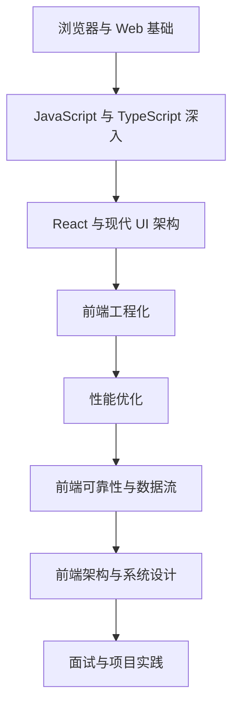

# 学习路线图

这份路线按“平台基础 -> 语言能力 -> UI 架构 -> 工程化 -> 性能可靠性 -> 系统设计 -> 面试表达”的顺序推进。

## 1. 浏览器与 Web 基础

- HTML 语义化、CSS 盒模型、BFC、Flex、Grid 和响应式布局。
- 浏览器渲染流程：HTML、CSS、JavaScript 如何变成页面。
- 事件循环：宏任务、微任务、渲染时机和异步代码执行顺序。
- 缓存体系：HTTP 缓存、Service Worker 缓存、浏览器存储。
- Web 安全：XSS、CSRF、点击劫持、CSP、Cookie 安全属性。

## 2. JavaScript 与 TypeScript 深入

- JavaScript 执行模型、作用域、闭包、原型链和 `this`。
- Promise、async/await、异常传播和并发控制。
- TypeScript 类型系统、泛型、类型收窄、工具类型和工程实践。
- 内存泄漏、垃圾回收和运行时性能陷阱。

## 3. React 与现代 UI 架构

- React 渲染模型、Fiber、render/commit、并发渲染基础概念。
- Hooks 原理、依赖数组、闭包陷阱和自定义 Hooks。
- 状态管理：本地状态、Context、外部 Store、Server State。
- 表单、列表、虚拟滚动、复杂交互组件和可访问性。

## 4. 前端工程化

- Vite、Webpack、Rspack 的构建流程和插件机制。
- Babel、SWC、PostCSS、CSS Modules、Tailwind 的工程角色。
- Monorepo、包管理、依赖版本治理和组件库发布。
- ESLint、Prettier、TypeScript、测试、CI 和 Source Map。

## 5. 性能优化

- Core Web Vitals：LCP、INP、CLS、TTFB。
- 首屏优化、代码分割、预加载、懒加载和资源优先级。
- 图片、字体、第三方脚本、长任务、Web Worker、虚拟列表。
- 性能监控、埋点和线上排障案例。

## 6. 前端可靠性与数据流

- 请求状态管理、重试、超时、取消和竞态控制。
- 乐观更新、回滚、幂等提交和防重复点击。
- 前端缓存与后端缓存协作。
- WebSocket、SSE、轮询、离线、弱网和错误边界。

## 7. 前端架构与系统设计

- BFF 与前后端协作边界。
- 微前端适用场景、隔离、路由和状态共享。
- 权限系统、菜单系统、动态路由、国际化和主题系统。
- 大型表格、低代码、可视化编辑器、IM 前端、直播间前端等案例。

## 8. 面试与项目实践

- 前端面试 30 天路径。
- 高频问题背后的真实工程问题。
- 前端系统设计题和项目复盘模板。
- 把原理文章压缩成可追问的面试表达。
