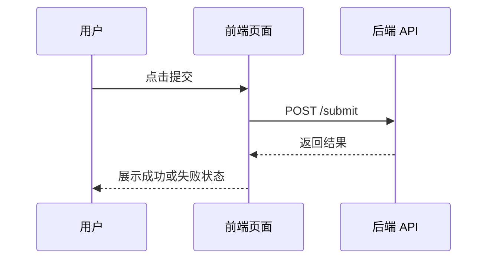

# 文章模板

正式文章优先使用下面结构。内容可以根据主题调整，但不要缺少场景、代码、反例、排查和面试表达。

```text
# 标题

## 场景
说明真实业务问题。

## 是什么
解释概念和核心术语。

## 为什么需要
说明没有它会遇到什么问题。

## 推荐做法
给流程图、时序图或状态图。

## 代码示例
给 TypeScript / JavaScript / React / 伪代码。

## 反例与后果
说明常见错误做法和实际后果。

## 常见坑
列出实战中容易踩的问题。

## 排查与验证
说明如何 debug、如何确认方案生效。

## 面试怎么讲
给一段可以直接用于面试表达的话。

## 延伸阅读
放官方文档或高质量引用链接。
```

## Mermaid 示例



## 代码示例要求

- 能用 TypeScript 就不用纯伪代码。
- React 主题优先给 TSX 示例。
- 示例要短，但必须体现真实边界，例如 loading、error、cleanup、取消请求或并发控制。

## 面试表达要求

面试表达建议分三层：

- 30 秒版本：先给结论。
- 1 分钟版本：补充机制和场景。
- 追问版本：补充边界、反例和项目经验。
